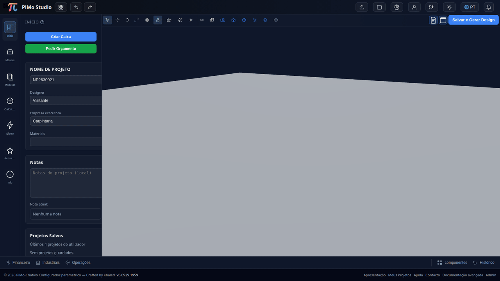
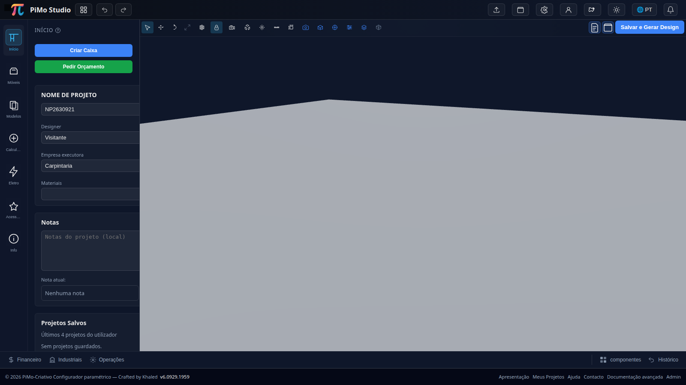
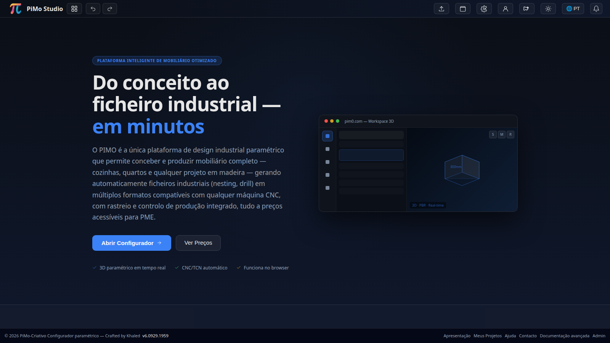
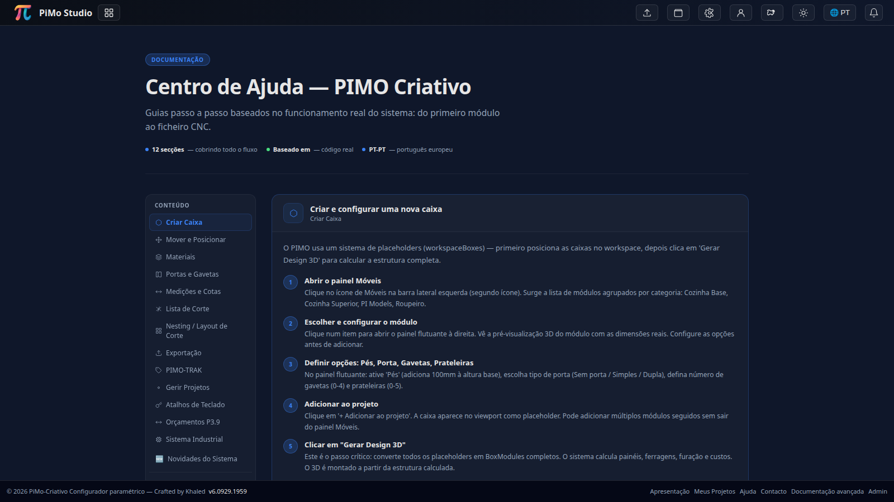
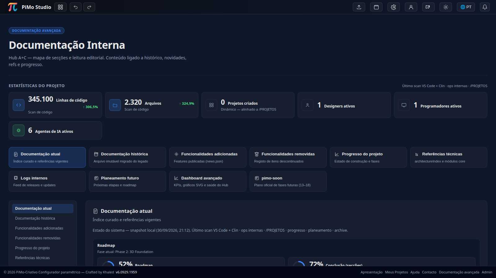
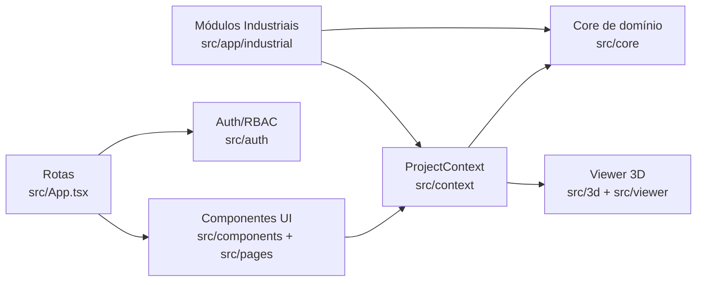
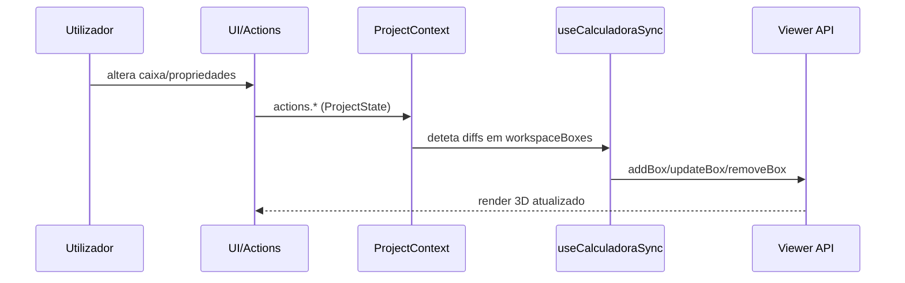

<p align="center">
  <picture>
    <source media="(prefers-color-scheme: dark)" srcset="docs/assets/banner-dark.svg" />
    
  </picture>
</p>

<p align="center">
  <picture>
    <source media="(prefers-color-scheme: dark)" srcset="docs/assets/logo-dark.svg" />
    
  </picture>
</p>

<h1 align="center">PIMO Criativo</h1>

<p align="center">
  Plataforma web para desenho de mobiliário com visualização 3D, gestão de projetos e módulos industriais.
</p>

<p align="center">
  <a href="https://github.com/pimo-pro/pimo-criativo/actions/workflows/verify.yml"></a>
  <a href="https://github.com/pimo-pro/pimo-criativo/actions/workflows/deploy.yml"></a>
  
  
  
  
  
  <a href="https://github.com/pimo-pro/pimo-criativo/tags"></a>
  <a href="https://github.com/pimo-pro/pimo-criativo/stargazers"></a>
  
</p>

> ℹ️ **Nota sobre licença:** este repositório **não inclui ficheiro LICENSE** neste momento.

## Índice

- [Visão geral](#visão-geral)
- [Demonstração visual](#demonstração-visual)
- [Funcionalidades principais](#funcionalidades-principais)
- [Stack tecnológica](#stack-tecnológica)
- [Arquitetura](#arquitetura)
- [Começar rapidamente](#começar-rapidamente)
- [Scripts disponíveis](#scripts-disponíveis)
- [Estrutura do projeto](#estrutura-do-projeto)
- [Variáveis de ambiente](#variáveis-de-ambiente)
- [CI/CD](#cicd)
- [GitHub Pages (landing estática)](#github-pages-landing-estática)
- [Contribuição e suporte](#contribuição-e-suporte)
- [FAQ](#faq)

## Visão geral

O **PIMO Criativo** é uma aplicação web construída com React + TypeScript para:

- desenhar módulos/caixas de mobiliário;
- visualizar em 3D (Three.js / React Three Fiber);
- gerir projetos e áreas administrativas;
- suportar fluxos industriais (work orders, tracking, quality, operações);
- gerar artefactos técnicos (ex.: PDF e componentes de pipeline CNC presentes em `src/core/cnc`).

A organização do estado do projeto gira à volta de `ProjectContext`/`ProjectState` (`src/context/`), com sincronização para o viewer 3D via `useViewerSync`.

## Demonstração visual

### Fluxo principal (GIF)



### Capturas reais (ambiente local)

| Workspace 3D | Apresentação |
|---|---|
|  |  |

| Ajuda | Documentação |
|---|---|
|  |  |

## Funcionalidades principais

- **Editor visual 3D** com manipulação de módulos no workspace.
- **Gestão de projetos** (áreas de projetos, páginas dedicadas e visualização protegida).
- **Autenticação e autorização** com rotas protegidas e permissões (`src/auth`, `ProtectedRoute`, `PermissionRoute`).
- **Administração** (utilizadores, permissões, settings, materiais/modelos em rotas admin).
- **Módulos industriais** (`/industrial/*`) para operações, tracking, qualidade, retrabalho e work orders.
- **Base técnica de produção** com módulos de cutlist/CNC/drilling/PDF no `src/core/`.

## Stack tecnológica

Confirmada a partir de `package.json` e código-fonte:

- **Frontend:** React 19, TypeScript, Vite 7
- **3D:** Three.js + @react-three/fiber + @react-three/drei
- **Estado:** Context API + Zustand
- **Testes:** Vitest
- **Lint:** ESLint 9
- **Integrações adicionais no repositório:** Supabase client, PostgreSQL (`pg`), utilitários PDF (`jspdf`, `jspdf-autotable`)

## Arquitetura

### Mapa de módulos (alto nível)



### Fluxo de dados do projeto para o viewer



## Começar rapidamente

### Pré-requisitos

- Node.js (recomendado: **20.19.x**, alinhado com CI/workflows)
- npm

### Instalação

```bash
npm ci
```

### Desenvolvimento

```bash
npm run dev
```

O Vite arranca por omissão em `http://localhost:5173`.

### Build de produção

```bash
npm run build
```

### Testes

```bash
npm run test
```

### Lint

```bash
npm run lint
```

> ✅ **Verificação real neste ambiente:** `npm ci`, `npm run dev`, `npm run build` e `npm run test` foram executados.

## Scripts disponíveis

<details>
<summary>Expandir lista de scripts do <code>package.json</code></summary>

| Script | Descrição prática |
|---|---|
| `npm run dev` | Inicia o servidor Vite em modo desenvolvimento |
| `npm run build` | Type-check + build Vite + cópia de API para `dist` |
| `npm run preview` | Serve localmente o build de produção |
| `npm run test` | Executa testes em modo single-run (Vitest) |
| `npm run test:watch` | Testes em watch mode |
| `npm run lint` | Lint de ficheiros TS/TSX em `src` e scripts TS |
| `npm run tsc:strict` | Type-check estrito com `tsconfig.strict.json` |
| `npm run publish` | Fluxo de publicação por script Node |
| `npm run deploy` | Build + commit/push + script de deploy (fluxo interno) |
| `npm run release:daily` | Geração de notas de release diária |
| `npm run release:email` | Envio de email com release notes |
| `npm run pimo` | Script utilitário `scripts/pimo.sh` |
| `npm run export:tcn:variants` | Exportação de variantes TCN |

</details>

## Estrutura do projeto

<details>
<summary>Expandir estrutura principal do repositório</summary>

```text
.
├── src/
│   ├── app/                # rotas de aplicação (inclui industrial)
│   ├── auth/               # autenticação e autorização
│   ├── components/         # componentes de interface
│   ├── context/            # ProjectContext e providers
│   ├── core/               # lógica de domínio (cutlist, cnc, regras, etc.)
│   ├── 3d/                 # motor/viewer 3D
│   ├── stores/             # stores Zustand de UI/estado derivado
│   └── ...
├── api/                    # endpoints/scripts da camada API no repositório
├── docs/                   # documentação técnica e planos
├── tests/                  # testes complementares
├── scripts/                # scripts operacionais
└── .github/workflows/      # pipelines GitHub Actions
```

</details>

## Variáveis de ambiente

<details>
<summary>Expandir visão geral de variáveis (sem segredos)</summary>

O ficheiro `.env.example` define chaves usadas em ambiente local/prod, incluindo:

- `VITE_API_URL`
- `VITE_TEXTURES_URL`
- `VITE_SUPABASE_URL`
- `VITE_SUPABASE_ANON_KEY`
- `VITE_PIMO_APP_ENV`
- `PIMO_APP_ENV`
- `PIMO_JWT_SECRET`
- `PIMO_INTERNAL_API_SECRET`

Nunca incluir segredos reais em commits.

</details>

## CI/CD

Workflows existentes em `.github/workflows/` (entre outros):

- `verify.yml` — lint + typecheck + testes
- `deploy.yml` — publish/deploy orientado por tags `v*`
- workflows operacionais de suporte (backup, migrações Supabase, health checks, etc.)

## GitHub Pages (landing estática)

Foi adicionada uma landing page estática em `docs/site/` com:

- layout responsive;
- modo claro/escuro automático;
- reutilização dos assets visuais desta documentação;
- resumo de funcionalidades e passos de instalação.

O deploy é feito por workflow dedicado (`.github/workflows/pages.yml`) usando `actions/deploy-pages`.

## Contribuição e suporte

- Guia de contribuição: [`CONTRIBUTING.md`](CONTRIBUTING.md)
- Código de conduta: [`CODE_OF_CONDUCT.md`](CODE_OF_CONDUCT.md)
- Política de segurança: [`SECURITY.md`](SECURITY.md)
- Templates de issue: `.github/ISSUE_TEMPLATE/`
- Template de pull request: `.github/pull_request_template.md`

## FAQ

<details>
<summary>Existe licença definida?</summary>

Não foi encontrado ficheiro `LICENSE` no repositório nesta revisão.

</details>

<details>
<summary>Há router manual ou biblioteca de routing?</summary>

O projeto usa `react-router-dom` (ver `src/main.tsx` e `src/App.tsx`) e mantém também algumas navegações por `window.history.pushState` em fluxos específicos.

</details>

<details>
<summary>Posso correr sem serviços externos?</summary>

Sim para desenvolvimento base de frontend. Algumas funcionalidades podem depender de configuração de API/credenciais (ver `.env.example`).

</details>
