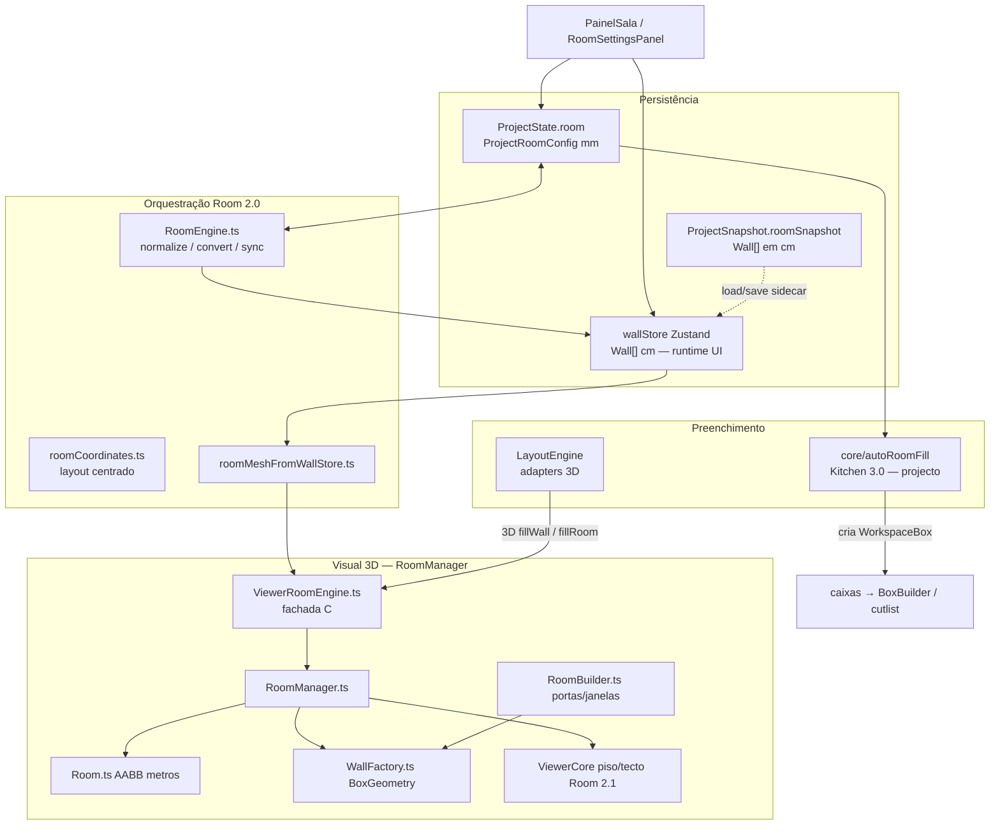
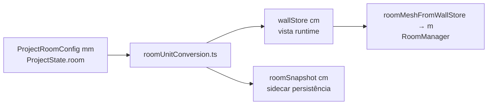

# PIMO-Criativo — Plano de limpeza (hub oficial)

| Campo | Valor |
|-------|--------|
| **Versão do plano** | 1.50 |
| **Estado** | Fases **1.3–1.12** / **Z-01–Z-03.11.3** / **Fase 7b CNC** concluídas; **checkpoint pós-limpeza-CNC** `v6.0824.1042`; **Fase 7d** limpeza de artefactos arrastados pelo publish. |
| **Modo actual** | Pós-deploy limpeza CNC. Hub v1.50. Checkpoint produção: `v6.0824.1042` / `d9a475e3`. |
| **Data da leitura inicial** | 18 de Agosto de 2026 |
| **Última actualização do plano** | 24 de Agosto de 2026 |
| **Método** | Leitura real do código como fonte primária; relatórios externos só para reconciliação |
| **Âmbito** | Repositório completo, incluindo ficheiros industriais protegidos (só leitura) |
| **Próximo passo** | Z-03.12 (checklist Zero-Legacy) ou decisão de produto. Pendentes: L-18/L-20. Dívida §15.3 fora de âmbito. |

Este documento é a **fonte de verdade única** das decisões de limpeza. Qualquer execução futura deve referenciar IDs (`L-`, `D-`, `F-`, `R-`, `P-`, `Z-`) e actualizar o estado aqui.

**Não executar nada com base neste ficheiro sem aprovação explícita** (ex.: «aplica Fase 1.3»). Sugestões de «aplicar Fase X» existem **apenas como texto** neste plano — sem diffs, sem commits, sem refactors.

Resumo visual complementar (não SSOT): [plano-limpeza.canvas.tsx](../canvases/plano-limpeza.canvas.tsx) no workspace Cursor.

---

## 0. Governança desta fase (obrigatório)

### 0.1 O que é permitido agora

| Permitido | Proibido |
|-----------|----------|
| Actualizar **este** ficheiro (`docs/PIMO-CRIATIVO-PLANO-LIMPEZA.md`) | Aplicar Fases 0–5 **não** aprovadas |
| Reconciliar relatórios técnicos com evidência de código | Apagar, mover ou refactorar ficheiros de produto **fora** dos lotes L- aprovados |
| Reclassificar itens (morto ↔ fantasma ↔ duplicado) | Alterar TCN, DRILL, PI, `industrialOutputGuard`, geradores industriais |
| Documentar zonas protegidas e dependências | Tocar em `src/validation/` excepto para **manter** testes verdes numa fase futura |
| Ajustar prioridades, riscos e estrutura de IDs | Criar código novo, rotas, endpoints ou scripts de runtime |

A regra L- («remover ficheiros sem uso») está **activa**. As fases 1.3–1.12 foram executadas em 18-08-2026. Novos lotes **não** avançam sem gatilho explícito.

---

## 0.5 Relatório de execução — 18 de Agosto de 2026

**Gatilho:** pedido explícito do dono do produto (Khaled) para aplicar Fases 1.3–1.12 (L-03 → L-30).

**Pré-checagens (todas OK):**
1. Grep estático: zero consumidores activos dos alvos (excluindo auto-referências e este plano).
2. Sem participação em viewer-engine / ViewerCore / BoxBuilder / pipeline industrial / routing / Supabase / PHP / CI.
3. Sem carregamento dinâmico (`import()` / barrels) dos alvos.
4. `src/api/apiClient.ts` e `useProjectsUIOverlay` **não** foram tocados (homónimos vivos).
5. `layoutWarnings.ts` **mantido**.
6. `scripts/backupManager.ts` **mantido**.

**Companion necessário:** `src/core/layout/utils.ts` removido com L-05 porque importava `./types.ts` e não tinha consumidores — caso contrário o `tsc` quebrava.

**Não executado:** L-18, L-20, zonas P-/Z- restantes, `dist/`, `docs/RELATORIO_*`, `ferragens_3d/RELATORIO_*`.  
**Executado na Fase 3 (24-08-2026):** L-12, L-13, L-22, resíduo `admin-icons-etapa2.diff`.  
**Executado na Fase 3b (24-08-2026):** L-01 (stubs vazios `services/*.js` + pasta raiz).
**Executado nesta fase (24-08-2026):** L-02 (fixture `backend/backend/data/projects/project-pimo-mn5tsivc-zcrvwgfl.json`).

### Ficheiros removidos por fase

| Fase | IDs | Removido |
|------|-----|----------|
| 1.3 | L-03, L-04 | `src/hooks/useProjects.js`, `src/services/apiClient.js` |
| 1.4 | L-05…L-08 | `service.ts`, `hooks.ts`, `types.ts`, `utils.ts` (companion), `smartArrange.ts`, `viewerLayoutAdapter.ts`, `pieceMaterialExtension.ts` em `src/core/layout/` |
| 1.5 | L-09…L-11 | `drawerGroup3D.ts`, `drawerTransforms.ts`, `drawerPlacement3D.ts` |
| 1.6 | L-14, L-15 | `tests/export.test.ts`, `tests/projectState.test.ts` |
| 1.7 | L-25 | 16× `*.diff`/`*.patch` na raiz |
| 1.8 | L-26 | 4 relatórios (html/txt/hífen) na raiz |
| 1.9 | L-27 | 33× `RELATORIO_*.md` na raiz |
| 1.10 | L-28 | pastas `tmp/` e `test-output/`; entradas no `.gitignore` |
| 1.11 | L-29 | `src/3d/viewer-engine/cleanup/ViewerCleanupReport.ts` |
| 1.12 | L-30 | `DocumentacaoSistemaLegacy.tsx.bak`, `_extract_preview.json` |

**Impacto em fluxos vivos:** nenhum. ViewerCore, BoxBuilder, cutlayout, TCN, DRILL, PI, routing, Supabase e PHP não foram alterados.

### 0.2 Hierarquia de fontes

1. **Código actual** (`grep`, leitura de ficheiros, imports reais) — verdade técnica.
2. **Este plano** — decisões de limpeza consolidadas.
3. **Relatórios no repo** — contexto histórico; podem estar desactualizados (ver §0.3).
4. **Conversas / análises externas** (ex.: sessão Cursor «Project code analysis report», Aug 2026) — input para reconciliação, não SSOT.

**Nota:** Não foi encontrado no repositório um ficheiro nomeado «Cliny» ou «VS Code/Cliny». A reconciliação abaixo usa a análise profunda da sessão Cursor (subagentes + grep) e relatórios `RELATORIO_*` / `docs/` existentes no repo.

### 0.3 Reconciliação com relatórios técnicos

| Fonte | Data | Usar como SSOT? | Alinhamento com plano v1.1 |
|-------|------|-----------------|----------------------------|
| Leitura profunda Cursor (Aug 2026) | 2026-08-18 | **Sim** (base) | Origem do plano v1.0 |
| `RELATORIO_AUDITORIA_TECNICA_POS_MIGRACAO_FASES1-7_2026-03-06.md` | 2026-03-06 | Parcial | Confirma pipeline drill/cutlist; `buildBoxLegacy` é **vivo** (nomenclatura legacy, não morto). `buildBasicDrillOperations` **já não existe** em `cncExport.ts` actual — item histórico |
| `RELATORIO_LIMPEZA_CODIGO.md` | 2025-02-11 | Histórico | Remoções **já executadas** (`Documentation.tsx`, `docsLoader.ts`, etc.) — não repetir |
| `RELATORIO_TECNICO_PIMO_CRIATIVO_COMPLETO.md` | 2026-06 | **Não** | Descreve `features.eventsSystem` e `useCadModelsSync` como existentes — **falso** no código actual (F-05, F-15) |
| `docs/auditoria-tecnica.md` | 2025 | **Não** | Arquitectura pré-migração viewer; referencia `PimoViewerClean`, `useCadModelsSync` — obsoleto |
| `RELATORIO_LIMPEZA_CODIGO.md` + 37× `RELATORIO_*` na raiz | várias | Histórico / ruído | Ver L-27, R-18 — documentação não é runtime mas confunde onboarding |
| `ViewerCleanupReport.ts` | 2026-05 | Interno | Lista limpezas viewer já feitas; **L-29** (ex-L-26) |

### 0.4 Legenda de categorias

| Prefixo | Significado | Exemplo |
|---------|-------------|---------|
| **L-** | Código morto — zero consumidores ou stub no-op | `useProjects.js` |
| **D-** | Duplicação / sobreposição activa ou estrutural | 4× TCN, 3× PHP |
| **F-** | Fantasma — chamada ou doc sem implementação / efeito real | `GET /projects` Axios |
| **R-** | Risco técnico, segurança ou processo | JWT fallback |
| **P-** | **Zona protegida** — não limpar; só documentar dependências | golden drill, PI |
| **Z-** | Zona de auditoria: dormida (Z-02…Z-04) **ou** expositor vivo (Z-01 ViewerCore) — não apagar sem cadeia auditada | `ViewerCore.ts` / dashboard |

---

## 1. Mapa geral da arquitectura actual

O produto é um **monólito React 19 + TypeScript + Three.js + PHP Hostinger + Supabase**. Não existe backend Node/Express.

```
Browser
  main.tsx → AuthProvider (JWT PHP / local-auth)
    App.tsx (React Router)
      ├── LegacyApp  (/ , /:projectSlug, /admin)
      │     Workspace → ViewerCore (Three.js)
      │     ProjectProvider → ProjectState (SSOT mm)
      └── Rotas modernas
           /dashboard, /projects, /industrial/*, /PROJETOS/*, /nesting_v3

Persistência
  PHP Hostinger: auth, users, settings, projects JSON, industrial/orders JSON
  Supabase: TRAK (industrial_work_orders*) + legado (work_orders)
  localStorage / IndexedDB: settings, autosave, offline projects

Fabricação (core, sem servidor)
  cutlistFromBoxes → drillingService → cutlayout → TCN/TXML/PDF
  (gate: industrialOutputGuard — zona P-02)
```

### 1.1 Pastas da raiz — classificação

| Pasta / ficheiro | Papel | Classificação |
|------------------|-------|----------------|
| `src/` | Aplicação (~2089 TS/TSX) | **Canónico** |
| `public/` | Assets, SSOT Excel/JSON, docs industriais | **Canónico** |
| `hostinger/api/` | PHP de projectos (fonte de deploy) | **Canónico deploy** |
| `api/` | PHP auth/users/settings/orders + `materials.ts` | **Canónico deploy** |
| `public_html/` | Stubs PHP + cópia projects | **Duplicata de deploy** (D-01) |
| `supabase/` | 27 migrations | **Canónico TRAK** |
| `scripts/` | Build, CNC bench, hub docs (~124) | **Ferramentas** + artefactos |
| `tests/` | 11 testes (2 placeholders L-14/L-15) | **CI** |
| `data/projects/` | 3 samples JSON locais | **Dev / não produção** (F-11) |
| `ferragens_3d/` | GLTF + medidas | **Runtime industrial UI** |
| `backend/` | 1 JSON órfão | **Fantasma** (F-09) |
| `services/` (raiz) | Stubs vazios removidos | **Removida** (L-01, Fase 3b, 24-08-2026) |
| `tmp/`, `test-output/` | Sobras internas (L-28) | **Removidas**; no `.gitignore` |
| `dist/` | Artefacto de build | **Fora de L-28** (gerado pelo build) |
| `dev/` | Gitignored | Fora de publicação |
| `*.diff`, `*.patch` (raiz) | 16 patches/diffs na raiz (inventário Aug 2026) | **Lixo de repo** (L-25) |
| `RELATORIO_*` (raiz) | 37 resíduos documentais (4 em L-26 + 33 em L-27) | **Ruído documental** |

### 1.2 Camadas `src/` (contagem TS/TSX)

| Pasta | Ficheiros | Papel |
|-------|-----------|-------|
| `core/` | ~797 | Domínio: cutlist, CNC, gavetas, financeiro, PDF, drill |
| `components/` | ~266 | UI workspace, admin, showroom |
| `3d/` | ~241 | Motor Three.js + geometria |
| `industrial/` | ~229 | TRAK + persistência Supabase |
| `app/` | ~119 | Rotas industrial / PROJETOS / nesting |
| `admin/` | ~73 | Editores de regras |
| `pages/` | ~69 | Páginas React Router |
| `validation/` | ~63 | Contratos industriais (**zona P-06**) |
| `context/` | ~55 | ProjectState, viewer context |
| `v4/` | ~24 | Experimento TEMPORARY |
| `viewer/` | 4 | Fachada de tipos/utils (não é o motor) |
| `src/services/` | 2+ | `boxLayersService` + `drawerCutlistAdapter` (**vivos**); `apiClient.js` **já removido** (L-04, 18-08-2026) |

### 1.3 Fluxo crítico runtime (zona P — não mexer sem plano dedicado)

1. `actions.*` → `recomputeState` (`context/projectState.ts`) — SSOT paramétrico.
2. `cutlistComPrecoFromBox` (`cutlistFromBoxes.ts`) — única fonte cutlist paramétrica (auditoria Fase 7).
3. `drillingService` + `drillingAdapter` — faces A/B, topDrillable (zona P-03).
4. `useCalculadoraSync` → fingerprints → `addBox` / `updateBox` / `removeBox`.
5. `ViewerCore` (~3570 linhas; engines/`ViewerCore*Ops` já extraídos) → `BoxSceneController` → `buildBoxLegacy` (= `buildBoxGroup`).
6. Export: `industrialOutputGuard` → `cutlayout` → `cncExport` (4 geradores TCN — zona P-04 observação only).

Unidades: **mm** no domínio, **metros** no Three.js.

---

## 2. Zonas protegidas (`P-`) — documentação apenas

**Regra:** Nenhuma fase de limpeza 0–2 pode alterar estes sistemas. Fases 4–6 só com dono industrial, testes `src/validation/` verdes e pedido explícito.

| ID | Zona | Caminhos principais | Dependências runtime | Risco se tocado |
|----|------|---------------------|----------------------|-----------------|
| P-01 | Golden laterais módulo | `src/core/drill/golden/*`, `PROTECTED_DRAWER_LATERAL_TIPOS` | Export TXML, testes golden | Regressão fábrica |
| P-02 | Gate export industrial | `src/core/industrial/industrialOutputGuard.ts` | TCN, TXML, PDF layout, worker | Export bloqueado ou bypass |
| P-03 | Pipeline furação SSOT | `src/core/drilling/drillingService.ts`, `src/modules/drilling/drillingAdapter.ts` | cutlist, viewer overlay, DRILL export | Divergência A/B / CNC |
| P-04 | Geradores TCN | `src/core/cnc/tcnGenerator*.ts`, `cncExport.ts` | Settings `cnc.tcnMetodo`; golden SHA256 em testes | Máquina errada |
| P-05 | Cutlayout / nesting industrial | `src/core/cutlayout/**` | CNC pipeline, PDF chapas | Layout produção |
| P-06 | Contratos validação | `src/validation/**`, testes co-localizados em `core/**` | CI industrial; paridade viewer↔XML↔PDF | Regressão silenciosa |
| P-07 | Dados PI | `src/data/moveisUnificados/pi/**` | `isPiBaseCabinetId`, cutlist, viewer sync | Mobiliário PI quebrado |
| P-08 | SSOT financeiro / materiais | `financeiroUnificado`, `public/config/pricing.json`, `materiais-ssot.xlsx` | Relatório final, orçamentos | Preços errados |
| P-09 | Ficheiros `.legacy` só testes | `drawerLowestFrenteExtFixedHoles.legacy.ts` | Golden gaveta; **não** produção | Quebra testes golden |
| P-10 | Worker geração industrial | `src/workers/industrialGeneration.worker.ts` | Export ZIP off-main-thread | UI bloqueada |

**Nota sobre `buildBoxLegacy`:** Não é zona morta — é alias activo de `buildBoxGroup` usado por `BoxSceneController`, showroom e v4 (D-19 nomenclatura).

---

## 3. Código morto (`L-`)

Critério: zero consumidores externos, stub no-op, placeholder de teste, ou artefacto não-runtime.

| ID | Item | Caminho | Evidência | Impacto runtime | Risco remoção |
|----|------|---------|-----------|-----------------|---------------|
| L-01 | Pasta `services/` + stubs vazios | `services/ai.service.js`, `mail.service.js`, `whatsapp.service.js` | Ficheiros 0 bytes; zero consumidores | Nenhum | **Nulo** — **Executado / Concluído** (Fase 3b; 24-08-2026; commit `aa1cb063`) |
| L-02 | Fixture backend | `backend/backend/data/projects/project-pimo-mn5tsivc-zcrvwgfl.json` | Sem servidor; zero consumidores do path específico; `hostinger/` e `public_html/` usam **outros** `project-*.json` | Nenhum | **Nulo** — **Executado / Concluído** (24-08-2026; `tsc -b`, build e testes sem regressão) |
| L-03 | Hook projectos JS | `src/hooks/useProjects.js` | Zero imports `from ".../useProjects"` | Nenhum | **Nulo** — **Executado** (Fase 1.3; executado 18-08-2026) |
| L-04 | Cliente API JS legado | `src/services/apiClient.js` | Só usado por L-03; zero referências no código actual | Nenhum | **Nulo** — **Executado** (Fase 1.3; executado 18-08-2026) |
| L-05 | Layout engine skeleton | `src/core/layout/service.ts`, `hooks.ts`, `types.ts` | `@placeholder`; `useLayoutEngine` sem consumidores | Nenhum | **Nulo** — **Executado** (Fase 1.4; executado 18-08-2026) |
| L-06 | Smart arrange CAD | `src/core/layout/smartArrange.ts` | `autoArrangeModels` sem imports externos | Nenhum | **Nulo** — **Executado** (Fase 1.4; executado 18-08-2026) |
| L-07 | Adapter layout↔viewer | `src/core/layout/viewerLayoutAdapter.ts` | Só usado por L-06 | Nenhum | **Nulo** — **Executado** (Fase 1.4; executado 18-08-2026) |
| L-08 | Extensão material preview | `src/core/layout/pieceMaterialExtension.ts` | Zero registos `setApplyPieceMaterialToPreview` | Nenhum | **Nulo** — **Executado** (Fase 1.4; executado 18-08-2026) |
| L-09 | Stub gaveta 3D grupo | `src/3d/groups/drawerGroup3D.ts` | Modelo B removido; zero imports | Nenhum | **Nulo** — **Executado** (Fase 1.5; executado 18-08-2026) |
| L-10 | Stub transforms gaveta | `src/3d/transforms/drawerTransforms.ts` | Devolve `null`; zero imports | Nenhum | **Nulo** — **Executado** (Fase 1.5; executado 18-08-2026) |
| L-11 | Stub placement gaveta | `src/3d/placement/drawerPlacement3D.ts` | Modelo B removido; zero imports | Nenhum | **Nulo** — **Executado** (Fase 1.5; executado 18-08-2026) |
| L-12 | SelectionManager deprecated | `src/3d/viewer-engine/selection/SelectionManager.ts` | `@deprecated`; export no barrel local; ViewerState activo | Nenhum | **Nulo** — **Executado** (Fase 3 Zero-Legacy; 24-08-2026; commit `bdd6a23d`) |
| L-13 | Re-export drawers viewer | `src/viewer/layers/resolveActiveDrawersLayer.ts` | Zero imports; SSOT em `core/drawers` | Nenhum | **Nulo** — **Executado** (Fase 3 Zero-Legacy; 24-08-2026; commit `59f9ee5a`) |
| L-14 | Teste placeholder export | `tests/export.test.ts` | `expect(true).toBe(true)` | CI falso-positivo | **Nulo** — **Executado** (Fase 1.6; executado 18-08-2026) |
| L-15 | Teste placeholder projectState | `tests/projectState.test.ts` | Idem | CI falso-positivo | **Nulo** — **Executado** (Fase 1.6; executado 18-08-2026) |
| L-16 | Archive `.bak` | `src/core/docs/archive/DocumentacaoSistemaLegacy.tsx.bak` | Backup | Nenhum | **Absorvido em L-30** — **Executado** (Fase 1.12; 18-08-2026) |
| L-17 | Extract preview JSON | `src/core/docs/archive/_extract_preview.json` | Artefacto equivalente na mesma pasta | Nenhum | **Absorvido em L-30** — **Executado** (Fase 1.12; 18-08-2026) |
| L-18 | Recover hub | `scripts/_ProjectProgress_recover.tsx` | Fora da app | Nenhum | Nulo |
| L-20 | Wrapper Ajuda deprecated | `src/pages/Ajuda.tsx` | Re-export; zero imports (rota usa `ajuda/AjudaPage`) | Nenhum | Nulo |
| L-22 | Wrapper relatório final | `src/pages/RelatorioFinalProjeto.tsx` | Re-export; rota usa `RelatorioFinalRoute` | Indireto | **Nulo** — **Executado / Concluído** (Fase 3 Zero-Legacy; 24-08-2026; commit `4cc57d92`) — página real `relatorio-final/` intacta |
| L-25 | Patches/diffs raiz | 16× `*.diff` / `*.patch` na raiz do repo | Histórico git; zero imports; fora de CI/build/deploy | Nenhum | **Nulo** — **Executado** (Fase 1.7; executado 18-08-2026) |
| L-26 | Relatórios antigos na raiz (lote 4) | `RELATORIO-FINAL.md`, `RELATORIO_EXECUTIVO.txt`, `RELATORIO_TECNICO_COMPLETO.html`, `RELATORIO_TECNICO_FINAL_RECONSTRUCAO_DOORS_DRAWERS.html` | Resíduos documentais; zero imports; fora de CI | Nenhum | **Nulo** — **Executado** (Fase 1.8; executado 18-08-2026) |
| L-27 | Relatórios `RELATORIO_*.md` na raiz | 33× `RELATORIO_*.md` na raiz | Não importados; SSOT falso (F-12); fora de CI/build/deploy | Nenhum | **Nulo** — **Executado** (Fase 1.9; executado 18-08-2026) |
| L-28 | Sobras internas em pastas secundárias | `tmp/` (~10 ficheiros), `test-output/` (~55 ficheiros); âmbito também `old/`, `draft/`, `experiments/`, `legacy/`, `unused/` se existirem na raiz | Zero imports; fora de CI/build/deploy; **não** no `.gitignore` | Nenhum | **Nulo** — **Executado** (Fase 1.10; executado 18-08-2026) |
| L-29 | ViewerCleanupReport | `src/3d/viewer-engine/cleanup/ViewerCleanupReport.ts` (pasta `cleanup/` só contém este ficheiro) | Zero imports em `src/`; resíduo documental (ex-L-26) | Nenhum | **Nulo** — **Executado** (Fase 1.11; executado 18-08-2026) |
| L-30 | Resíduos finais (padrões) | `backup_*`, `notes_*`, `analysis_*`, `draft_*`, `temp_*`, `*.old`, `*.bak`, `*.copy`, `*.unused`, `*.deprecated` + equivalentes | Glob Aug 2026: 1× `*.bak` + 1× JSON archive; restantes padrões **ausentes** | Nenhum | **Nulo** — **Executado** (Fase 1.12; executado 18-08-2026) |

**Removido de L- (reclassificado):**

| Antigo ID | Novo ID | Motivo |
|-----------|---------|--------|
| L-19 `useCadModelsSync` | **F-15** | Fantasma documental — ficheiro não existe; só `projectRoadmap.ts` |
| L-21 `ajuda/AjudaPage.tsx` | **D-14** (mantido) | **Activo** — importado por `ajudaRoutes.tsx`; é re-export, não morto |
| L-23 integration/ui | **Z-04** (ex-Z-01) | Cadeia interna; zero imports em `app/`; ID libertado para o expositor Viewer |
| L-16 / L-17 | **L-30** | Absorvidos no lote de resíduos finais (Fase 1.12) |
| L-24 dashboard core | **Z-02** | Cadeia metrics→dashboard→analytics; zero UI TRAK |

### 3.1 Regras gerais e decisões de remoção aprovadas (executado 18-08-2026)

**Regra L- (oficial):** Remover definitivamente qualquer ficheiro que não seja usado e que não quebre o projecto.

> Regra aprovada pelo dono do produto (Khaled): todo ficheiro sem uso, sem referências e sem impacto no produto deve ser removido definitivamente nas fases L-.

Esta regra **não** autoriza execução automática. Cada lote continua a ser aprovado manualmente pelo dono do produto (Khaled), com gatilho explícito (ex.: «aplica Fase 1.8 — L-26»).

Nenhuma das remoções abaixo foi aplicada. A aprovação autoriza a execução **apenas** quando o dono do produto pedir explicitamente o passo correspondente.

| Passo | IDs | Decisão | Status | Execução | Justificação | Aprovado por |
|-------|-----|---------|--------|----------|--------------|--------------|
| **Fase 1.3** | **L-03**, **L-04** | **Remoção definitiva** | **Executado** | **Concluída** (18-08-2026). Gatilho: «aplica Fase 1.3 — L-03 + L-04» | Remoção segura — sistema antigo — zero referências — aprovado pelo dono do produto (Khaled). Fluxo real de projectos: `listProjects` + `/api/projects/index.php`. Não participam em industrial, viewer, routing, Supabase nem PHP. Sem plano de reactivação. | Khaled (dono do produto) |
| **Fase 1.4** | **L-05**, **L-06**, **L-07**, **L-08** | **Remoção definitiva** | **Executado** | **Concluída** (18-08-2026). Gatilho: «aplica Fase 1.4 — L-05 – L-08» | Remoção segura — sistema antigo de Layout — zero referências — aprovado pelo dono do produto (Khaled). Layout Engine nunca concluído; substituído por `cutlayout`, `nesting3`, `drill`, `cnc`, `drawers`, `remate`. **Excluído:** `layoutWarnings.ts` (activo). | Khaled (dono do produto) |
| **Fase 1.5** | **L-09**, **L-10**, **L-11** | **Remoção definitiva** | **Executado** | **Concluída** (18-08-2026). Gatilho: «aplica Fase 1.5 — L-09 – L-11» | Remoção segura — stubs 3D experimentais — zero referências — aprovado pelo dono do produto (Khaled). Modelo B nunca concluído; substituído pelo ViewerCore / `viewer-engine`. **Excluído:** ViewerCore, BoxBuilder, L-12 (`SelectionManager`), L-13. | Khaled (dono do produto) |
| **Fase 1.6** | **L-14**, **L-15** | **Remoção definitiva** | **Executado** | **Concluída** (18-08-2026). Gatilho: «aplica Fase 1.6 — L-14 + L-15» | Remoção segura — testes placeholder — zero referências — aprovado pelo dono do produto (Khaled). Não testam nenhum módulo real; CI actual não depende deles. **Excluído:** restantes testes em `tests/` e `src/validation/`. | Khaled (dono do produto) |
| **Fase 1.7** | **L-25** | **Remoção definitiva** | **Executado** | **Concluída** (18-08-2026). Gatilho: «aplica Fase 1.7 — L-25» | Remoção segura — patches/diffs experimentais no raiz — zero referências — aprovado pelo dono do produto (Khaled). Inventário actual: 16 ficheiros `*.diff`/`*.patch` na raiz (o plano v1.0–1.6 dizia 13). **Excluído:** patches noutros caminhos, código de produto, CI. | Khaled (dono do produto) |
| **Fase 1.8** | **L-26** | **Remoção definitiva** | **Executado** | **Concluída** (18-08-2026). Gatilho: «aplica Fase 1.8 — L-26» | Remoção segura — relatórios antigos no raiz — zero referências — aprovado pelo dono do produto (Khaled). Lote: 4 resíduos `relatorio*` na raiz (html/txt/hífen). **Excluído:** L-27 (lote separado), `docs/`, `ferragens_3d/`, páginas `RelatorioFinal*`, L-29 (`ViewerCleanupReport`). | Khaled (dono do produto) |
| **Fase 1.9** | **L-27** | **Remoção definitiva** | **Executado** | **Concluída** (18-08-2026). Gatilho: «aplica Fase 1.9 — L-27» | Remoção segura — relatórios antigos `RELATORIO_*` — zero referências — aprovado pelo dono do produto (Khaled). 33× `RELATORIO_*.md` na raiz. **Excluído:** L-26 (já aprovado à parte), `docs/RELATORIO_*`, `ferragens_3d/RELATORIO_*`, páginas `RelatorioFinal*`. | Khaled (dono do produto) |
| **Fase 1.10** | **L-28** | **Remoção definitiva** | **Executado** | **Concluída** (18-08-2026). Gatilho: «aplica Fase 1.10 — L-28» | Remoção segura — sobras internas em pastas secundárias — zero referências — aprovado pelo dono do produto (Khaled). Inventário actual: `tmp/` + `test-output/`. Pastas `old/`, `draft/`, `experiments/`, `legacy/`, `unused/` **não existem** neste clone. **Excluído:** `dist/`, `node_modules`, `*.legacy.ts` (P-09), `src/core/docs/archive` (L-16/L-17). | Khaled (dono do produto) |
| **Fase 1.11** | **L-29** | **Remoção definitiva** | **Executado** | **Concluída** (18-08-2026). Gatilho: «aplica Fase 1.11 — L-29» | Remoção segura — ViewerCleanupReport.ts — zero referências — aprovado pelo dono do produto (Khaled). Pasta `cleanup/` só tem este ficheiro (remove-se também se ficar vazia). **Excluído:** ViewerCore, resto de `viewer-engine`, BoxBuilder, L-12. | Khaled (dono do produto) |
| **Fase 1.12** | **L-30** | **Remoção definitiva** | **Executado** | **Concluída** (18-08-2026). Gatilho: «aplica Fase 1.12 — L-30» | Remoção segura — resíduos finais no raiz e pastas secundárias — zero referências — aprovado pelo dono do produto (Khaled). Inclui L-16/L-17. **Excluído:** `scripts/backupManager.ts` (produto), `tmp/encoding-backup` (L-28), `*.legacy.ts` (P-09), L-18, L-20. | Khaled (dono do produto) |

**Vivo — não confundir com L-05…L-11:**

- `src/core/layout/layoutWarnings.ts` — usado por `projectState.ts`, `LayoutWarningsAlert.tsx`.
- ViewerCore / `src/3d/viewer-engine/` / `BoxBuilder` — motor 3D de produção; **não** são L-09…L-11 nem L-29.
- Restantes testes em `tests/` e `src/validation/` — **activos**; **não** são L-14/L-15.
- Páginas `RelatorioFinal*` / `src/core/projectReport/` — **produto**; **não** são L-26 nem L-27.
- `docs/RELATORIO_*`, `ferragens_3d/RELATORIO_*` — **fora da raiz**; **não** são L-26 nem L-27.
- `dist/` (build), `node_modules`, ficheiros `*.legacy.ts` (P-09) — **não** são L-28 nem L-30.
- `scripts/backupManager.ts` — **produto**; **não** é L-30.

**Inventário L-25 (raiz, Aug 2026) — executado 18-08-2026; ficheiros removidos:**

```
auth-layout-refactor.diff
auth-pages-final.diff
auth-pages-original-shell.diff
cnc_albatros_hotfix.patch
dashboard-projects-final.diff
final-auth-pages.diff
final-dashboard-projects.diff
final-saas-polish.diff
final-ui-components.diff
frontend-user-admin.diff
industrial-list-fix.patch
nesting_hotfix.patch
rotation_diff.patch
ui-components-final.diff
ui-reforma-completa.diff
wood-grain-nesting.patch
```

**Inventário L-26 (raiz, Aug 2026) — executado 18-08-2026; ficheiros removidos:**

```
RELATORIO-FINAL.md
RELATORIO_EXECUTIVO.txt
RELATORIO_TECNICO_COMPLETO.html
RELATORIO_TECNICO_FINAL_RECONSTRUCAO_DOORS_DRAWERS.html
```

Nota: o dono referiu 4 ficheiros `relatorio_*` na raiz. O inventário da raiz tem 37 `RELATORIO*` no total; os 33 `RELATORIO_*.md` restantes são **L-27** (Fase 1.9, Ready for Removal).

**Inventário L-27 (raiz, Aug 2026) — executado 18-08-2026; ficheiros removidos:**

```
RELATORIO_ANALISE_MATERIAIS_EXISTENTES.md
RELATORIO_ANALISE_PROJETO.md
RELATORIO_ANALISE_TECNICA.md
RELATORIO_ATUALIZACAO_DIMENSOES_PAINEIS.md
RELATORIO_AUDITORIA_TECNICA_POS_MIGRACAO_FASES1-7_2026-03-06.md
RELATORIO_CAMADAS_ZINDEX.md
RELATORIO_CORRECAO_COMPLETA_GAVETAS_MARCENARIA.md
RELATORIO_CORRECAO_ERRO_500_GESTAO_MATERIAIS.md
RELATORIO_CORRECAO_GAVETAS_COMPLETA.md
RELATORIO_CORRECOES_ESTRUTURAIS.md
RELATORIO_CRUD_MATERIAIS_FASE3_ETAPA1.md
RELATORIO_FASE3_ETAPA2_MATERIAIS_VIEWER_BOXES.md
RELATORIO_FASE3_ETAPA3_MATERIAIS_PROJETO.md
RELATORIO_FASE3_ETAPA4_MATERIAIS_PDF_CNC_CUTLIST.md
RELATORIO_FASE3_ETAPA6_MELHORIAS_MATERIALS.md
RELATORIO_FASE3_ETAPA6_PARTE2_MELHORIAS_MATERIALS.md
RELATORIO_FASE3_SKELETON.md
RELATORIO_FASE4_ETAPA8_PARTE1_MATERIAL_PRESETS.md
RELATORIO_FASE4_ETAPA8_PARTE2_MATERIALLIB_V2.md
RELATORIO_FASE4_ETAPA8_PARTE3_LAYOUT_MATERIAIS_UV.md
RELATORIO_FIX_OVERLAY_LOOP.md
RELATORIO_GESTAO_MATERIAIS_ADMIN.md
RELATORIO_IMPLEMENTACAO_FUROS_SUPERIORES.md
RELATORIO_LIMPEZA_CODIGO.md
RELATORIO_MELHORIAS_PRE_DEV.md
RELATORIO_MODELOS_CAIXAS_2026-03-05.md
RELATORIO_RECONSTRUCAO_PORTAS_GAVETAS_V3.md
RELATORIO_SIDEBAR_BOX_SELECIONADO.md
RELATORIO_SISTEMA_PI_TECNICO.md
RELATORIO_TAREFAS_PRE_FASE3.md
RELATORIO_TECNICO_COMPLETO.md
RELATORIO_TECNICO_PIMO_CRIATIVO_COMPLETO.md
RELATORIO_VALIDACAO_FERRAGENS_3D.md
```

**Inventário L-28 (Aug 2026) — executado 18-08-2026; ficheiros removidos:**

Pastas presentes:

```
tmp/Amostra_ferragens_totais.json
tmp/layout_gaveta_cavilhas_ssot.json
tmp/encoding-backup/ (8 ficheiros: backup de groups/transforms/placement/layers/DrawerFactory)
test-output/ (~55 ficheiros: PDFs de teste + xlsm-extract/)
```

Pastas nomeadas pelo dono **ausentes** neste clone: `old/`, `draft/`, `experiments/`, `legacy/`, `unused/`. Se existirem na execução, entram no mesmo lote **só** se forem pastas secundárias na raiz (não `src/**/*.legacy.ts`).

Após remoção: acrescentar `tmp/` e `test-output/` ao `.gitignore` (prevenção; faz parte do passo 1.10, não é um passo separado).

**Inventário L-29 (Aug 2026) — executado 18-08-2026; ficheiros removidos:**

```
src/3d/viewer-engine/cleanup/ViewerCleanupReport.ts
```

Artefacto associado: pasta `src/3d/viewer-engine/cleanup/` (só este ficheiro; remove-se se ficar vazia). Zero imports em `src/`. **Não** arquivar — remoção definitiva.

**Inventário L-30 (Aug 2026) — executado 18-08-2026; ficheiros removidos:**

Padrões do lote: `backup_*`, `notes_*`, `analysis_*`, `draft_*`, `temp_*`, `*.old`, `*.bak`, `*.copy`, `*.unused`, `*.deprecated` e equivalentes.

Hits actuais:

```
src/core/docs/archive/DocumentacaoSistemaLegacy.tsx.bak   (L-16, *.bak)
src/core/docs/archive/_extract_preview.json               (L-17, equivalente na mesma pasta)
```

Padrões **sem hits** neste clone: `backup_*`, `notes_*`, `analysis_*`, `draft_*`, `temp_*`, `*.old`, `*.copy`, `*.unused`, `*.deprecated`. Se aparecerem até à execução (raiz ou pastas secundárias), entram no mesmo lote.

**Limpeza histórica já feita** (não repetir — o ficheiro `RELATORIO_LIMPEZA_CODIGO.md` descreve remoções de 2025 **já aplicadas** no código; o próprio relatório é L-27):

- `Documentation.tsx`, `ProjectRoadmapStyles_new.ts`, `docsLoader.ts`, `ferragensIndustriaisPdf.ts` — **já removidos**.

---

## 4. Sistemas duplicados ou sobrepostos (`D-`)

| ID | Sistemas | Caminhos | Relação | Sugestão (texto only) | Impacto |
|----|----------|----------|---------|----------------------|---------|
| D-01 | 3 locais PHP | `api/`, `hostinger/`, `public_html/` | `copyDeployApiToDist.mjs` | Uma fonte deploy | Manutenção |
| D-02 | 2 clientes projectos (activo) | `src/api/projectsApi.ts`, `core/projects/*` | Axios vs Fetch; `src/services/apiClient.js` **já removido** (L-04) | Preferir `core/projects/*` como SSOT | F-01 |
| D-03 | Work orders legado vs TRAK | `work_orders` vs `industrial_work_orders` | UI TRAK vs `industrial/core/work-orders/actions.ts` | Migração dados | R-07 |
| D-04 | Auth dupla | JWT PHP + Supabase + `local-auth` | Sessões independentes | Plataforma | SSO |
| D-05 | 4 geradores TCN | `tcnGenerator*.ts` | `settings.cnc.tcnMetodo` default `nesting_mo` | Deprecar v1/v2 (**P-04**) | Alto industrial |
| D-06 | 3 nestings | `cutlayout/`, `nesting3/`, `nesting-v3/` | Fallback híbrido em `nestingV3Engine` | Fundir após validar flag | Bundle |
| D-07 | Viewers 3D restantes | ViewerCore (canónico), `src/viewer/` (utils), showroom, pimo-drill | **v4 removido** em Z-03.8; pimo-drill = shell incompleto (dívida fora de âmbito) | Não reintroduzir V4; isolação showroom/drill | Confusão residual |
| D-08 | API tripla viewer | `window.viewerCore`, Context, `useViewerSync` | Stubs triplicados | Unificar API | React |
| D-09 | Sala dupla | `RoomManager` vs `RoomEngine` | Bind duplo em `useViewerRoom` | Interface única | Bugs parede |
| D-10 | Snap parede duplo | `ModelWallSnap` vs `SmartSnapping` | `ViewerCoreAudit.ts` | **Mitigado** em Z-01.2.3 (`SnapEngine`; SmartSnapping overlay-only) | Drag |
| D-11 | 3 camadas materiais | `core/`, `3d/`, `viewer-engine/materials/` | Domínio vs PBR | Renomear | Nomes |
| D-12 | 3 camadas regras | `core/rules/`, `admin/rules/`, snapping admin | Produto vs admin vs runtime | Mapa regra→runtime | Config |
| D-13 | Routing híbrido | React Router + `LegacyApp.pushState` | `/` legacy | Migrar rotas | URLs |
| D-14 | Ajuda triplicada | `HelpPage`, `Ajuda.tsx`, `ajuda/AjudaPage.tsx` | Re-exports | Um entry (`HelpPage`) | Nulo |
| D-15 | `.htaccess` duplicado | `public/` = `public_html/` | Idênticos | Fonte única build | Drift |
| D-16 | `version.json` duplicado | raiz + `public/` | CI carimba ambos | Documentar | Baixo |
| D-17 | Migrations SQL | `create_*.sql` vs `001_*.sql` | Ordem CI ambígua | Renumerar | Schema |
| D-18 | Materiais localStorage vs API | `core/materials/service.ts` vs `/api/materials` | SSOT split | Unificar | Preços |
| D-19 | Alias `buildBoxLegacy` | `BoxBuilder.ts:540` | Alias de `buildBoxGroup`; usado em 6+ sítios | Renomear gradualmente | Nomenclatura only |
| D-20 | `src/services/` vs raiz `services/` | Dois namespaces «services» | Raiz **removida** (L-01 Fase 3b); `src/services/` vivo | Documentar só `src/services/` | Resolvido em grande parte |

---

## 4.1 Z-03.11.0 — Inventário fechado de duplicações e nomenclaturas

**Escopo:** documentação apenas. Nenhuma alteração funcional; nenhum merge de sistemas; nenhuma mudança em `src/industrial/**`.

### 4.1.1 `window.viewerCore` (ponte transitória)

| Tipo | Local | Papel | Estado |
|------|-------|-------|--------|
| Escrita | `src/components/layout/workspace/Workspace.tsx` | Atribuição em `setOnViewerReady`; ponte HMR / dispose | **Activo** |
| Tipo | `src/hooks/viewer/viewerCoreWindow.d.ts` | Declara `viewerCore?: PimoViewerApi` | **Activo** |
| Runtime | `src/core/viewer/pimoViewerRuntime.ts` | Documenta `PimoViewerApi` como canónico e `window.viewerCore` como compatibilidade | **Activo** |
| Ready/bind | `src/core/viewer/viewerReadiness.ts` | Regra de atribuição do viewer activo | **Activo** |
| Classe | `src/3d/viewer-engine/ViewerCore.ts` | Comentário de ponte no callback ready | **Activo** |
| Teste de guarda | `tests/viewer/PimoViewerApi.test.ts` | Garante que consumidores de produto não usam o global | **Activo** |
| Docs históricas | `src/3d/viewer-engine/API.md`, `docs/RELATORIO_VIEWER_MULTI_SELECTION_FASE2.md` | Ainda referem o global; alinhar nomenclatura sem o remover | **A corrigir em docs** |

**Regra de uso:** código novo deve usar `PimoViewerApi`. `window.viewerCore` fica como ponte transitória confirmada, fora de lotes L- até decisão explícita.

**Fecho Z-03.11.1 (24-08-2026):**
- grep alargado por `window.viewerCore`, `window["viewerCore"]`, `window['viewerCore']`, `globalThis.viewerCore` e variantes: **nenhuma leitura/escrita adicional** em código de produto;
- a única **escrita real** continua em `Workspace.tsx`;
- o teste `tests/viewer/PimoViewerApi.test.ts` percorre `SRC_ROOT`, exclui apenas allowlist/documentação de teste e falha se qualquer ficheiro de produto contiver `window.viewerCore`;
- **Mapa fechado — Z-03.11.1 concluído.**

### 4.1.2 Camadas de materiais (3 camadas reais)

| Camada | Caminhos principais | Responsabilidade canónica | Observação |
|--------|---------------------|----------------------------|------------|
| Domínio / catálogo | `src/core/materials/**` | IDs, persistência, inferência, serviço de materiais, dados de negócio | **Canónico** para regras e dados |
| 3D legacy / helpers | `src/3d/materials/**` e satélites visuais antigos | Helpers/intermédios de rendering fora do viewer-engine actual | Observação / nomenclatura |
| Engine 3D actual | `src/3d/viewer-engine/materials/**` | PBR, cache de texturas, aplicação de materiais ao viewer | **Canónico** para rendering do viewer |

**Satélites mapeados (não contam como 4.ª camada):**
- `src/core/viewer/materialPreservation.ts` — preservação/sync de materiais entre camadas;
- `src/server/materialsApiMiddleware.ts` + `api/materials.ts` — transporte/API, não domínio nem engine;
- `src/core/materials/materialLibraryV2.ts` / `materials.api.ts` — parte da camada `core/materials`, não camada separada.

**Regra de uso:** preços/catálogo/persistência em `core/materials`; rendering actual em `viewer-engine/materials`; `3d/materials` permanece como camada legacy **com consumidores reais** (`BoxMaterialApplier`, `ViewerCore`, `BoxSceneController`, `Piece3DModal`, `viewer-engine/materials`) e **não** pode ser classificada como dead code nesta fase.

**Fecho Z-03.11.2 (24-08-2026):**
- grep amplo por nomes/conteúdo `material` / `Material` / `materiais` não revelou uma 4.ª camada runtime escondida;
- revelou apenas satélites de API, preservação, relatórios e docs, agora classificados;
- `src/3d/materials/**` tem consumidores reais e fica registado como legacy activo, não morto;
- **Mapa fechado — Z-03.11.2 concluído.**

### 4.1.3 Geradores de ID (inventário)

| Domínio | Local principal | Mecanismo | Regra recomendada |
|---------|-----------------|-----------|-------------------|
| Projectos | `src/core/projects/projectsMappers.ts` + `projectsClient` / `projectsOfflineStore` / `projectsMerge` | `makeId(prefix)` | Usar para IDs de projectos e sync local |
| Materiais | `src/core/materials/service.ts` | `generateId()` | Usar para registos de materiais |
| Box layers / portas | `src/services/boxLayersService.ts` | `createId(prefix)` + `crypto.randomUUID` | Usar para layers/doors gerados pelo viewer |
| Guest auth | `src/core/auth/authGuest.ts` | `crypto.randomUUID` com fallback | Usar só para identidade guest |
| PIPRO | `src/core/pipro/piproModelsRegistry.ts`, `PiproDesignWorkspace.ts` | prefixo + `crypto.randomUUID` | Usar só no domínio PIPRO |
| Stores UI | `src/stores/invariantNotificationStore.ts`, `industrialExportPanelStore.ts` | `makeId()` local | Usar só para estado efémero UI |
| Sala / viewer utilitário | `src/3d/viewer-engine/room/RoomEngine.ts`, `src/3d/room/RoomBuilder.ts`, `src/components/layout/left-panel/PainelSala.tsx`, `src/stores/wallStore.ts` | `Date.now()` + `Math.random()` | Usar só para entidades locais efémeras de sala / viewer |
| Medição / grupos viewer | `src/core/viewer/measurementAnchors.ts`, `src/3d/viewer-engine/measurement/*Types.ts`, `src/core/viewer/groupTypes.ts` | `Date.now()` + `Math.random()` | Usar só para entidades temporárias do viewer |
| Industrial designer | `src/core/industrialDesigner/customIndustrialModel.ts` | `idFactory` / `crypto.randomUUID` | Observação apenas; não unificar nesta fase |
| Industrial / analytics | `src/core/industrial/onlineAnalysis/industrialOnlineAnalysisRowIds.ts`, `src/industrial/core/rules/rules.ts` | `crypto.randomUUID` / `generateId()` | **Observação apenas, fora do âmbito sem dono de produto** |
| UI/admin documental | `src/components/admin/RulesManager.tsx`, `EtiquetaDesignerPage.tsx`, `src/admin/invariants/InvariantRulesAdminPage.tsx`, `src/industrial/realtime/ChatRealtimeAdapter.ts` | `Date.now()` + `Math.random()` | Usar só em editor/admin/realtime local |
| Painéis/relatórios | `src/core/projectReport/types.ts`, `src/core/projects/projectsSyncEngine.ts`, `src/core/box/panelIds.ts`, `src/core/labelDesigner/labelDesignerStorage.ts` | `Date.now()` + `Math.random()` / fallback local | Usar só no domínio específico; não promover a helper global |

**Regra de uso:** não criar helper global nesta fase. Cada domínio mantém o seu gerador até auditoria dedicada; `src/industrial/**` e industrial-adjacente ficam só mapeados. Sempre que houver helper de domínio (`makeId`, `generateId`, `createId`), ele tem precedência sobre combinações ad-hoc `Date.now()+Math.random()`.

**Fecho Z-03.11.3 (24-08-2026):**
- grep mais amplo por `uuid`, `nanoid`, `crypto.randomUUID`, `Date.now()+Math.random()`, contadores e factories encontrou **mais domínios** do que a versão inicial: sala/viewer, medição, admin/realtime, relatorios/painéis;
- não surgiram `nanoid` nem `uuidv4` activos fora das ocorrências já mapeadas por `crypto.randomUUID`/helpers locais;
- a regra “quando usar qual” foi expandida para cobrir os domínios encontrados;
- **Mapa fechado — Z-03.11.3 concluído.**

### 4.1.4 Nomenclatura residual / D-02

| Item | Estado actual | Canónico / acção documental |
|------|---------------|-----------------------------|
| D-02 clientes de projectos | `src/api/projectsApi.ts` + `src/core/projects/*` | **Canónico:** `src/core/projects/*`; `projectsApi.ts` fica documentado como alternativo/legado activo |
| `window.viewerCore` | Ponte ainda documentada como API em alguns ficheiros | Corrigir docs para “ponte transitória”, sem remover código |
| Modelo B / `european/` | Restos textuais em documentação histórica | Marcar como histórico/inexistente |
| `/v4` | Restos textuais em docs históricas | Manter só como referência histórica explícita |
| `apiClient.js` | Já removido do runtime; ainda pode aparecer em changelogs antigos | Manter menções históricas só quando contextualizadas |

**Nota:** Z-03.11.0 regista o inventário; Z-03.11.1–11.3 tratam apenas de mapas/recomendações, sem fundir código.

---

## 5. Sistemas ou código fantasma (`F-`)

Critério: chamada, rota ou documentação sem implementação efectiva ou efeito no-op/404.

| ID | Item | Evidência | Efeito actual | Risco |
|----|------|-----------|---------------|-------|
| F-01 | `GET /projects` (Axios) | `projectsApi.ts`; `.htaccess` sem rewrite; `DashboardPage` também usa `listProjects()` | Erro remoto silenciável | Contagens erradas |
| F-02 | SGPI `/api/industrial/sgpi/*` | `industrialExportBridge.ts`; zero PHP | Catch silencioso; export OK | Falsa integração |
| F-03 | `/api/deploy` | TODO `DeployAdminPage.tsx` | UI sem backend | Admin enganoso |
| F-04 | Rewrites em falta | PHP `auth/register`, `user-settings`; `.htaccess` incompleto | SPA fallback | Auth online |
| F-05 | Events System | `features.eventsSystem` só em docs/rules; **zero código** | No-op | Plano vs código |
| F-06 | Rota `/v4` | `App.tsx` «TEMPORARY» | **Removido em Z-03.8** | Rota removida |
| F-07 | `core/layout` Fase 3 | Skeleton com `@placeholder` (L-05…L-08) | **Removido** na Fase 1.4 | — |
| F-08 | `Viewer.events.emit` | Stub (auditoria viewer) | **Removido** em Z-01.2.1 | — |
| F-09 | Pasta `backend/` | Nome «servidor»; 1 JSON | Confusão | Onboarding |
| F-10 | `api/materials.ts` | Handler Node; runtime = `src/server/materialsApi.ts` | Órfão design? | Confusão |
| F-11 | `data/projects/` no git | Zero imports TS | Samples locais | Ruído clone |
| F-12 | `RELATORIO_TECNICO_PIMO_CRIATIVO_COMPLETO.md` | Events System como existente | Doc fantasma | Decisões erradas |
| F-13 | `landing-v4/` referenciado | Mencionado em relatório Jun/2026; **pasta não existe** em `src/` | Doc obsoleta | — |
| F-14 | `useCadModelsSync` em CLAUDE/roadmap | Hook documentado; **ficheiro inexistente**; sync via `addModelToBox` | Doc obsoleta | — |
| F-15 | (= ex-L-19) | `projectRoadmap.ts` referencia hook inexistente | Roadmap interno errado | — |

---

## 6. Zonas `Z-` — auditoria obrigatória antes de remover ou fatiar

Nota de governança (v1.14): o prefixo `Z-` nasceu como «zona dormida». **Z-01 foi reatribuído pelo dono do produto** à auditoria do expositor geral do Viewer (código **vivo**). A antiga Z-01 (integration UI industrial) passou a **Z-04**. **Z-02 (dashboard)** e **Z-03** mantêm o significado original (dormidas). **Z-02.0** (v1.25) é uma campanha **nova** de auditoria do chrome UI do Viewer — **não** substitui o dashboard Z-02.

| ID | Item | Caminho | Evidência | Porque não é L- |
|----|------|---------|-----------|-----------------|
| **Z-01** | **Expositor geral do Viewer** | `src/3d/viewer-engine/ViewerCore.ts` | **~3570 linhas** (23-08-2026; era ~6112 em 18-08 antes de Z-01.2/Z-03.10) — maior ficheiro TS/TSX de `src/`; fachada + orquestração; engines e `ViewerCore*Ops` extraídos | **Vivo e crítico** — auditoria §6.1; modularização **§6.2** + **Z-03.10** executados; **não apagar** |
| Z-02 | Dashboard + analytics | `industrial/core/dashboard/*`, `analytics/stats.ts` | Cadeia interna metrics→dashboard; sem UI | Pode alimentar supervisor futuro |
| **Z-02.0** | **Toolbar superior do Viewer** | `UnifiedTopToolbar.tsx` + `ViewerToolbar.tsx` | Chrome UI **vivo**; 20 controlos visíveis + faixa vazia + popovers | **Auditoria §6.3** — diagnóstico only; **não apagar** sem gatilho Z-02.1+ |
| Z-03 | Adapter WO legado | `legacyWorkflowWorkOrderAdapter.ts` | Exportado; documentado como ponte read-only | Transição TRAK (D-03) |
| **Z-03.1** | **Sala industrial / RoomManager** | `src/3d/room/*` + `RoomEngine` + `wallStore` + `ProjectState.room` | Sistema **vivo** e duplicado (D-09); não é o adapter WO | **Auditoria §6.4** — diagnóstico only |
| **Z-03.2** | **Classificação completa dos sistemas de sala** | Inventário §6.5 | Zero código apagado; etiquetas de destino futuro | **Relatório §6.5** — documentação only |
| **Z-03.3** | **Unificação SSOT da sala** | `roomUnitConversion.ts` + fluxos RoomEngine / persistência | `ProjectRoomConfig` (mm) canónico; wallStore/roomSnapshot derivados | **Executado** 19-08-2026 — tag `z-03-3-room-ssot` — §6.6 |
| **Z-03.4** | **Remoção de legado sala** | ViewerCore, wallStore, v4/room, autoRoomFillEngine | Código morto removido; v4 reorganizado; bind D-09 corrigido | **Executado** 19-08-2026 — tag `z-03-4-room-legacy-removal` — §6.7 |
| **Z-04** | Integration UI industrial (**ex-Z-01**) | `src/industrial/integration/ui/*` | Zero imports em `src/app` | Tipos re-exportados; possível uso futuro TRAK |

**Contentor React (não é o alvo Z-01):** `src/components/layout/workspace/Workspace.tsx` (1439 linhas) monta o ViewerCore, liga bridges e overlays. É o casco UI, não o expositor 3D.

---

## 6.1 Z-01 — Auditoria completa do expositor geral (Viewer)

| Campo | Valor |
|-------|--------|
| **Estado** | Auditoria **concluída** (18-08-2026). Plano de modularização em **§6.2**. Código **não** iniciado. |
| **Gatilho de código** | Nenhum. Qualquer fatiamento futuro exige pedido explícito (ex.: «aplica Z-01 — extrair módulo X»). |
| **Ficheiro alvo** | `src/3d/viewer-engine/ViewerCore.ts` |
| **Caminho absoluto** | `c:\Users\Mofreita\pimo-v3\pimo-criativo\src\3d\viewer-engine\ViewerCore.ts` |
| **Linhas** | **~3570** (contagem PowerShell, 23-08-2026; histórico Z-01: 6112 em 18-08-2026 antes das extracções) |
| **Instanciação** | `Workspace.tsx` → `loadViewerCore()` dinâmico → `new ViewerCore(container)` |
| **Fachada legado** | `src/3d/core/Viewer.ts` (8 linhas: `export class Viewer extends ViewerCore {}`) |
| **Exclusões** | BoxBuilder, DrawerFactory, TCN/DRILL/PI, PHP, Supabase, `src/validation/` — **não tocar** nesta fase |

### 6.1.1 Identificação do ficheiro alvo

Critérios do dono do produto: maior número de linhas; botões/handlers não usados; sistemas antigos ou duplicados; lógica acumulada; «expositor geral» do Viewer; responsável por grande parte do comportamento visual.

Comparação (linhas com conteúdo, `src/`, excl. testes):

| Ficheiro | Linhas | Papel |
|----------|--------|--------|
| **`src/3d/viewer-engine/ViewerCore.ts`** | **~3570** | **Alvo Z-01** — orquestrador / expositor 3D (pós Z-01.2 / Z-03.10) |
| `src/components/admin/SystemSettingsBase.tsx` | 1597 | Admin (fora do Viewer) |
| `src/components/layout/workspace/Workspace.tsx` | 1439 | Contentor React (montagem + sync) |
| `src/3d/viewer-engine/panels/ViewerPanelVisibility.ts` | 990 | Já extraído (visibilidade / exploded) |
| `src/3d/viewer-engine/box/BoxSceneController.ts` | 845 | Já extraído (CRUD scene-graph) |
| `src/3d/viewer-engine/raycast/ViewerRaycastSystem.ts` | 771 | Já extraído (picking) |

**Conclusão:** o expositor geral é `ViewerCore.ts`. Já existem ~210 ficheiros em `viewer-engine/`, mas o orquestrador continua a concentrar API pública, construtor, drag/snap, sala, materiais, pós-processamento e engines de layout. O rascunho interno `core/ViewerCoreAudit.ts` está **desactualizado** (ainda refere «~4500 linhas»).

### 6.1.2 Estrutura geral e responsabilidades actuais

O próprio ficheiro declara-se orquestrador (linhas ~248–254) e ponto único de composição. Na prática ainda contém lógica própria além da delegação.

| Linhas (aprox.) | Bloco | Responsabilidade |
|-----------------|-------|------------------|
| 1–247 | Imports | Three/postprocessing, composition, box, room, snap, materials, overlays, industrial |
| 256–610 | Campos + facades | `display`, `events` (stub), `internalRuler`, `snapping`, `autoLayout`, `smartLayout`, `intelligentDesigner`, `conversationalDesigner`, `manufacturing`, `costEstimator`, visuais orla/remate/hemati/rodapé |
| 612–1165 | Constructor / init | Foundation (cena/câmara/renderer/luzes), raycast, materiais, **todas as engines**, TransformControls, RoomManager, composers, RAF (`start()`), `notifyViewerReady` |
| 1167–1538 | Bridges visuais | orla / remate / tampo / hemati / rodapé / divSep |
| 1540–1759 | Modos + lighting | showcase / ultra-performance, intensidade luz/sombra |
| 1763–2180 | Selecção / grupo | marquee, outlines, group gizmo, align |
| 2200–2366 | Medição / régua | `UnifiedMeasurementEngine` + aliases «régua interna» |
| 2370–2446 | Pós-processamento | `composer` (showcase: bloom+bokeh) vs `mainComposer` (bloom suave) |
| 2448–2812 | Materiais | updateBox/Door/Drawer/frente-fixa; NO-OP de sync de frentes |
| 2818–3345 | Câmara / qualidade / industrial design | mouse preset, photo, exploded, highlight, furos |
| 3347–4096 | Sala | RoomManager, piso/tecto/utilities; `createRoom` deprecated |
| 4098–4200 | Presets de câmara | vistas, `resetCamera`, `frameSelection` |
| 3393–3644 + 4473–4685 | Boxes + CAD | add/update/remove, GLB/OBJ/STL, gap/spacing legado |
| 4328–5340 | Gizmos / tools | TransformControls, GroupGizmo, WallGizmo, clamp/drag |
| 5688–6088 | Snap no translate | SmartAlign + RemateSmart + TransformConstraints |
| 5731–5932 | Layout / designer / custo | wrappers das engines |
| 6090–6669 | RAF tick, snapshot, **dispose** | |

**Já extraído (não voltar a fundir):** `ViewerCompositionRoot`, `ViewerRuntimeLoop`, `BoxSceneController`, `ViewerPanelVisibility`, `ViewerRaycastSystem`, `ViewerOverlayCoordinator`, `ViewerBoundsCache`, visualizers orla/remate/hemati/rodapé.

### 6.1.3 Secções antigas, duplicadas, mortas e handlers/botões não usados

#### Código morto / NO-OP / aliases (grep 18-08-2026)

| Símbolo | Linha (aprox.) | Veredicto |
|---------|----------------|-----------|
| `events.emit` | 375–380 | Stub sem listeners; único emit interno (`shadowIntensityChanged`) sem subscritores |
| `setOnRulerTick` | 4300 | **@deprecated + NO-OP**; zero callers |
| `setRulerEnabled` | 3138 | **@deprecated**; só muda o cursor; zero callers |
| `setTransformAttachmentRefreshSuspended` | 4343 | NO-OP ligado ao EventsManager |
| `refineLayoutPlan` | 5735 | NO-OP; engines de manufacturing/intelligent chamam sem efeito |
| `onAfterRenderTick` | 6561 | Corpo vazio; chamado **todos os frames** |
| `syncDrawerFrontMaterialsForBox` | 2793 | NO-OP; `BoxSceneController` **não** invoca o callback |
| `updateBoxDimensions` | 2818 | Alias de `updateBox`; zero callers |
| `setCameraFrontView` | 2889 | Zero callers (UI usa `setCameraView` / `resetCamera`) |
| `enableInternalRuler` / `disableInternalRuler` / `setInternalMeasurementMode` | 2210–2260 | Vivos na API/tipos; **mortos na UI** |
| `setBoxSpacing` / `updateBoxSpacing` | 4677–4684 | LEGACY; sync real usa `setBoxGap` |
| `SmartSnapping.applyDuringTranslate` | (módulo) | **Nunca** chamado pelo ViewerCore no clamp |
| `Tools3DToolbar` | `viewer-toolbar/Tools3DToolbar.tsx` | **`return null`** — slot UI morto; props só por compatibilidade |

#### Sistemas duplicados (vivos em paralelo)

| Duplicação | Evidência | Risco |
|------------|-----------|--------|
| **Triplo snap** | Unificado em Z-01.2.3: `SnapEngine` orquestra SmartAlign → TransformConstraints/ModelWallSnap; `SmartSnapping` só overlay | Resolvido (algoritmos intactos; D-10) |
| **autoLayout vs smartLayout vs `core/autoRoomFill`** | Unificado em Z-01.2.4: `LayoutEngine` orquestra; Kitchen 3.0 = projecto; 3D = adapters (menus intactos) | Resolvido (algoritmos intactos) |
| **`composer` vs `mainComposer`** | Dois EffectComposers no RAF | Custo GPU; não é morto |
| **`window.viewerCore` vs `PimoViewerApi`** | Workspace atribui o global em `setOnViewerReady`; contexto React relê o mesmo objecto | Dois caminhos, tipagem frouxa |
| **Régua vs Régua interna** | Toolbar: `toggleRuler` → `setMeasurementMode` — **unificado** em Z-01.2.2 (ContextMenu duplicado removido) | Resolvido |
| **Três pastas «viewer»** | `src/3d/viewer-engine/` (motor), `src/viewer/` (tipos/utils, 4 ficheiros), `src/core/viewer/` (adapter/readiness) | Onboarding |

`createRoom` (@deprecated, ~3660) **ainda é chamado** por `useViewerSync.ts` — não é morto; é ponte.

### 6.1.4 Dependências internas e externas

| Grupo | Origem |
|-------|--------|
| Three / postprocessing | `three`, EffectComposer, UnrealBloomPass, BokehPass, OBJLoader, STLLoader, TransformControls |
| Composition / runtime | `ViewerCompositionRoot`, Scene/Camera/Renderer, Controls, `ViewerRuntimeLoop` |
| Box / malha | `BoxSceneController`, BoxBuilder, DrawerFactory, drill filter (só visual) |
| Sala | `RoomManager`, `RoomBuilder`, WallGizmo, WallRaycastCulling |
| Snap / layout | SmartSnapping, SmartAlign, AutoLayout, AutoWall/Room/Distribution/Stack, Predictive, Intelligent/Conversational designer, Manufacturing, Cost |
| Materiais | pipeline, display/ultra, grain, drawer-front trace |
| Overlays | Dimensions, SelectionOutline, Internal/Multi outline, OverlayCoordinator, IndustrialDesign overlay |
| Medição | UnifiedMeasurementEngine, internalRulerFacade, anchors |
| Industrial (viewer) | `IndustrialDesignWorkspaceMode` — **não** importa `src/industrial/**` de produção |
| Projecto | types, glbLoader, historyManager, selectionIds, rulesStore |
| Legado `@/viewer` | `viewerUtils`, `ViewerOptions` |

Consumidores principais: `Workspace.tsx`, `usePimoViewer.ts`, `ContextMenu.tsx`, `UnifiedTopToolbar.tsx`, `PainelSala.tsx` (conversational / manufacturing / cost), remates, `useViewerSync`, hooks `useViewerBoxes` / `useViewerRoom` / `useViewerMaterials`.

### 6.1.5 Riscos, desempenho e pontos frágeis

| ID interno | Tema | Severidade | Nota |
|------------|------|------------|------|
| R-05 | Orquestrador ViewerCore ainda grande | **~3570 linhas** | **Média–Alta** | Qualquer bug de drag/snap/câmara passa por este ficheiro; engines já extraídas |
| — | RAF + dois composers | **Alta** runtime | Bloom no modo normal todos os frames; showcase acrescenta bokeh |
| D-10 | Dual/triplo snap | **Mitigado** | Orquestrador `SnapEngine` (Z-01.2.3); tolerâncias de produto intocadas |
| — | `window.viewerCore` | **Média** | HMR, acesso antes de ready, `as unknown` |
| — | Zero testes directos | **Alta** | Nenhum `ViewerCore*.test.ts`; só subsistemas |
| — | Engines no constructor | **Média** | designer/cost/manufacturing nascem mesmo sem PainelSala |
| F-08 | `events.emit` stub | **Baixa** | **Removido** em Z-01.2.1 |
| — | API pública inchada | **Média** | `viewerCoreWindow.d.ts` ~430 linhas; fácil chamar o alias errado |

**Pontos frágeis:** `clampTransform` (ordem snap+constraints); `dispose()` / remount HMR; sync live `objectChange` → ProjectContext por frame; `syncRemateForBox` ignora `_boxId`.

**Isolar primeiro (sem reescrita):** pipeline de snap; superfície de medição; facades `autoLayout` vs `smartLayout`; acesso global vs contexto.

**Modularizar a seguir:** lighting/composers; finish sync (orla/remate/hemati/rodapé); selection/group; room API; box API (já há controller); layout facades.

**Reescrita futura (não agora):** unificar snap numa única pipeline testável; fundir auto-fill com `core/autoRoomFill`; eliminar `window.viewerCore` após migrar consumidores para `PimoViewerApi`.

### 6.1.6 Plano industrial de divisão (proposta — não executar)

Manter `ViewerCore.ts` como **fachada fina** (constructor + bind + dispose + getters). Mover lógica para módulos já alinhados com `viewer-engine/`.

| Ficheiro proposto | Conteúdo a extrair | Camada |
|-------------------|--------------------|--------|
| `viewer-engine/lighting/ViewerLightingController.ts` | ultra/showcase, lerp luzes, sombra, init dos composers | engine |
| `viewer-engine/finish/ViewerFinishSync.ts` | bind/sync orla/remate/hemati/rodapé/divSep | engine |
| `viewer-engine/selection/ViewerSelectionApi.ts` | multi/group/marquee/align/outlines | engine |
| `viewer-engine/measurement/ViewerMeasurementApi.ts` | uma régua; eliminar aliases públicos | engine |
| `viewer-engine/materials/ViewerMaterialApi.ts` | update materiais; apagar NO-OP de drawer sync | engine |
| `viewer-engine/room/ViewerRoomApi.ts` | createRoom*, floor/ceiling/utilities | engine |
| `viewer-engine/camera/ViewerCameraApi.ts` | presets, frame, reset | engine |
| `viewer-engine/box/ViewerBoxApi.ts` | só delegação para `BoxSceneController` | engine |
| `viewer-engine/layout/ViewerLayoutFacades.ts` | **um** de autoLayout/smartLayout; designer/cost/manufacturing | engine |
| `viewer-engine/snap/ViewerSnapPipeline.ts` | um `applyDuringTranslate` com ordem documentada | core |
| (já existe) `Workspace.tsx` + hooks | UI, teclado, overlays React | ui |
| (já existe) `createViewerApiAdapter` | ponte ProjectContext | helpers / adapter |

Separação obrigatória: **UI** (Workspace, toolbars, ContextMenu) ≠ **estado** (`ViewerState` + ProjectContext) ≠ **eventos** (`EventsManager`; hoje `events.emit` é no-op) ≠ **cálculos** (snap AABB, auto-layout plans, cavity measurements).

Ordem sugerida (cada passo = gatilho próprio):

1. Remover NO-OPs e aliases sem callers (`setOnRulerTick`, `setRulerEnabled`, `updateBoxDimensions`, `setCameraFrontView`, wiring morto de drawer-front sync). **Não** remover `createRoom` enquanto `useViewerSync` o chamar.
2. Unificar régua na UI (ContextMenu «Régua interna» → `toggleRuler`, ou esconder o segundo botão).
3. Escolher **um** pipeline de snap e **um** de auto-fill; o outro vira adapter.
4. Migrar `window.viewerCore` → `PimoViewerApi` (começar pelo ContextMenu).
5. Fatiar o ficheiro com testes de fachada (`viewerReady`, addBox, setMeasurementMode, dispose).
6. Só então considerar lazy-init das engines de designer/cost/manufacturing.

### 6.1.7 Recomendações adicionais (sem execução)

| Acção | Destino | Motivo |
|-------|---------|--------|
| Manter malha paramétrica em **BoxBuilder** / **DrawerFactory** | `src/3d/objects/` | Já é o sítio certo; ViewerCore só orquestra |
| Não migrar cutlist/TCN/DRILL/PI para o Viewer | industrial | Viewer só filtra furos para **visualização** |
| Completar extração já começada | `viewer-engine/*` | CompositionRoot, RuntimeLoop, PanelVisibility, Raycast, OverlayCoordinator |
| Adapters | `src/core/viewer/viewerApiAdapter.ts` (já existe) | Alargar em vez de criar um segundo adapter |
| Hooks | `useViewerBoxes` / `useViewerRoom` / `useViewerMaterials` (já existem) | Completar cobertura; deixar de ler o global nos componentes |
| Serviços | `SmartAlignSnapEngine` + `TransformConstraints` | Fundir atrás de `ViewerSnapPipeline` |
| Actualizar `ViewerCoreAudit.ts` | `core/ViewerCoreAudit.ts` | Ainda diz ~4500 linhas |
| `Tools3DToolbar` | UI | **Removido** em Z-01.2.1 |

**Não fazer nesta fase:** alterar ViewerCore, BoxBuilder, `viewer-engine` vivo, routing, Supabase, PHP, geradores industriais.

A sequência oficial de extração e o «motor universal» de formatos estão em **§6.2 (Z-01.2)** — esta subsecção 6.1.6 fica como rascunho da auditoria.

---

## 6.2 Z-01.2 — Plano de modularização do expositor (`ViewerCore` → fachada fina)

| Campo | Valor |
|-------|--------|
| **Estado** | Plano técnico **registado** (18-08-2026). **Nenhuma** extração, rename ou teste novo executado. |
| **Objectivo** | `ViewerCore` como fachada fina; módulos especializados; Viewer preparado para ser o motor de visualização do PIMO.PRO, capaz de **exibir** projectos normalizados de múltiplas origens. |
| **SSOT de produto** | Continua a ser `ProjectState` (milímetros) em `src/context/projectTypes.ts`. O Viewer **não** passa a ser a fonte de verdade industrial. |
| **Gatilho de código** | Só `aplica Z-01 — extrair módulo X` (passos Z-01.2.1 … Z-01.2.9). |
| **Exclusões permanentes** | BoxBuilder, DrawerFactory, malha paramétrica, PDF/XLSX/TCN/DRILL/PI, `industrialOutputGuard`, PHP, Supabase, `src/validation/` excepto testes de fachada **depois** de extração aprovada. |

### 6.2.1 Princípio industrial — motor universal de *visualização*, não de fabricação

O Viewer deve, no futuro, **ler e mostrar** qualquer projecto ou design que tenha sido convertido para um modelo interno único. **Não** deve gerar TCN, DRILL, PI, PDF ou XLSX a partir de CAD cru (GLB/DXF/IFC/STEP) sem passar por `ProjectState` validado.

```
Formatos externos (PIMO-PROJECT, JSON, GLB, DXF, IFC, STEP, …)
        │
        ▼
 ProjectFormatAdapter  →  NormalizedProject (mm, schema PIMO)
        │
        ▼
   ProjectState (SSOT)  ──►  pipeline industrial (intocada)
        │
        ▼
 ViewerFacade / engines  ──►  cena Three.js (exibir / manipular / sincronizar)
```

Regras:

- Adaptadores vivem em **`src/core/viewer/formats/`** (dados), **não** dentro de `ViewerCore.ts`.
- O Viewer só consome `NormalizedProject` / `ProjectState` + assets 3D já resolvidos.
- Um GLB/IFC importado começa como **visual** (caixa CAD / malha). Fabricação só depois de mapeamento explícito para `WorkspaceBox` + regras industriais.
- Cada formato novo = gatilho próprio **depois** de Z-01.2.5 (não misturar com extração de snap/luzes).

### 6.2.2 Arquitectura alvo (camadas)

| Camada | Pasta / peça | Função | Não faz |
|--------|----------------|--------|---------|
| **ui** | `Workspace.tsx`, toolbars, ContextMenu, hooks `useViewer*` | Input React, overlays 2D, teclado | Não contém RAF nem geometria de caixa |
| **facade** | `ViewerCore.ts` (nome público mantido) ≡ `ViewerFacade` | Constructor, bind, dispose, getters estáveis | Sem lógica de snap/luz/régua |
| **runtime** | `ViewerRuntimeLoop.ts`, `ViewerState.ts` | Frame, resize, flags de modo | Sem I/O de projecto |
| **engine** | módulos A–D abaixo | Cena, interacção, dados 3D, layout | Sem PHP/Supabase/TCN |
| **adapter** | `viewerApiAdapter.ts`, `ProjectFormatAdapter` | ProjectContext ↔ Viewer; ficheiro ↔ `NormalizedProject` | Sem malha BoxBuilder |
| **core produto** | `ProjectState`, BoxBuilder, cutlist | SSOT + fabricação | Não importar Three.js |

`src/3d/core/Viewer.ts` (`class Viewer extends ViewerCore`) **mantém-se** até todos os imports de tipo migrarem. Não criar uma terceira classe pública no passo 1.

### 6.2.3 Mapa proposto ↔ o que já existe (não duplicar)

Os nomes A–E são o vocabulário Z-01.2. A extração **reutiliza** ficheiros vivos; só se cria ficheiro novo quando não há dono claro.

#### A) Núcleo de cena

| Módulo Z-01.2 | Caminho alvo | Estado actual | Responsabilidade |
|---------------|--------------|---------------|------------------|
| `SceneEngine.ts` | `viewer-engine/scene/SceneManager.ts` (já existe) + orquestração residual no Core | Parcial | Cena, fundo, environment, ground |
| `LightingEngine.ts` | **novo** `viewer-engine/lighting/LightingEngine.ts` | Lógica no Core (~1540–1759) | Intensidade global, sombras, ultra lerp, perfil showcase |
| `ComposerEngine.ts` | **novo** `viewer-engine/lighting/ComposerEngine.ts` | `composer` + `mainComposer` no Core | Um API: `setMode(performance\|showcase\|ultra)`; dois pipelines internos até unificação GPU |

#### B) Núcleo de interacção

| Módulo Z-01.2 | Caminho alvo | Estado actual | Responsabilidade |
|---------------|--------------|---------------|------------------|
| `CameraEngine.ts` | `camera/CameraManager.ts` + extrair presets do Core | Parcial | Vistas, frame, reset, photo-mode camera |
| `SelectionEngine.ts` | **novo** `selection/SelectionEngine.ts` | Outlines + marquee + group no Core | Selecção simples/multi, align, encoded IDs |
| `MeasurementEngine.ts` | `UnifiedMeasurementEngine` + matar aliases | Duplicado na UI | **Uma** régua; `internalRuler` = alias interno, não botão |
| `GizmoEngine.ts` | `tools/ViewerTools.ts` + TransformControls / GroupGizmo / WallGizmo | Disperso | Attachment, drag lifecycle, clamp **chama** SnapEngine |

#### C) Núcleo de dados (cena + projecto)

| Módulo Z-01.2 | Caminho alvo | Estado actual | Responsabilidade |
|---------------|--------------|---------------|------------------|
| `MaterialEngine.ts` | `materials/materialPipelineFacade.ts` + extrair API do Core | Parcial | Qualidade, gloss, matte, update por caixa/porta/gaveta |
| `RoomEngine.ts` | `RoomManager` + extrair API do Core | Parcial | create/update/remove sala, piso, tecto, utilities |
| `BoxEngine.ts` | `box/BoxSceneController.ts` (já existe) | Quase | Única porta `addBox`/`updateBox`/`removeBox`; **delega malha ao BoxBuilder** |
| `ProjectLoader.ts` | **executado** `src/core/viewer/formats/ProjectLoader.ts` | Esqueleto vivo | Orquestra detect → adapt → validate; identidade PIMO; gancho GLB |
| Finish sync | `finish/ViewerFinishSync.ts` (proposta §6.1.6) | orla/remate/hemati/rodapé no Core | Sync visual; não é formato |

#### D) Núcleo de layout

| Módulo Z-01.2 | Caminho alvo | Estado actual | Responsabilidade |
|---------------|--------------|---------------|------------------|
| `SnapEngine.ts` | **novo** `snap/SnapEngine.ts` (pipeline única) | Triplo: SmartAlign + ModelWallSnap + SmartSnapping overlay | Um `applyDuringTranslate`; outros viram estratégias internas |
| `LayoutEngine.ts` | **executado** `viewer-engine/layout/LayoutEngine.ts` — fachada sobre `core/autoRoomFill` + adapters 3D | Triplo auto-fill | Um auto-fill de produto; o outro 3D vira adapter |
| `DesignerEngine.ts` | lazy sobre intelligent / conversational / cost / manufacturing | Constructor eager | Fora do hot path; **não** substitui cutlist industrial |

#### E) Núcleo de runtime

| Módulo Z-01.2 | Caminho alvo | Estado actual | Responsabilidade |
|---------------|--------------|---------------|------------------|
| `ViewerRuntimeLoop.ts` | já existe | Vivo | RAF, resize, escolha composer vs `renderScene` |
| `ViewerState.ts` | já existe | Vivo; superfície ainda larga | Flags de tool, selecção, drag; sem Three.js pesado |
| `ViewerFacade.ts` | **é o próprio `ViewerCore.ts` reduzido** | ~3570 linhas | API pública estável; re-exporta engines |

### 6.2.4 `ProjectFormatAdapter` — formatos futuros

Ficheiro conceptual: `src/core/viewer/formats/ProjectFormatAdapter.ts` + um adapter por formato.

Contrato alvo (implementado em Z-01.2.5 como orquestração; parsers CAD = Z-01.3+):

```
detect(input) → FormatId
parse(input) → unknown
toNormalized(parsed) → NormalizedProject   // mm, ids PIMO, sem Three.js
validate(normalized) → ValidationResult    // schema; NÃO é golden drill
toProjectState(normalized) → ProjectState
```

| FormatId | Prioridade | Situação actual | Notas industriais |
|----------|------------|-----------------|-------------------|
| `pimo-project` / JSON interno | P0 | Já é o fluxo (`ProjectState`) | Adapter identidade |
| `glb` | P1 | `loadGLB` + `addModelToBox` | Visual/CAD na caixa; **não** gera cutlist sozinho |
| `json-externo` (export de outro PIMO) | P1 | Persistência PHP/JSON | Validar versão de schema |
| `dxf` | P2 futuro | **Inexistente** | Só 2D/paredes/peças planas após parser dedicado |
| `ifc` | P2 futuro | **Inexistente** | BIM → mapeamento de IfcFurnishing/IfcWall; visual first |
| `step` | P3 futuro | **Inexistente** | Sólidos CAD; nunca pipeline TCN directo |
| outros | sob pedido | — | Feature flag por formato |

`NormalizedProject` (esboço): `version`, `units: "mm"`, `room?`, `workspaceBoxes[]`, `materials[]`, `assets[]` (glb urls), `source: { format, warnings[] }`. Campos industriais (`cutList`, drill, PI) **só** se a origem for PIMO validado; imports CAD trazem `source.warnings` e `industrialReady: false`.

O Viewer, após load: `BoxEngine` aplica boxes; `RoomEngine` aplica sala; `MaterialEngine` resolve IDs; assets GLB via loader existente. Sem isto, «carregar qualquer design» no Core actual acopla parsers ao RAF — **proibido**.

### 6.2.5 Ordem de execução (gatilhos Z-01.2.1 … Z-01.2.9)

Nenhum passo avança sem: `aplica Z-01 — extrair módulo X` (X = ID da linha). Cada extração é **atómica**, reversível (um commit), e o Viewer permanece funcional.

| ID | Passo | O que entra | O que **não** entra | Dependências |
|----|-------|-------------|---------------------|--------------|
| **Z-01.2.1** | Remover NO-OPs sem consumidores | `setOnRulerTick`, `setRulerEnabled`, `updateBoxDimensions`, `setCameraFrontView`, wiring `syncDrawerFrontMaterialsForBox`, `events.emit`, `refineLayoutPlan`, `onAfterRenderTick`, `Tools3DToolbar` | `createRoom` (ainda usado por `useViewerSync`); BoxBuilder | **Executado** 18-08-2026 |
| **Z-01.2.2** | Unificar régua | Um botão / uma API `setMeasurementMode`; ContextMenu deixa de duplicar «Régua interna»; fachada `MeasurementEngine.ts` | Novo motor de medição (reutiliza `UnifiedMeasurementEngine`) | **Executado** 18-08-2026 |
| **Z-01.2.3** | Unificar snap | `SnapEngine.applyDuringTranslate` / `applyBoxTranslatePipeline`; ordem SmartAlign → TransformConstraints; SmartSnapping overlay-only | Alterar tolerâncias de produto sem testes de drag | **Executado** 18-08-2026 |
| **Z-01.2.4** | Unificar auto-fill | Uma fachada `LayoutEngine`; Kitchen 3.0 (`core/autoRoomFill`) é o canónico de **projecto**; 3D preview opcional | Apagar `core/autoRoomFill` | **Executado** 18-08-2026 |
| **Z-01.2.5** | `ProjectLoader` + `ProjectFormatAdapter` | Esqueleto + adapter `pimo-project` + gancho GLB existente | Parsers DXF/IFC/STEP; qualquer gerador industrial | **Executado** 18-08-2026 |
| **Z-01.2.6** | Migrar API global → `PimoViewerApi` | ContextMenu e remates deixam `window.viewerCore`; tipos em `viewerCoreWindow.d.ts` encolhem | Remover o global no mesmo passo se HMR/Workspace ainda o atribuir | **Executado** 18-08-2026 |
| **Z-01.2.7** | Extrair módulos A → E | Lighting, Composer, Selection, Room API, Box fachada, Finish sync, Camera presets | Mudança de comportamento visual | **Executado** 18-08-2026 |
| **Z-01.2.8** | Testes de fachada | `viewerReady`, addBox, setMeasurementMode, dispose, load `pimo-project` mínimo | jsdom Three completo no primeiro PR | **Executado** 18-08-2026 |
| **Z-01.2.9** | Lazy-init engines pesadas | designer / cost / manufacturing / conversational só ao abrir PainelSala | Alterar algoritmos desses engines | **Executado** 18-08-2026 |

Ordem obrigatória: **2.1 → 2.2 → 2.3 → 2.4** antes de fatiar ficheiros grandes. **2.5** pode paralelizar após 2.1 (é `core/`, não hot path 3D). **2.6** pode começar pelo ContextMenu em paralelo com 2.2. **2.7** é o fatiamento. **2.8** acompanha cada extração quando possível. **2.9** no fim (constructor já fino).

### 6.2.6 Impactos

| Eixo | Hoje | Depois (se o plano for executado) | Risco se avançar cedo |
|------|------|-----------------------------------|------------------------|
| **Desempenho** | RAF + dois composers; engines pesadas no constructor | Constructor leve; composer atrás de `ComposerEngine`; lazy designer | Unificar snap mal → drag «salta» |
| **Manutenção** | ~3570 linhas (era 6112 em 18-08), API `d.ts` ainda ampla | Fachada mais fina; engines testáveis | Extrair sem testes = regressão silenciosa |
| **API pública** | `window.viewerCore` + `PimoViewerApi` + aliases | Uma `PimoViewerApi`; global só ponte de transição | Quebrar ContextMenu/remates se o global cair cedo |
| **Formatos** | JSON PIMO + GLB por caixa | Loader + adapters; DXF/IFC/STEP **opt-in** | Parser no ViewerCore = novo monólito |
| **Industrial** | Cutlist a partir de boxes paramétricas | Inalterado; imports CAD com `industrialReady: false` | Gerar TCN de STEP = **proibido** |
| **Testes** | 0 directos ao Core | Fachada + SnapEngine + FormatAdapter identidade | Vitest sem WebGL: mockar renderer |

Alvo de superfície pública (orientação, não contrato rígido): grupos `scene`, `camera`, `selection`, `measurement`, `room`, `boxes`, `materials`, `layout`, `loadProject` — sem aliases `setBoxSpacing` / `enableInternalRuler`.

### 6.2.7 Riscos e mitigação

| Risco | Mitigação |
|-------|-----------|
| Drag/snap (D-10) | **Feito** em Z-01.2.3: testes de ordem + limiar 250 mm; algoritmos SmartAlign/ModelWallSnap não fundidos |
| Dupla API durante 2.6 | `window.viewerCore` permanece até grep = 0 consumidores de produto |
| HMR / dispose | Teste de fachada `dispose` + `setOnViewerReady` (já documentado em `viewerReadiness.ts`) |
| BoxBuilder tocado por acidente | Extrações só movem **chamadas**; zero edits em `src/3d/objects/` |
| «Motor universal» interpretado como fabricação universal | §6.2.1; flag `industrialReady` |
| Criar SceneEngine paralelo ao `SceneManager` | Reutilizar; rename só com gatilho |
| DXF/IFC/STEP sem dono de parser | 2.5 entrega só esqueleto + PIMO + GLB; formatos CAD = IDs futuros Z-01.3+ |

### 6.2.8 Dependências (o que pode / não pode mover)

| Pode depender de | Não pode depender de |
|------------------|----------------------|
| `ProjectState`, tipos em `core/types`, `ViewerOptions` | `api/**/*.php`, Supabase client, geradores TCN/DRILL/PI |
| BoxBuilder **como biblioteca de malha** (chamada) | Alterar BoxBuilder |
| `RoomManager`, loaders GLB/OBJ/STL existentes | `src/industrial/**` de produção (TRAK) |
| `createViewerApiAdapter` | Segundo adapter concorrente |

Finish (orla/remate/hemati/rodapé): extração de **sync visual** no passo 2.7; regras de peça continuam em `src/core/remate` etc.

### 6.2.9 Recomendações industriais

1. Tratar Z-01.2 como **campanha de fachada**, não como rewrite do Viewer.
2. Um PR = um ID Z-01.2.x; Viewer sempre arranca.
3. Não introduzir DXF/IFC/STEP no mesmo PR que Lighting/Snap.
4. Não fundir materiais de domínio com shaders Three (já proibido no hub).
5. Actualizar `ViewerCoreAudit.ts` no primeiro PR de código (ainda diz ~4500 linhas).
6. `Tools3DToolbar` — **removido** em Z-01.2.1 (pedido explícito do dono).
7. `events.emit` (F-08) — **removido** em Z-01.2.1; Events System continua F-05 (sem código).
8. Documentar `industrialReady: false` em qualquer import CAD na UI, para o operador não exportar CNC de malha não paramétrica.

**Z-01.2.1 a Z-01.2.9 executados** em 18-08-2026. Campanha de fachada Viewer **concluída**.

### 6.2.10 Relatório de execução — Z-01.2.1 (18 de Agosto de 2026)

**Gatilho:** «Aplicar Z-01.2.1» / remoção de NO-OPs, aprovado pelo dono do produto.

**Pré-checagens:** grep sem consumidores vivos fora do próprio wiring; `createRoom` **não** tocado; BoxBuilder, TCN/DRILL/PI, PHP, Supabase **não** tocados.

| Alvo | Acção |
|------|--------|
| `events.emit` / `readonly events` | Removido do ViewerCore e de `viewerCoreWindow.d.ts`; emit de `shadowIntensityChanged` eliminado (zero listeners) |
| `setOnRulerTick` | Removido |
| `setRulerEnabled` | Removido |
| `updateBoxDimensions` | Removido (alias sem callers) |
| `setCameraFrontView` | Removido (zero callers; UI usa `setCameraView` / `resetCamera`) |
| `syncDrawerFrontMaterialsForBox` | Método + param morto em `BoxSceneController` removidos |
| `refineLayoutPlan` | Método e wiring removidos; `refinePlan` nas engines ficou **opcional** |
| `onAfterRenderTick` | Método vazio removido; callback do runtime loop passou a opcional |
| `Tools3DToolbar` | Ficheiro apagado; JSX removido de `Workspace.tsx` |

**Intocado:** `createRoom`, BoxBuilder, pipeline industrial.

### 6.2.11 Relatório de execução — Z-01.2.2 (18 de Agosto de 2026)

**Gatilho:** «Aplicar Z-01.2.2» — unificação da régua.

**Motor canónico:** `src/3d/viewer-engine/measurement/MeasurementEngine.ts` (fachada sobre `UnifiedMeasurementEngine`, **sem** segundo algoritmo).

**Fluxo único:**
`UnifiedTopToolbar` → `actions.toggleRuler()` → `viewerSettings.rulerEnabled` → `Workspace` → `viewerApi.setMeasurementMode` → `MeasurementEngine.setEnabled`.

**UI:** removido o item «Régua interna» do ContextMenu (`ferramentas.internalRulerToggle`). O botão **Régua** da toolbar mantém-se.

**Aliases públicos removidos:** `setInternalMeasurementMode`, `getInternalMeasurementMode`, `enableInternalRuler`, `disableInternalRuler`.

**Mantido:** `internalRuler` (sync/isActive), `getInternalMeasurements` (cavidade, não é a régua), `createRoom`, BoxBuilder, snap, layout, ProjectState schema (`internalRulerEnabled` passa a espelhar `rulerEnabled`).

**Grep:** zero callers de `enableForBox` fora da fachada/motor; zero «Régua interna» na UI.

### 6.2.12 Relatório de execução — Z-01.2.3 (18 de Agosto de 2026)

**Gatilho:** «Aplicar Z-01.2.3» — unificação do snap, aprovado pelo dono do produto.

**Motor canónico:** `src/3d/viewer-engine/snapping/SnapEngine.ts` (orquestrador; **não** funde a matemática de SmartAlign + ModelWallSnap).

**Pontos de entrada mapeados:**
- `ViewerCore.clampTransform` — caixas, remates, rodapés
- `ViewerCore.clampGroupTransform` / `applySmartSnapForGroup` — gizmos de grupo
- `ViewerTools` → `clampTransform`
- `BoxSceneController` — **sem** snap (auto-rotate desligado, comentário legado)
- Workspace — **sem** chamadas directas de snap

**Fluxo único (caixa, translate):**
1. `SnapEngine.applyDuringTranslate` → `SmartAlignSnapEngine` + overlay de alinhamento
2. `TransformConstraints.clampTransform` → chão, colisão, `SnapEngine.snapMeshToNearestMainWall` (`ModelWallSnap`, limiar **250 mm**), limites da sala

**Overlay:** `SmartSnapping.applyDuringTranslate` **não** entra no pipeline (fachada `viewerApi.snapping` / refresh de overlay). Remates continuam a usar `RemateSmartSnapping` (domínio de peça, não motor de caixa).

**Grep:** `snapModelToNearestWall` só em `ModelWallSnap.ts` (definição) e `SnapEngine.ts` (único wrapper). ViewerCore **não** chama ModelWallSnap nem SmartAlign directamente no drag.

**Intocado:** BoxBuilder, malha, PDF/XLSX/TCN/DRILL/PI, ProjectState, mm industriais, RoomManager, LayoutEngine, algoritmos de SmartAlign/ModelWallSnap.

**Testes D-10:** `SnapEngine.test.ts` — ordem align→constraints; limiar 250 mm; posição em mm inalterada quando os motores mock não movem.

### 6.2.13 Relatório de execução — Z-01.2.4 (18 de Agosto de 2026)

**Gatilho:** «Aplicar Z-01.2.4» — unificação do auto-fill, aprovado pelo dono do produto.

**Motor canónico:** `src/3d/viewer-engine/layout/LayoutEngine.ts` (orquestrador; **não** funde Kitchen 3.0 com os planos 3D).

**Canais (UX intacta):**
1. **Projecto** — Kitchen 3.0 (`runProjectKitchenLayout` → `runKitchenLayout30OnState`); PainelSala e `Workspace.bindAutoLayoutBridge.runProjectRoomFill`
2. **3D Ferramentas** — `autoLayout.*` → `AutoLayoutEngine` (preencher parede / estender / distribuir / prateleiras)
3. **3D Smart Layout** — `smartLayout.*` → Auto-Wall-Fill / Auto-Room-Fill 3D (este último delega a Kitchen 3.0 quando o bridge existe)

**Pontos de entrada mapeados:**
- PainelSala / `useAutoRoomFillActions` — Kitchen 3.0 e auto-room legado de projecto
- ContextMenu `ferramentas.fillWall` → `viewerApi.autoLayout`
- ContextMenu `smartLayout.*` → `window.viewerCore.smartLayout`
- `BoxSceneController` — **sem** auto-fill
- Workspace — só `bindAutoLayoutBridge` (Kitchen 3.0 no `runProjectRoomFill`)

**Grep:** `runKitchenLayout30OnState` / `runAutoRoomFillOnState` só em `core/autoRoomFill` (definição) e `LayoutEngine` (único wrapper). ViewerCore **não** instancia AutoLayout/AutoWallFill/AutoRoomFill.

**Intocado:** BoxBuilder, malha, PDF/XLSX/TCN/DRILL/PI, ProjectState schema, mm industriais, RoomManager, SnapEngine, menus do ContextMenu e botões do PainelSala.

**Testes:** `LayoutEngine.test.ts` — Kitchen 3.0 vs legado; posições `_mm` no fill 3D; adapters autoLayout ≠ smartLayout.

### 6.2.14 Relatório de execução — Z-01.2.5 (18 de Agosto de 2026)

**Gatilho:** «Aplicar Z-01.2.5» — `ProjectLoader` + `ProjectFormatAdapter`, aprovado pelo dono do produto.

**Módulo:** `src/core/viewer/formats/` (fora do hot path 3D).

**Contrato:**
`detect` → adapter `parse` → `toNormalized` (`units: "mm"`) → `validate` → opcional `toProjectState`.

**Adapters:**
- `pimo-project` — identidade: `toProjectState` devolve o mesmo `ProjectState` (schema intocado)
- `glb` — gancho `loadGLB` via `ProjectLoader.loadGlbScene`; `industrialReady: false`; **não** faz parse da malha
- `dxf` / `ifc` / `step` — detectados, **sem parser**, `industrialReady: false` (Z-01.3+)

**ViewerCore:** `loadModelObject` GLB/GLTF passa por `projectLoader.loadGlbScene` (mesmo `loadGLB`). `loadExternalProject` só inspecciona — **não** aplica à cena. Abertura de projectos PIMO continua via persistência / Workspace.

**Intocado:** BoxBuilder, malha, PDF/XLSX/TCN/DRILL/PI, ProjectState schema, RoomManager, SnapEngine, LayoutEngine, comportamento visual.

**Testes:** `ProjectLoader.test.ts` — identidade 600 mm; GLB não industrial; CAD futuro rejeitado.

### 6.2.15 Relatório de execução — Z-01.2.6 (18 de Agosto de 2026)

**Gatilho:** «Quero avançar para a execução da fase Z-01.2.6» — migração `window.viewerCore` → `PimoViewerApi`, aprovado pelo dono do produto.

**Runtime canónico:** `src/core/viewer/pimoViewerRuntime.ts` — `setActiveViewerCore` / `getActiveViewerCore` e `setActivePimoViewerApi` / `getActivePimoViewerApi`.

**Fachada:** `PimoViewerApi` passa a incluir a superfície pública que estava só em `viewerCoreWindow.d.ts` (sync finish, selecção remate/rodapé, bridges, medição, smartLayout/designer, etc.). `usePimoViewer` copia esses métodos do core activo.

**Consumidores migrados:** Workspace, ContextMenu, remates, rodapé, regras de ORLA, Photo Mode, `remateGapMeasure`, `roomMeshFromWallStore`, `industrial/viewerIntegration`, hooks `useViewerBoxes` / `Room` / `Camera` / `Materials`.

**Ponte:** Workspace continua a atribuir `window.viewerCore` em `setOnViewerReady` (HMR / dispose). `viewerCoreWindow.d.ts` encolhe para `viewerCore?: PimoViewerApi`. Aliases mortos (`setBoxSpacing` / `updateBoxSpacing`) saíram do `d.ts`; **não** foram apagados do ViewerCore.

**Intocado:** BoxBuilder, malha, PDF/XLSX/TCN/DRILL/PI, ProjectState, RoomManager, SnapEngine, LayoutEngine, comportamento visual.

**Testes:** `pimoViewerRuntime.test.ts`; `drawerFrontMaterialUiPaths.test.ts` passa a usar o runtime (não o global).

### 6.2.16 Relatório de execução — Z-01.2.7 (18 de Agosto de 2026)

**Gatilho:** «Aplicar Z-01.2.7» / extrair módulos A→E do ViewerCore, aprovado pelo dono do produto.

**Papel do ViewerCore:** fachada pública (`ViewerFacade` é alias interno). O nome público **não** muda.

**Motores extraídos (sem duplicar ficheiros vivos):**

| Grupo | Motores | Notas |
|-------|---------|-------|
| A Cena | `SceneEngine`, `LightingEngine`, `ComposerEngine` | Wrapper sobre `SceneManager` / `Lights`; composers com os mesmos parâmetros de bloom/bokeh |
| B Interacção | `CameraEngine`, `SelectionEngine`, `GizmoEngine` | `MeasurementEngine` já unificado em 2.2 |
| C Dados | `BoxEngine`, `ViewerRoomEngine`, `ViewerFinishSync` | Malha continua no BoxBuilder; `room/RoomEngine.ts` continua Room 2.0; `ProjectLoader` já em 2.5; `MaterialEngine` já existia |
| D Layout | `DesignerEngine.ensure()` | `SnapEngine` / `LayoutEngine` já unificados; lazy-init real = Z-01.2.9 |
| E Runtime | `ViewerRuntimeLoop`, `ViewerState`, `ViewerFacade.ts` | Loop e estado já existiam; alias `ViewerFacade` = `ViewerCore` |

**Grep:** clamp de luz 0.6–1.4 e presets de câmara só nos motores; finish sync só via `requestFinishSync` / `flushPendingFinishSync`; API 3D da sala via `ViewerRoomEngine`.

**Intocado:** BoxBuilder, malha, PDF/XLSX/TCN/DRILL/PI, ProjectState, RoomManager (algoritmo), medidas industriais, `PimoViewerApi` (superfície).

**Testes:** um ficheiro `*.test.ts` por motor extraído + `ViewerFinishSync` + `ViewerFacade` + `ViewerState`.

### 6.2.17 Relatório de execução — Z-01.2.8 (18 de Agosto de 2026)

**Gatilho:** «Aplicar Z-01.2.8» / testes de fachada ViewerFacade / PimoViewerApi, aprovado pelo dono do produto.

**Suite:** `tests/viewer/` — `ViewerFacade.test.ts`, `PimoViewerApi.test.ts` e `engines/` (A→E). Sem instanciar `new ViewerCore()` (sem jsdom Three / WebGL), conforme a linha «o que não entra».

**Cobertura:**
- Fachada: alias `ViewerFacade` = `ViewerCore`; mapa `engines.ts`; delegação luz/câmara/caixa/sala/finish/designer; `ViewerState` inicial
- `PimoViewerApi`: stub `viewerReady === false`; `getActiveViewerCore` / `getActivePimoViewerApi`; addBox / setMeasurementMode / dispose (limpa runtime); load `pimo-project` em mm
- Grep: zero `window.viewerCore` fora da ponte Workspace + docs/d.ts
- Motores: Scene, Lighting, Composer, Camera, Selection, Gizmo, Measurement, Material, Room (ViewerRoomEngine + mm Room 2.0), Box, Snap (ordem + 250 mm), Layout (Kitchen 3.0 vs adapters), Designer.ensure, ViewerRuntimeLoop (um tick)

**Intocado:** BoxBuilder, malha, PDF/XLSX/TCN/DRILL/PI, ProjectState, RoomManager, SnapEngine, LayoutEngine, comportamento visual.

### 6.2.18 Relatório de execução — Z-01.2.9 (18 de Agosto de 2026)

**Gatilho:** «Aplicar Z-01.2.9» / lazy-init das engines pesadas, aprovado pelo dono do produto.

**Constructor:** deixa de instanciar Lighting, Composer, BoxEngine, ViewerRoomEngine, IntelligentDesigner, Cost, Manufacturing e Conversational. Motores leves (Snap, Layout, Measurement, Camera, Selection, Gizmo) continuam no arranque.

**ensure():** cada motor pesado ganhou `ensure()` estático (ou `DesignerEngine.ensure()` / `ensureMaterialEngine()`). A primeira chamada da `PimoViewerApi` (luz, showcase, addBox, sala, PainelSala) constrói a instância. O RAF **não** cria LightingEngine (lerp só se já existir). Composer GPU continua a nascer no primeiro frame de performance via `ensureMainComposer`.

**Grep:** zero `new LightingEngine` / `new ComposerEngine` / `designerEngine.ensure` no constructor.

**Testes:** `tests/viewer/engines/LazyInit.test.ts`.

**Intocado:** BoxBuilder, malha, PDF/XLSX/TCN/DRILL/PI, ProjectState, RoomManager, SnapEngine, LayoutEngine, comportamento visual.

## 6.3 Z-02.0 — Auditoria completa da toolbar superior do Viewer 3D

| Campo | Valor |
|-------|--------|
| **Estado** | Auditoria **concluída** (18-08-2026). Código **não** alterado. |
| **Gatilho de código** | Nenhum. Qualquer limpeza futura exige pedido explícito (ex.: «aplica Z-02.1 — ocultar Orbit/Pan»). |
| **Alvo** | Chrome UI da faixa **acima do canvas 3D** (não o Header da app, não a LeftToolbar, não o Showroom, não `/v4`) |
| **Ficheiro principal** | `src/components/layout/unified-toolbar/UnifiedTopToolbar.tsx` |
| **Contentor** | `Workspace.tsx` → `.workspace-toolbars` monta `UnifiedTopToolbar` + `ViewerToolbar` |
| **Config** | `src/constants/toolbarConfig.ts` (`VIEWER_TOOLBAR_ITEMS` + `TOOLS_3D_ITEMS`) |
| **Exclusões** | BoxBuilder, malha, PDF/XLSX/TCN/DRILL/PI, ProjectState, RoomManager (algoritmo), SnapEngine, LayoutEngine, medidas industriais, comportamento visual |

### 6.3.1 Identificação e arquitectura

A toolbar superior do Viewer **não** é um único componente.

| Camada | Ficheiro | Papel real |
|--------|----------|------------|
| Fachada visível | `src/components/layout/unified-toolbar/UnifiedTopToolbar.tsx` | **Todos** os botões 3D + Novo/Projetos/Salvar |
| Faixa residual | `src/components/layout/viewer-toolbar/ViewerToolbar.tsx` | **Zero botões** renderizados; autosave 10 s + modal «Novo projecto» + toasts de sync |
| Qualidade | `src/components/layout/topbar/DisplayMenuButton.tsx` | Popover de presets / luz / sombras / mate / escala default |
| Vistas | `src/components/layout/viewer-toolbar/CameraViewMenu.tsx` | 7 presets de câmara |
| Sala | `src/components/viewer/toolbar/RoomIconButton.tsx` | Criar sala 4×3×2,4 m **ou** alternar tab SALA/HOME — **não remove** a sala |
| Design industrial | `src/components/layout/workspace/WorkspaceToolbar.tsx` | Um botão: `IndustrialDesignToolbarButton` |
| Wiring | `Workspace.tsx` `handleToolSelect` + `useViewerUiActions.setActiveTool` | Ferramentas 3D → `ProjectState.activeViewerTool` → `viewerSync.setActiveTool` → adapter `setTool` → `ViewerCore.setTransformMode` |
| Ícones | `src/components/icons/groups/viewer.tsx` e `groups/toolbar.tsx` | SVG inline React (`<svg>`), não ficheiros `.svg` soltos |

`Tools3DToolbar.tsx` **já não existe no disco** (removido em Z-01.2.1). CSS `.tools-3d-toolbar` em `src/index.css` ficou órfão.

**Undo/Redo** saíram desta faixa: vivem em `HeaderUndoRedoButtons.tsx` + atalho Ctrl+Z no `Workspace`. Config ainda lista `desfazer`/`refazer` em `VIEWER_TOOLBAR_ITEMS`, mas a `ViewerToolbar` filtra-os.

**Zoom:** não há botão. Zoom = roda do rato (`MouseInputMapper.wheelAction = "zoom"` → `OrbitControls` DOLLY). Existe `PimoViewerApi.setCameraZoom` / `useViewerCamera`, **sem** consumidor na toolbar.

**Remate:** não há botão «Remate». Remate selecciona-se na cena; o popover de rotação aplica-se ao remate. «Escalar remate» é o botão Scale (morto na UI — ver tabela).

**Motor A→E** (referência Z-01.2.7): A Cena (`LightingEngine`, `ComposerEngine`); B Interacção (`CameraEngine`, `SelectionEngine`, `GizmoEngine`, `MeasurementEngine`); C Dados (`BoxEngine`, `ViewerRoomEngine`, `MaterialEngine`); D Layout (`DesignerEngine` — **não** usado por esta toolbar); E Runtime (`ViewerState`, `ViewerPanelVisibility`, loop).

### 6.3.2 Tabela industrial — todos os botões (esquerda → direita)

Veredicto: **Manter** / **Melhorar** / **Remover** = proposta **sem execução**.

| # | Botão (UI) | Ficheiro / hook | Ícone actual | Função chamada | Motor A→E | Estado | Duplicado | Utilidade real | Veredicto |
|---|----------------|-----------------|--------------|----------------|-----------|--------|-----------|----------------|-----------|
| 1 | Selecionar | `UnifiedTopToolbar` + `Workspace.handleToolSelect` | SVG `IconSelect` (`name="select"`) — cursor | `actions.setActiveTool("select")` → `setTransformMode(null)` | B `SelectionEngine` + `GizmoEngine` (desanexa gizmo) | **Activo** | Não | Sim — modo canónico | **Manter** |
| 2 | Mover | idem | SVG `IconMove` | `setActiveTool("move")` → `setTransformMode("translate")` | B `GizmoEngine` / `ViewerTools` + Snap no Core | **Activo** (desactiva se peça `locked`) | Não | Sim | **Manter** |
| 3 | Rodar | idem + popover XYZ | SVG `IconRotate` | `setActiveTool("rotate")` → `setTransformMode("rotate")`; popover: `updateWorkspaceBoxTransform` / `updateRemate` | B `GizmoEngine`; estado em ProjectContext (não DesignerEngine) | **Activo** | Não | Sim — gizmo + ângulos numéricos | **Manter** |
| 4 | Escalar (1.ª instância) | `PRIMARY_3D_IDS` inclui `"scale"` | SVG **`IconAdminSettings`** (engrenagem) — **ícone errado** | Clique **impossível**: `enabledTools` nunca inclui `"scale"` | B `GizmoEngine` **teria** `setTransformMode("scale")` se o botão estivesse enabled | **Morto na UI** (sempre `disabled`) | **Sim — #6** | Backend existe; UI bloqueia | **Melhorar** (activar com remate/peça) **ou Remover** da PRIMARY |
| 5 | Peças | `UnifiedTopToolbar` texto «Peças» | **Sem SVG** — label 11 px | `actions.setViewerSettings({ panelRenderingEnabled })` → `viewerApi.setPanelRenderingEnabled` | E `ViewerPanelVisibility` (não `BoxEngine`; **não** cria malha) | **Activo** | Sobreposição parcial com Design Industrial (também liga peças/arestas) | Sim — explodir painéis individuais | **Manter**; alinhar copy «Ver Peças» vs label fixa «Peças» |
| 6 | Escalar (2.ª instância) | 2.º `map` de `TOOLS_3D_ITEMS` (`scale\|orbit\|pan`) | Mesma engrenagem | Idem #4 — sempre disabled | Idem #4 | **Morto** | **Duplicado de #4** | Nenhuma enquanto disabled | **Remover** duplicado |
| 7 | Orbit | `toolbarConfig` tooltip «Orbit (futuro)» | SVG `IconOrbit` | Clique **impossível** (`enabledTools` sem `"orbit"`). `handleToolSelect` **ignora** orbit (só select/move/rotate/scale) | Orbit **real** está no rato: `MouseInputMapper` → `OrbitControls` (B `CameraEngine`) | **Morto** (placeholder) | Conceito duplicado com o rato (não com outro botão) | **Não** — orbit já funciona pelo pointer | **Remover** da toolbar (não do rato) |
| 8 | Pan | tooltip «Pan (futuro)» | SVG `IconPan` | Idem orbit: sempre disabled; `handleToolSelect` ignora | Pan **real** = botão do rato via `OrbitControls` | **Morto** | Conceito duplicado com o rato | **Não** | **Remover** da toolbar |
| 9 | Lock 3D | `onToggleLock` → `Workspace.toggleLock` | SVG `IconLock3D` | `viewerSync.setLockEnabled` | Core / colisão (não A→E nomeado); impede overlap caixa/parede/chão | **Activo** | Não | Sim | **Manter** |
| 10 | Vistas da câmara | `CameraViewMenu` | SVG `IconCamera` — **olho** (fácil de confundir com #18) | `viewerApi.setCameraView(preset)` | B `CameraEngine.applyPreset` | **Activo** | Presets também no Photo Mode (front/top/iso) | Sim — 7 vistas | **Manter**; ícone de câmara em vez de olho |
| 11 | Exploded View | popover local | SVG `IconExploded` | `setViewerSettings` + `setExplodedViewEnabled` / `setExplodedViewIntensity` | E `ViewerPanelVisibility` | **Activo** | Não | Sim | **Manter** |
| 12 | Highlight | `actions.toggleHighlight` | SVG `IconHighlight` (estrela) | `viewerApi.setHighlightEnabled` | E `HighlightManager` + `ViewerState` | **Activo** | Não | Sim | **Manter** |
| 13 | Régua | `actions.toggleRuler` | SVG `IconRuler` | `viewerSettings.rulerEnabled` → `Workspace` → `setMeasurementMode` | B `MeasurementEngine.setEnabled` (unificado Z-01.2.2) | **Activo** | ContextMenu «Régua interna» já removido | Sim | **Manter** |
| 14 | MC (Medidas do Conjunto) | estado local `dimensionsOverlayOn` | **Texto «MC»** — sem SVG | `viewerApi.toggleDimensionsOverlay()` | Overlay de dimensões no Core (não MeasurementEngine da régua) | **Activo** (estado **não** persistido em ProjectState) | Conceito próximo da régua, motor diferente | Sim | **Manter**; persistir flag se for produto |
| 15 | Photo Mode | `uiStore.photoModePanelOpen` | SVG `IconPhotoMode` (câmara fotográfica) | `setPhotoModeEnabled` + painel esquerdo `PhotoModeSettingsContent` | A `ComposerEngine` (showcase/realista via preview); A `LightingEngine`; B `CameraEngine`; captura `renderScene` | **Activo** | Não | Sim — captura + preview | **Manter** |
| 16 | Reset Camera | `VIEWER_TOOLBAR_ITEMS` `reset-camera` | SVG `IconResetCamera` (mira + cruz) | `viewerApi.resetCamera()` → `setCameraView("front")` + limpa preset | B `CameraEngine` | **Activo** | Próximo de #10 «Vista Frontal» | Sim — atalho frontal | **Manter** |
| 17 | Qualidade de exibição | `DisplayMenuButton` | SVG `IconDisplayMenu` (**raio**) | Popover: `setUltraPerformanceMode`, `setMaterialQuality`, `setBackgroundMode`, luz/sombra/gloss/mate | A `LightingEngine` + `ComposerEngine` (ultra); C `MaterialEngine` (qualidade PBR) | **Activo** | Reflexos também no menu #18 | Sim — mas UX confusa (ver §6.3.4) | **Melhorar** copy/ícone; **não** remover |
| 18 | Mostrar/ocultar | popover visibilidade | SVG `IconDisplayCheck` — **olho** (igual família de #10) | arestas / esconder painéis / tecto / edição paredes / reflexos | E `ViewerPanelVisibility`; sala tecto via Room; reflexos A cena | **Activo** | Reflexos duplicados com #17 | Sim | **Manter**; ícone distinto da câmara |
| 19 | Design Industrial | `WorkspaceToolbar` | `IconIndustrialDesign` (componente próprio) | `applyIndustrialDesignToolbarToggle` → modo furos + painel + peças/arestas ON | E `IndustrialDesignWorkspaceMode` (não DesignerEngine D) | **Activo** (disabled até `viewerReady`) | Liga `panelRenderingEnabled` como #5 | Sim — furos no viewer | **Manter** |
| 20 | Sala | `RoomIconButton` | SVG `IconRoom` | Sem sala: `wallStore.setRoomLayoutFromMeters(4,3,2.4)` + tab HOME; com sala: **toggle** SALA↔HOME | C `ViewerRoomEngine` **indirecto** (sync paredes → `createRoomWithDimensions`); **não** chama `removeRoom` | **Activo com tooltip mentiroso** | Painel Sala na LeftToolbar | Sim — atalho de sala | **Melhorar** tooltip/aria («Remover sala» é **falso**) |
| 21 | Novo | direita da Unified | SVG `adminDocs` | `onNovo` → modal ou `createNewProject` | Fora A→E (ProjectContext) | **Activo** | Handler também em `ViewerToolbar.handleAction("novo")` — **não visível** | Sim | **Manter** |
| 22 | Projetos | direita | SVG `projects` | `openModal("projects")` | Fora A→E | **Activo** | Idem ViewerToolbar morto | Sim | **Manter** |
| 23 | Salvar e Gerar Design | botão texto primary | Sem ícone | `gerarESalvarDesign()` + `UnifiedExportPanel` | Pipeline industrial **só disparada**; esta fase **não** a altera | **Activo** | `VIEWER_TOOLBAR_ITEMS.enviar` está morto | Sim | **Manter** (não tocar na pipeline) |

**Sub-controlos dos popovers** (não são botões da faixa, mas fazem parte da toolbar):

| Contentor | Controlos | Motor | Notas |
|-----------|-----------|-------|-------|
| #3 Rodar | 90° direita; XYZ graus | ProjectContext transform | Remate usa `placementMode: "FREE"` |
| #10 Câmara | top / bottom / front / back / right / left / isometric | B `CameraEngine` | Clique no trigger **só abre** (`setShowCameraMenu(true)`), não toggle |
| #11 Exploded | checkbox + slider 0–100 % | E panel visibility | |
| #17 Qualidade | botão **«Quality»** (EN) chama `enableUltraQualityMode` — **rótulo errado**; toggle Ultra; perfil balanced/flat2/aggressive; material standard/premium/lacado; fundo studio/white/dark/woodFloor; luz 60–140 %; sombra; mate; gloss; **modo de escala default** (additive/ratio — usado pelo ContextMenu, **não** pelo botão Scale); Restaurar visual | A+C | Mix PT/EN |
| #18 Visibilidade | arestas; esconder painéis; tecto; edição paredes; reflexos probe | E + Room + A | |

### 6.3.3 O que o utilizador pediu e não existe como botão

| Pedido | Achado |
|--------|--------|
| **Zoom** | Sem botão. Roda + `setCameraZoom` na API sem UI. |
| **Remate** | Sem botão. Selecção na cena + rotação no #3. |
| **Escalar Remate** | Botões #4 e #6 — **sempre disabled**. Backend `setTransformMode("scale")` está pronto. `defaultScalingMode` no menu qualidade alimenta o **ContextMenu**, não estes botões. |
| **Orbit / Pan** | Botões visíveis mas mortos. Orbit/pan **vivos** no mapeamento do rato (`cad` default: esquerdo=pan, direito=orbit). |

### 6.3.4 Botões sem função, APIs antigas, duplicados, ícones errados

**Sem função na faixa (visíveis mas inertes):**

1. Orbit (#7) — `disabled={!enabledTools.includes("orbit")}` e `enabledTools` ∈ {select, move, rotate}.
2. Pan (#8) — idem.
3. Scale ×2 (#4 e #6) — idem; `handleToolSelect` até **aceitaria** `"scale"`, mas o `disabled` impede o clique.

**Faixa morta (sem botões, com efeitos colaterais):**

- `ViewerToolbar`: filtra **todos** os `VIEWER_TOOLBAR_ITEMS` (`novo`, `projeto`, `desfazer`, `refazer`, `imagem`, `reset-camera`, `enviar`) → `map` vazio. Continua: intervalo de autosave 10 s (`gerarESalvarDesign`), `subscribeProjectsSyncStatus` (toasts), `ConfirmNewProjectModal`. Ocupa padding CSS (`.viewer-toolbar` 2 px).

**Config / APIs antigas sem UI nesta toolbar:**

| Símbolo | Onde | Estado |
|---------|------|--------|
| `TOOLS_3D_ITEMS.eventKey` (`tool:select` etc.) | `toolbarConfig.ts` | Passado a `onToolSelect` e **descartado** (`_eventKey`). Events System no-op (feature flag). |
| `VIEWER_TOOLBAR_ITEMS.enviar` | config | Nunca renderizado; exporto vai por «Salvar e Gerar Design» |
| `VIEWER_TOOLBAR_ITEMS.desfazer/refazer` | config | UI no **Header**, não no Viewer |
| `setCameraZoom` | `PimoViewerApi` | Sem botão |
| `Tools3DToolbar` | disco | **Ausente** (Z-01.2.1); CSS órfão |
| `createRoom` deprecated | ViewerCore | RoomIconButton **não** o chama; usa `wallStore` |

**Duplicados:**

| Par | Tipo |
|-----|------|
| Scale #4 e #6 | Dois botões iguais, ambos mortos |
| Olho #10 (vistas) vs olho #18 (visibilidade) | Ícones da mesma família |
| Reflexos #17 e #18 | Dois sítios para o mesmo `enableReflections` |
| Peças #5 vs Design Industrial #19 | Ambos ligam `panelRenderingEnabled` |
| Reset #16 vs Vista frontal no menu #10 | Dois caminhos para front; Reset ainda limpa o preset (auto-follow) |
| Photo Mode vistas vs menu #10 | `PhotoModeSettingsContent` também chama `setCameraView` |

**Ícones errados / enganadores:**

| Botão | Ícone | Problema |
|-------|-------|----------|
| Scale | `adminSettings` (engrenagem) | Não comunica escala; parece Definições |
| Vistas | `camera` = olho | Não é câmara; choca com visibilidade |
| Qualidade | raio | Aceitável para «potência», mas o botão interno chama-se Quality e activa **Ultra** |
| Sala | casa/sala | Tooltip «Remover sala» quando a sala existe — a acção **não remove** |
| Peças | texto | Inconsistente com o resto (tudo SVG 24 px) |

### 6.3.5 Riscos (diagnóstico — sem mitigação de código)

| ID | Risco | Severidade | Evidência |
|----|-------|------------|-----------|
| Z20-R1 | Operador clica Orbit/Pan/Scale e nada acontece (opacity 0.5) | Média UX | `enabledTools` omite os três IDs |
| Z20-R2 | Tooltip da Sala promete remoção | Média UX / confiança | `title` vs `handleClick` só muda tab |
| Z20-R3 | Botão «Quality» activa Ultra | Média UX | `onClick={enableUltraQualityMode}` |
| Z20-R4 | `ViewerToolbar` vazia ainda dispara autosave | Baixa processo | `setInterval` 10 s independente da faixa visível |
| Z20-R5 | Estado MC não persiste | Baixa | `useState` local; refresh perde overlay |
| Z20-R6 | Confundir motores D vs industrial design | Baixa manutenção | Botão #19 **não** é `DesignerEngine` |
| Z20-R7 | Tocar nestes botões sem diagnóstico | Alta industrial | Pode partir gizmos, régua, photo, cutlist via «Salvar e Gerar» |

**Não é risco desta fase:** BoxBuilder, malha, TCN/DRILL/PI, medidas. A toolbar só **dispara** `gerarESalvarDesign` no botão 23.

### 6.3.6 Sugestões de limpeza (texto only — **não executar**)

Ordem proposta para gatilhos futuros (atómicos, reversíveis):

| Gatilho | Acção proposta | Não fazer |
|---------|----------------|-----------|
| **Z-02.1** | **Executado** 18-08-2026: Orbit, Pan e 2.ª Scale removidos da faixa | Não alterar `OrbitControls` nem `MouseInputMapper` |
| **Z-02.2** | **Executado** 18-08-2026: Escalar canónico activo em GLB/cadOnly; ícone de escala; gizmo bloqueado em peças industriais | Não alterar algoritmo de scale do gizmo; não tocar cutlist |
| **Z-02.3** | **Executado** 18-08-2026: ícones SVG unificados na `UnifiedTopToolbar` (pedido do dono; proposta antiga de autosave adiada) | Não alterar `gerarESalvarDesign` nem lógica dos botões |
| **Z-02.4** | **Executado** 18-08-2026: painel de qualidade simplificado para Baixa / Média / Alta; Ultra só no Photo Mode (pedido do dono; proposta antiga de CSS `.tools-3d-toolbar` adiada) | Não alterar LightingEngine, ComposerEngine, RoomManager, BoxBuilder nem schema ProjectState |
| **Z-02.5** | **Executado** 18-08-2026: Orbit/Pan/Zoom unificados no `MouseInputMapper` (pedido do dono; proposta antiga de tooltip da Sala adiada para Z-02.6) | Não alterar BoxBuilder, malha, RoomManager, ProjectState, SnapEngine, LayoutEngine |
| **Z-02.6** | Corrigir tooltip/aria da Sala; opcional: ícones câmara vs olho | Não alterar `RoomManager` nem criação de paredes |

### 6.3.7 Sugestões de melhoria (texto only — **não executar**)

1. Painel de qualidade 100 % PT; separar «Qualidade standard» de «Ultra». **Feito na Z-02.4** (Baixa/Média/Alta; Ultra no Photo Mode).
2. Um único sítio para reflexos (qualidade **ou** visibilidade).
3. Persistência de MC em `viewerSettings`.
4. Decisão de produto: botão Zoom (dolly) vs só roda — hoje a API `setCameraZoom` está pronta.
5. Se o produto quiser «Remate» na faixa: atalho de ferramenta/camada, **não** um segundo BoxBuilder.
6. Trigger das vistas: toggle abrir/fechar (hoje só abre).
7. Harmonizar altura: `ViewerToolbar` residual + `UnifiedTopToolbar` são duas linhas visuais (a de baixo quase vazia).

### 6.3.8 Cadeia de chamada (ferramentas vivas)

```
UnifiedTopToolbar.onClick
  → Workspace.handleToolSelect(select|move|rotate|scale)
  → actions.setActiveTool
  → ProjectState.activeViewerTool
  → viewerSync.setActiveTool
  → createViewerApiAdapter.setTool
  → PimoViewerApi.setTransformMode(null|translate|rotate|scale)
  → ViewerState.setCurrentTool
  → GizmoEngine.refreshAttachment → ViewerTools (TransformControls)
```

Régua: `toggleRuler` → `rulerEnabled` → `setMeasurementMode` → `MeasurementEngine.setEnabled`.

Photo: `photoModePanelOpen` → `setPhotoModeEnabled` (exposição) + `LeftPanel` / `usePhotoModeLivePreview` (pode pedir Composer showcase).

### 6.3.9 Regras respeitadas nesta auditoria

- Nenhuma alteração a BoxBuilder, malha, pipeline industrial, ProjectState, RoomManager, SnapEngine, LayoutEngine, comportamento visual.
- Nenhum botão removido **nesta auditoria** (Z-02.0). Remoções da faixa: **Z-02.1**.
- `tsc` / Viewer **não** foram executados como gate de código (não houve diff de `src/` na Z-02.0).

### 6.3.10 Relatório de execução — Z-02.1 (18 de Agosto de 2026)

**Gatilho:** «Aplicar Z-02.1» / remoção de botões mortos da `UnifiedTopToolbar`, aprovado pelo dono do produto.

**Diff:** um único bloco JSX removido em `UnifiedTopToolbar.tsx` — o segundo `map` de `TOOLS_3D_ITEMS` filtrado a `scale | orbit | pan`.

| Removido da faixa | Motivo | O que ficou |
|-------------------|--------|-------------|
| Orbit | Sempre `disabled`; orbit real = rato / `OrbitControls` | `MouseInputMapper` intocado |
| Pan | Sempre `disabled`; pan real = rato / `OrbitControls` | `MouseInputMapper` intocado |
| Escalar duplicado (2.ª instância) | Mesmo ID `scale` já renderizado em `PRIMARY_3D_IDS` | Escalar **canónico** mantido (ainda disabled via `enabledTools`) |

**Confirmado:**
- `enabledTools` continua `["select"]` se peça locked sem remate, senão `["select", "move", "rotate"]`.
- `PRIMARY_3D_IDS` = `select, move, rotate, scale` (canónico intacto, ícone/tooltip inalterados).
- `toolbarConfig.ts` / `Tool3DId` / ícones `orbit`/`pan` **não** alterados (consumidores activos da faixa = zero; config fica para fase posterior).
- Motores A→E, BoxBuilder, malha, RoomManager, ProjectState, pipeline industrial: intocados.

**Grep pós-remoção:** `item.id === "orbit"` / `"pan"` deixam de existir na UnifiedTopToolbar. Referências restantes: `toolbarConfig.ts` (definição), `IconGallery` / tipos de ícone, `MouseInputMapper` (rato — vivo).

**Tag:** `z-02-1-remove-dead-buttons`.

### 6.3.11 Relatório de execução — Z-02.2 (18 de Agosto de 2026)

**Gatilho:** «Aplicar Z-02.2» / activar e unificar o botão Escalar, aprovado pelo dono do produto.

**Cadeia:** clique Escalar → `handleToolSelect("scale")` → `setActiveTool` → adapter `setTool` → `setTransformMode("scale")` → `GizmoEngine.refreshAttachment` → `ViewerTools.attachScaleGizmo`.

**Política industrial:** `shouldAttachScaleGizmo` só permite caixas `cadOnly` (GLB / modelos externos). Bloqueia remate, rodapé, hemati, DIV/SEP, parede, elementos de sala, grupos e caixas paramétricas.

**UI:** `enabledTools` = `select/move/rotate` em peças industriais; inclui `scale` só em GLB cadOnly. Ícone `scale` (SVG de expansão) substitui `adminSettings`. Botão canónico em `PRIMARY_3D_IDS` (duplicado já removido na Z-02.1). Se a selecção deixar de ser escalável, a ferramenta volta a `select`.

**Testes:** `scaleGizmoPolicy.test.ts`, `ViewerTools.scale.test.ts`, `isCadOnlyWorkspaceBox.test.ts`, `enabledViewerTools.test.ts`.

**Intocado:** BoxBuilder, malha, PDF/XLSX/TCN/DRILL/PI, ProjectState, RoomManager, SnapEngine, LayoutEngine, comportamento visual de peças industriais (move/rotate iguais).

**Tag:** `z-02-2-scale-activation`.

### 6.3.12 Relatório de execução — Z-02.3 (18 de Agosto de 2026)

**Gatilho:** «Aplicar Z-02.3» / unificação dos ícones SVG da `UnifiedTopToolbar`, aprovado pelo dono do produto.

**Nota de ID:** a proposta original de Z-02.3 (extrair autosave da `ViewerToolbar`) **não** foi executada — o dono reatribuiu Z-02.3 aos ícones. O autosave permanece candidato a fase posterior.

**Traço comum:** viewBox 24×24, `fill="none"`, `strokeWidth={1.5}`, `round` caps/joins.

| Botão | Antes | Depois |
|-------|-------|--------|
| Escalar | `IconScale` (já SVG) | Confirmado; traço unificado |
| Vistas | Olho (`IconCamera`) | Corpo de câmara (presets) |
| Peças | Texto «Peças» | `IconPieces` (três painéis) |
| Sala | U 2D | Sala isométrica (tooltip intacto) |
| Qualidade | Raio | Cursores/sliders |
| Mostrar/Ocultar | Olho | Camadas |
| Design Industrial | Cubo+lápis 22 px fora do registry | `industrialDesign` no registry (cubo+furo) |
| MC | Texto «MC» | `IconDimensions` (caixa + cotas) |
| Exploded | Cubo único | Peças separadas |
| Highlight | Estrela irregular | Brilho radial |
| Photo Mode | SLR SVG | **Confirmado** — sem alteração de glifo |

**Intocado:** tooltips, `onClick`, motores A→E, BoxBuilder, malha, RoomManager, ProjectState, pipeline industrial, comportamento 3D.

**Tag:** `z-02-3-svg-icons`.

### 6.3.13 Relatório de execução — Z-02.4 (18 de Agosto de 2026)

**Gatilho:** «Aplicar Z-02.4» / simplificação completa do botão Configuração de Qualidade, aprovado pelo dono do produto.

**Nota de ID:** a proposta original de Z-02.4 (CSS órfão `.tools-3d-toolbar` e config `enviar`) **não** foi executada — o dono reatribuiu Z-02.4 ao painel de qualidade. O CSS órfão e os eventKeys mortos permanecem candidatos a fase posterior.

**Painel (`DisplayMenuButton`):** apenas três presets — **Baixa** (luz simples, sem efeitos), **Média** (bloom leve via `setShowcaseMode`), **Alta** (bloom + reflexos via `enableReflections`). Removidos sliders de luz/sombra/gloss, Material Quality, Background, Modo Mate, perfil Ultra, «Quality» (que activava Ultra) e modo de escala padrão (o campo `defaultScalingMode` em `viewerSettings` permanece para o ContextMenu).

**Persistência sem schema novo:** Baixa = `materialQuality: standard` + sem reflexos; Média = `premium` + sem reflexos; Alta = `premium` + reflexos. Ultra nunca fica `enabled` no trabalho diário.

**Photo Mode:** toggle **Ultra** (sessão; APIs existentes `setUltraPerformanceMode`). Ao fechar o Photo Mode, Ultra desliga-se. «Realismo avançado» (showcase) mantém-se.

**Sync:** `Workspace` aplica `setShowcaseMode` a partir do preset e força Ultra off fora do Photo Mode, para não lutar com o preview.

**Intocado:** LightingEngine, ComposerEngine, RoomManager, BoxBuilder, schema ProjectState, pipeline industrial, `gerarESalvarDesign`.

**Testes:** `tests/ui/displayQualityPresets.test.ts` (mapeamento Baixa/Média/Alta, sem WebGL).

**Tag:** `z-02-4-quality-panel`.

### 6.3.14 Relatório de execução — Z-02.5 (18 de Agosto de 2026)

**Gatilho:** «Aplicar Z-02.5» / unificação completa de Orbit / Pan / Zoom no `MouseInputMapper`, aprovado pelo dono do produto.

**Nota de ID:** a proposta original de Z-02.5 (tooltip/aria da Sala) **não** foi executada — o dono reatribuiu Z-02.5 à navegação do rato. O tooltip da Sala passa a **Z-02.6**.

**Mapeamento canónico** (`CANONICAL_MOUSE_NAVIGATION`), igual para todos os presets persistidos (`cad` / `classic` / `orbitFriendly` / `mouseCentric`):

| Gesto | Acção |
|-------|--------|
| Botão esquerdo | Orbit (`THREE.MOUSE.ROTATE`) |
| Botão do meio | Pan |
| Shift + esquerdo | Pan (nativo do OrbitControls quando LEFT = ROTATE) |
| Roda | Zoom sempre |

Não depende de `enabledTools` nem do tipo de peça (industrial vs GLB). `shouldBlockPointerDownForSelection` passa a `false`: a selecção fica no clique, o pointerdown esquerdo não interrompe o Orbit.

**Zoom com gizmo/sala:** `applyCameraNavigationLock` desliga só rotate/pan; `enableZoom` permanece `true`. Botão do meio não entra no wall gizmo.

**Toolbar:** `orbit` / `pan` removidos de `Tool3DId` e `TOOLS_3D_ITEMS` (já tinham saído da faixa na Z-02.1).

**Intocado:** BoxBuilder, malha, RoomManager, schema ProjectState (`mousePreset` continua a existir mas a navegação ignora-o), SnapEngine, LayoutEngine, pipeline industrial.

**Testes:** `tests/viewer/controls/MouseInputMapper.test.ts`; `enabledViewerTools.test.ts` garante que orbit/pan não voltam às ferramentas.

**Tag:** `z-02-5-mouse-unification`.

## 6.4 Z-03.1 — Diagnóstico RoomManager (sala industrial)

| Campo | Valor |
|-------|--------|
| **Estado** | Diagnóstico **concluído** (18-08-2026). **Zero** alterações a `src/`. |
| **Gatilho de código** | Nenhum. Correcção, reescrita ou Aedifex exigem pedido explícito (ex.: «aplica Z-03.2»). |
| **Exclusões** | BoxBuilder, malha, SnapEngine, LayoutEngine (algoritmo), schema ProjectState, PDF/XLSX/TCN/DRILL/PI — **não tocados** |
| **Nota de ID** | **Z-03** original = adapter WO legado (`legacyWorkflowWorkOrderAdapter.ts`). **Z-03.1** é campanha **nova** de auditoria da sala, no mesmo espírito de Z-02.0. Não substitui Z-03. |

**Conclusão em uma frase:** não existe um tipo único `RoomState`. A «sala» vive em **três SSOT paralelos** (`ProjectState.room`, `wallStore`, meshes do `RoomManager`), com **três sistemas de unidades** (mm / cm / m), layout **só axis-aligned** (0°/90°), **uma sala por projecto**, e **paredes que não entram em cutlist/CNC**. O impacto industrial é **indirecto**: Auto-Room-Fill / Kitchen 3.0 usa a sala para **colocar caixas**; as caixas é que alimentam a pipeline.

Não há ficheiros com os nomes pedidos `RoomGeometry`, `RoomConverter`, `RoomValidator`, `RoomUtils`, `RoomVisual` nem `RoomState`. Equivalentes reais:

| Nome pedido | Equivalente no código |
|-------------|------------------------|
| RoomState | `ProjectRoomConfig` (`project.room`) + `wallStore` (`Wall[]`) + `RoomSnapshot` |
| RoomGeometry | `Room.ts` + `roomCoordinates.ts` + `roomDynamicBounds.ts` + `autoLayoutRoomGeometry.ts` + `core/autoRoomFill/roomAnalysis.ts` |
| RoomConverter | `RoomEngine.ts` (`projectRoomToWallStoreWalls` / `wallStoreToProjectRoom` / `normalizeProjectRoom`) + `roomMeshFromWallStore.ts` + `ViewerRoomEngine.roomConfigToDimensions` |
| RoomValidator | `normalizeProjectRoom` / `normalizeOpening` / `normalizeUtility` + `openingConstraints` |
| RoomUtils | `roomCoordinates.ts`, `roomWorkspaceBounds.ts`, `wallSnapping.ts`, `openingPlacement.ts` |
| RoomVisual | `WallFactory.ts`, `RoomBuilder.ts`, `ViewerCore.rebuildRoomFloorAndCeiling`, `roomFloorOverlay.ts` |

**Aedifex:** zero referências no repositório. Tratado abaixo só como motor externo hipotético.

### 6.4.1 Diagrama de ficheiros e papéis



**Camadas (caminhos absolutos relativos a `src/`):**

| Camada | Ficheiros | Papel |
|--------|-----------|--------|
| UI | `components/layout/left-panel/PainelSala.tsx`, `components/layout/room/RoomSettingsPanel.tsx`, `components/viewer/toolbar/RoomIconButton.tsx` | Criar/editar sala; Kitchen 3.0; aviso explícito «não entra em cutlist» |
| Projecto | `context/hooks/useRoomActions.ts`, `context/projectTypes.ts` (`room`), `context/projectPersistence.ts` (`captureRoomSnapshot`) | SSOT de projecto + sidecar de snapshot |
| Runtime paredes | `stores/wallStore.ts` | Lista viva de paredes (cm); `applyLayoutIfMissing` |
| Room 2.0 orquestrador | `3d/viewer-engine/room/RoomEngine.ts`, `roomEngineTypes.ts` | Converter projecto ↔ wallStore; `syncProjectRoomToViewer` |
| Coordenadas | `utils/roomCoordinates.ts`, `utils/roomWorkspaceBounds.ts`, `utils/wallSnapping.ts` | Centro do footprint; clamp de caixas; snap de extremos **legado** |
| Mesh sync | `utils/roomMeshFromWallStore.ts` | Recria RoomManager a partir do wallStore |
| Motor 3D | `3d/room/RoomManager.ts`, `Room.ts`, `WallFactory.ts`, `RoomBuilder.ts`, `openingPlacement.ts`, `roomDynamicBounds.ts` | Meshes BoxGeometry; portas/janelas filhas da parede |
| Fachada Viewer | `3d/viewer-engine/room/ViewerRoomEngine.ts`, `ViewerCore` (sala / piso Room 2.1) | Delegação a RoomManager; chão global 25 m |
| Fill projecto | `core/autoRoomFill/*`, `core/kitchenFinish/roomContext.ts` | Analisa `ProjectRoomConfig`; gera módulos |
| Fill 3D | `3d/viewer-engine/layout/LayoutEngine.ts`, `autoLayout/autoLayoutRoomGeometry.ts`, `snapping/autoRoomFillEngine.ts` | Adapters; Kitchen 3.0 via bridge |
| Paralelos (fora do fluxo canónico) | `v4/room/*`, `components/showroom/*` | Viewers derivados (D-07) — **não** o RoomManager do Workspace |

### 6.4.2 Relação RoomManager / Room 2.0 / Room 2.1 / RoomEngine / Auto-Room-Fill

| Nome no código | O que é de facto |
|----------------|------------------|
| **RoomManager** | Motor **visual 3D** de uma sala: cria `Room` em metros, meshes de parede, bounds dinâmicos. Comentário próprio: piso **não** é criado aqui. |
| **Room 2.0** | Contrato de **projecto visual**: `ProjectRoomConfig` em mm, labels sul/este/norte/oeste, openings/utilities. Comentários: «não alimenta cutlist, CNC ou produção». |
| **Room 2.1** | Só o **chão global fixo** (25 m) em `ViewerCore.ensureStaticSceneGround` — independente das bounds da sala. |
| **RoomEngine.ts** | Orquestrador Room 2.0: normaliza, converte para wallStore, chama `roomMeshFromWallStore`. **Não** substitui RoomManager. |
| **ViewerRoomEngine** | Fachada Z-01.2.7 C sobre RoomManager. Comentário: **não duplicar** RoomEngine. |
| **wallStore** | Estado UI/runtime (cm). Workspace observa `roomMeshSyncToken` e reconstrói a mesh. |
| **Auto-Room-Fill** | Lê `project.room` (`analyzeRoomWalls`). Escreve **caixas**, não paredes. Kitchen 3.0 é o canal canónico de projecto (`LayoutEngine.runProjectKitchenLayout`). |

`useViewerRoom` ainda faz **bind duplo** (ViewerCore **e** RoomManager) — D-09 confirmado.

### 6.4.3 Lógica de paredes

**Representação:** cada parede é um `THREE.BoxGeometry(length, height, thickness)` posicionada pelo **centro** da mesh. Não há polilinha, CSG nem união de cantos: os cantos **sobrepor-se** (meia espessura para fora do interior).

| Atributo | Onde vive | Notas |
|----------|-----------|--------|
| Origem / fim | Derivados do centro + `rotation` + `length/2` (`computeWallEndpoints` em cm) | Snap de extremos existe mas **não está ligado à UI** (`applySnapping` LEGACY) |
| Espessura | `thicknessMm` / `thicknessCm` / `wallThicknessM` (módulo WallFactory) | Create usa uma só espessura; `updateWallFromConfig` permite por parede |
| Altura | Por parede no store; `getRoomDimensionsCm` usa o **máximo**; `applyProjectRoomDimensions` força todas = `heightMm` |
| Direcção | `rotationDeg` 0 (sul/norte) ou 90 (este/oeste) | Layout conectado **só** estes ângulos |
| Labels | sul=0, este=1, norte=2, oeste=3 | «Frente» lógica = `mainWallIndex` (default 0 = sul) |

**Fecho de sala:** 4 paredes = fechada; 3 = aberta (sem traseira, `numWalls === 3`). `createMainWalls` omite a parede back.

**Paredes não rectas:** **não suportadas**. `computeCenteredConnectedLayoutCm` gera apenas 0°/90°. `roomAnalysis` assume rectângulo centrado e cantos 85°–95°.

**Múltiplas salas:** **não suportadas**. Um `RoomManager.room`, um `project.room`.

**Alturas / espessuras diferentes:** persistidas por parede, mas o footprint interior (`widthMm`/`depthMm`) é a **média** das paredes opostas (`getRoomDimensionsCm`). Assim, uma parede mais longa não define um polígono irregular — só distorce a média.

**Intersecções / cantos:** Auto-fill usa `detectRoomCorners` (vértices esperados do rectângulo ±5 mm). Não há corte geométrico. `wallSnapping` alinha extremos se `snapEnabled`, mas `toggleSnap`/`applySnapping` não têm botão.

**Duplicação RoomManager vs RoomEngine:**

| Responsabilidade | RoomManager | RoomEngine |
|------------------|-------------|------------|
| Meshes 3D | Sim | Não (delega) |
| Dimensões AABB metros | `Room` | Converte mm↔cm |
| Layout sul/este/norte/oeste | WallFactory posições | `centeredWallPositionForLabel` (mesma ideia, outra unidade) |
| Persistência | Não | Sim (`project.room` + wallStore) |
| Openings | RoomBuilder filhos da mesh | Lista em `ProjectRoomOpening` |

Dois cálculos de posição de parede (WallFactory em metros vs `centeredWallPositionForLabel` em mm) têm de permanecer alinhados; `roomMeshFromWallStore` volta a aplicar posições do wallStore por cima das meshes recém-criadas.

### 6.4.4 Fluxo 2D → 3D

Fluxo canónico actual (UI PainelSala):

```
createDefaultProjectRoom / updateProjectRoom
  → ProjectState.room (mm)
  → applyProjectRoomToWallStore
  → wallStore.loadRoomConfig (cm)
  → Workspace (roomMeshSyncToken / fingerprint)
  → applyRoomMeshFromWallStore
       createRoomWithDimensions (m) → ViewerRoomEngine → RoomManager.createRoom
       updateWallFromConfig / addWallFromConfig (posição centrada)
  → applyRoomOpeningsFromWallStore → addDoorToRoom / addWindowToRoom → RoomBuilder
  → ViewerCore.setRoomFromManager → piso/tecto Room 2.1
```

**Restore de snapshot:** `roomSnapshot` (wallStore) **ou** `project.room`. `useProjectPersistence` carrega `roomSnapshot` no wallStore se `restored.room` estiver vazio. `projectsMappers` trata `roomSnapshot` e `state.room` como intercambiáveis no envelope do ficheiro — **tipos diferentes** (cm vs mm).

**Lógica repetida / divergente:**

1. Dimensões a partir de 4 comprimentos: `getRoomDimensionsCm`, `roomConfigToDimensions`, `wallStoreToProjectRoom` (este último usa só `w1` para depth, não a média w1/w3).
2. Posição de parede: WallFactory vs `centeredWallPositionForLabel` vs layout wallStore.
3. Defaults: `Room.ts` 4×**2.5**×2.6 m; `ROOM_20_DEFAULTS` 4000×**4000**×2600 mm; PainelSala 400×400×260 cm.
4. `RoomBuilder.createRoom` / `updateRoom` são **no-op**; quem constrói paredes é o RoomManager.
5. `ViewerCore.createRoom(RoomConfig)` está `@deprecated` e só extrai dimensões (perde posição por parede).
6. `ViewerCore.createRoomBox` **não tem consumidores** (método morto).

**Dependência viewer na lógica industrial:** `RoomEngine.syncProjectRoomToViewer` e `roomMeshFromWallStore` chamam `PimoViewerApi` — aceitável na orquestração visual. `core/autoRoomFill` e `kitchenFinish/roomContext` lêem só `ProjectRoomConfig` (mm) — **sem Three.js**. BoxBuilder **não importa** sala.

### 6.4.5 Medidas industriais e pipeline

| Consumidor | Usa geometria da sala? | Como |
|------------|------------------------|------|
| **Cutlist / BoxBuilder** | Não | Caixas `WorkspaceBox` / `BoxModule` |
| **Técnico / PDF / XLSX** | Não (directo) | Peças; NQR via etiquetas da peça |
| **Etiquetas / NQR** | Não | `buildEtiquetaCodeV5` / peça |
| **TCN / DRILL / PI** | Não | Cutlist + furos da peça |
| **Auto-Room-Fill / Kitchen 3.0** | **Sim** | `project.room` → posição/rotação das **caixas novas** |
| **Rodapé / hemati FULL** | Parcial | `parentWallId` = `room.walls[0].id` se existir |
| **Envelope do projecto** | Sidecar | `roomSnapshot` gravado em save/export (`captureRoomSnapshot`) — não é input de CNC |
| **Paredes da sala** | Visual only | Comentário PainelSala / `roomEngineTypes.ts` |

**Campos críticos para a indústria (indirectos):** `widthMm`, `depthMm`, `heightMm`, `walls[].id/label/position/rotationDeg/widthMm`, `openings[]` (folgas de preenchimento). Sem estes, Kitchen 3.0 coloca mal as caixas — e **essas** caixas é que vão a cutlist.

**Não críticos para CNC:** `floorMode`, `ceilingVisible`, `hiddenWalls`, `utilities`, cor da parede, `locked`/`visible`, Room 2.1 ground.

### 6.4.6 Tabela de campos («RoomState»)

Não há `RoomState`. Inventário por estrutura.

**A — `ProjectRoomConfig` (`project.room`) — SSOT de projecto**

| Campo | Estado | Notas |
|-------|--------|--------|
| `widthMm` / `depthMm` / `heightMm` | **Activo** | Interior lógico; default 4000×4000×2600 |
| `wallThicknessMm` | **Activo** | Default 200; WallFactory 0.2 m |
| `locked` / `visible` | **Activo** | Viewer lock / hide |
| `floorMode` | **Activo** | `full` \| `room` \| `hybrid` |
| `ceilingVisible` | **Activo** | |
| `hiddenWalls` | **Activo** | IDs a ocultar |
| `walls[]` | **Activo** | |
| `walls[].id` | **Activo** | `room-wall-{label}` |
| `walls[].label` | **Activo** | sul/este/norte/oeste/extra |
| `walls[].widthMm` | **Activo** | Comprimento visual |
| `walls[].lengthMm` | **Duplicado / compat** | Espelha `widthMm` |
| `walls[].heightMm` / `thicknessMm` | **Activo** | |
| `walls[].position` {x,y,z} mm | **Activo** | Centro da mesh |
| `walls[].rotationDeg` | **Activo** | |
| `openings[]` | **Activo** | Lista plana (não aninhada na parede, no projecto) |
| `openings[].xPosMm` | **Activo** | |
| `openings[].horizontalOffsetMm` | **Duplicado / compat** | Espelha `xPosMm` |
| `openings[].floorOffsetMm` | **Activo** | |
| `openings[].verticalOffsetMm` | **Duplicado / compat** | Espelha `floorOffsetMm` |
| `openings[].kind` | **Activo** | normal/correr |
| `utilities[]` | **Activo visual** | Tomadas/água/esgoto; não CNC |

**B — `wallStore.Wall` (runtime cm)**

| Campo | Estado | Notas |
|-------|--------|--------|
| `lengthCm` / `heightCm` / `thicknessCm` | **Activo** | 1 cm = 10 mm |
| `position` / `rotation` | **Activo** | cm; layout U centrado |
| `openings[]` | **Activo** | Aninhadas na parede (ao contrário do projecto) |
| `color` | **Activo visual** | |
| `selectedWallId` / `mainWallIndex` | **Activo** | |
| `isOpen` | UI painel | |
| `roomMeshSyncToken` | Sync Workspace | |
| `snapEnabled` / `snapThreshold` | **Legacy** | `toggleSnap` / `applySnapping` sem UI |
| `createWall` offset 25 cm | Extra walls | Fora do U se >4 |

**C — `RoomSnapshot` (sidecar persistência)**

Espelho de **B** (cm), não de **A** (mm). Compatível com `loadRoomConfig`. **Não** é o mesmo objecto que `project.room`.

**D — `Room` + `WallConfig` (`3d/room`) — viewer metros**

`originX/originZ` = canto (−width/2, −depth/2). `WallConfig` (`3d/room/types.ts`) e `projectTypes.RoomConfig` são **terceiro** formato (mm + position em **metros**). Usado pelo `createRoom` deprecated.

**Compatibilidade `room` ↔ `roomSnapshot` ↔ presets:**

- Save grava **ambos** (estado serializado inclui `room`; envelope inclui `roomSnapshot` do wallStore).
- Load pode aplicar só o sidecar cm se `project.room` vier vazio.
- `wallStoreToProjectRoom` devolve `null` se `< 4` paredes → **sala em U de 3 paredes não redonda** para `ProjectRoomConfig`.
- Presets `cad` / `classic` / `orbitFriendly` / `mouseCentric` são **rato** (Z-02.5), **não** afectam sala.

### 6.4.7 Auto-Room-Fill e presets

```
PainelSala runKitchenLayout30
  → LayoutEngine.runProjectKitchenLayout
  → core/autoRoomFill.runKitchenLayout30OnState
  → analyzeRoomWalls(project.room)
  → applyAutoRoomFillPlan → WorkspaceBoxes
```

Canal 3D: `LayoutEngine.autoRoomFill` → `AutoRoomFillEngine.fillRoom` → `bridge.runProjectRoomFill` (Kitchen 3.0) ou fallback «4 paredes × módulo mais próximo».

`runAutoRoomFill` legado de projecto **mantém-se** (`runProjectAutoRoomFill`) — não substitui Kitchen 3.0.

Presets de rato: irrelevantes para paredes. Presets de sala = labels Kitchen I/L/U/ilha (`LAYOUT_OPTIONS` no PainelSala).

Lógica antiga a não usar como fonte de verdade: `applySnapping` do wallStore; `RoomBuilder.createRoom` no-op; `createRoom(RoomConfig)` deprecated; `createRoomBox`; bind RoomManager directo em `useViewerRoom`.

### 6.4.8 Integração potencial Aedifex (sem integrar)

Nada no repo. Encaixe possível **mantendo** `ProjectRoomConfig` como contrato industrial/visual de projecto:

| Substituir | Manter |
|------------|--------|
| Cálculo de posições/intersecções (`roomCoordinates`, WallFactory layout, `computeCenteredConnectedLayoutCm`) | `ProjectRoomConfig` + IDs de parede + openings em mm |
| Conversão 2D→mesh (`roomMeshFromWallStore`, parte do RoomManager.create/update) | `normalizeProjectRoom` no limite do adapter |
| Lógica de cantos/não-rectas (hoje inexistente de verdade) | Auto-fill a ler o **mesmo** `ProjectRoomConfig` |
| Viewer meshes (RoomManager/WallFactory) | Kitchen 3.0, BoxBuilder, cutlist, TCN/DRILL/PI |

**Core industrial (não substituir por Aedifex sem adapter):** `ProjectState.room` campos mm; `autoRoomFill` / Kitchen 3.0; caixas resultantes; envelope `roomSnapshot` (ou migrar com adapter).

**Candidatas a substituição:** geometria 3D de paredes, fecho de polígono, multi-sala, paredes não axis-aligned, CSG de cantos, conversor wallStore↔mm (unificar unidades no adapter).

Camada de compatibilidade mínima: `AedifexModel → ProjectRoomConfig` (mm, 4 labels ou extra) e o inverso para round-trip. Sem isso, Kitchen 3.0 e persistência partem.

### 6.4.9 Duplicações, riscos e problemas

**Duplicações (além de D-09):**

| ID local | Par | Efeito |
|----------|-----|--------|
| Z31-D1 | `ProjectRoomConfig` mm vs `wallStore` cm vs `Room` m | Drift de 10× / 1000× |
| Z31-D2 | `widthMm` / `lengthMm`; `xPosMm` / `horizontalOffsetMm`; `floorOffsetMm` / `verticalOffsetMm` | Snapshots antigos; duas verdades |
| Z31-D3 | Openings no projecto (lista plana) vs wallStore (por parede) | Conversão bidireccional |
| Z31-D4 | Layout WallFactory vs `centeredWallPositionForLabel` vs wallStore | Posição aplicada 3 vezes |
| Z31-D5 | Auto-fill `roomAnalysis.WALL_GEOM` vs `autoLayoutRoomGeometry.buildWallDef` | Dois modelos de «corrida» de parede |
| Z31-D6 | `v4/room` + showroom | Salas paralelas (D-07) |

**Riscos:**

| ID | Risco | Severidade |
|----|--------|------------|
| Z31-R1 | Três SSOT (`room` / wallStore / meshes) dessincronizam após edição 3D (gizmo de parede) | Alta UX |
| Z31-R2 | Sala de 3 paredes não converte para `ProjectRoomConfig` (`wallStoreToProjectRoom` exige 4) | Média Kitchen 3.0 |
| Z31-R3 | Defaults 2.5 m vs 4.0 m de profundidade | Baixa (UI usa 4 m) |
| Z31-R4 | Paredes extra / ângulos livres gravados mas o layout U **reimpoe** 0°/90° se faltar position | Média produto |
| Z31-R5 | `roomSnapshot` cm misturado com `project.room` mm no mapper de ficheiros | Alta persistência se um lado faltar |
| Z31-R6 | Auto-fill gera caixas industriais a partir de geometria **visual** — erro de sala = erro de cutlist **indirecto** | Alta industrial |
| Z31-R7 | Tocar RoomManager/WallFactory sem adapter parte viewer e fill | Alta (Z20-R7 análogo) |

**Lista de problemas (código actual, sem mitigação nesta fase):**

1. Não há `RoomState` único nem validador industrial de polígono fechado.
2. Cantos por sobreposição de caixas, não por união.
3. Sem multi-sala, sem parede enviesada, sem altura de tecto por zona.
4. Snap de extremos legado morto na UI; layout automático em U é o que manda.
5. `createRoom(RoomConfig)` descarta geometria por parede.
6. `RoomBuilder.createRoom` vazio — nome enganador.
7. `createRoomBox` morto no ViewerCore.
8. Comentários «sem impacto industrial» são verdadeiros para **paredes**, falsos para **caixas geradas pelo fill**.
9. `useViewerRoom` ainda duplica o bind (D-09).
10. Aedifex inexistente no repo — qualquer integração é trabalho novo + adapter.

### 6.4.10 Opções futuras (texto only — **não executar**)

| Opção | O que faria | Quando faz sentido | Custo / risco |
|-------|-------------|--------------------|---------------|
| **A — Corrigir o actual** | Um SSOT (`ProjectRoomConfig` mm); wallStore como vista; uma função de layout; matar aliases; round-trip 3 paredes; eliminar bind duplo | Produto continua rectângulo 3/4 paredes | Médio; reversível; não mexe BoxBuilder |
| **B — Reescrever núcleo de geometria** | Novo `RoomKernel` polígono fechado, cantos correctos, multi-sala opcional; RoomManager só renderiza | Precisam de L, U irregular, paredes enviesadas | Alto; exige testes de fill + persistência |
| **C — Aedifex + camada de compatibilidade** | Aedifex gera/edita geometria; adapter ↔ `ProjectRoomConfig`; Kitchen 3.0 e pipeline **inalterados** | Motor externo já cobre polígonos/aberturas melhor que BoxGeometry | Alto de integração; **proibido** sem adapter mm e sem manter IDs de parede |

**Recomendação de leitura (não é execução):** A é pré-requisito de B ou C. Sem unificar mm/cm/m e o SSOT, um motor externo herda o drift.

**Próximo gatilho (código):** Z-03.5+ (evolução sala) só com pedido explícito. **Z-03.3** (SSOT) concluído em §6.6; **Z-03.4** (legado) em §6.7.

## 6.5 Z-03.2 — Limpeza e classificação completa dos sistemas de sala

| Campo | Valor |
|-------|--------|
| **Estado** | Classificação **concluída** (19-08-2026). **Zero** alterações a `src/`. Nenhum ficheiro apagado. |
| **Gatilho de código** | Nenhum. Remoção, unificação de SSOT, ou Aedifex exigem pedido explícito (ex.: «aplica Z-03.3»). |
| **Exclusões** | BoxBuilder, SnapEngine, LayoutEngine (algoritmo), schema ProjectState industrial, PDF/XLSX/TCN/DRILL/PI — **não tocados** |
| **Nota de ID** | Complementa §6.4 (Z-03.1). **Não** substitui Z-03 (adapter WO legado). |

**Conclusão em uma frase:** as paredes da sala são **só visual/runtime**; a fabricação **nunca** corta paredes. O único impacto industrial é **indirecto**: Kitchen 3.0 / Auto-Room-Fill (e rodapé/hemati FULL) lêem `ProjectRoomConfig` para **colocar ou ancorar caixas** — as caixas é que entram em cutlist/CNC. Nada disto importa BoxBuilder nem o pipeline industrial.

### 6.5.1 Legenda das etiquetas

Cada ficheiro (ou trecho, quando o ficheiro é misto) recebe **uma ou mais** etiquetas:

| Etiqueta | Significado nesta fase |
|----------|------------------------|
| **industrial-safe** | Não alimenta BoxBuilder, cutlist, PDF/XLSX, TCN, DRILL nem PI. Remoção futura **não** parte a fabricação **directamente**. |
| **legacy** | Geração anterior ainda referenciada, ou API morta dentro de ficheiro vivo. Não é SSOT. |
| **unused** | Sem consumidores activos (método ou ficheiro). |
| **candidate for removal** | Destino futuro de código, **depois** de unificar SSOT / matar bind duplo. **Não remover agora.** |
| **candidate for replacement** | Geometria ou mesh que um motor externo (Aedifex) ou `RoomKernel` pode substituir **via adapter** para `ProjectRoomConfig`. |

Etiqueta extra (obrigatória quando o ficheiro gera ou ancora caixas):

| Etiqueta | Significado |
|----------|-------------|
| **preservar (industrial-adjacente)** | Não apagar nem substituir sem adapter. Impacto industrial **indirecto** (posição/IDs de caixas). |

### 6.5.2 Separação conceptual (visual / runtime / contrato)

| Camada | O que é | O que **não** é | Fabricação |
|--------|---------|-----------------|------------|
| **Apenas visual** | Meshes Three.js (paredes, portas, janelas, piso/tecto Room 2.1, gizmos, culling) | Geometria de peça | Paredes **nunca** vão a cutlist |
| **Apenas runtime** | `wallStore` (cm), tokens de sync, selecção de parede, clamp de caixas no viewer | Contrato gravado em mm | Não é input de TCN; só impede caixas de sair do rectângulo **na UI** |
| **Apenas contrato de projecto** | `ProjectState.room` = `ProjectRoomConfig` (mm) + sidecar `roomSnapshot` (cm) | Motor 3D | Persistência; Kitchen 3.0 lê o contrato |
| **Industrial-adjacente** | `core/autoRoomFill` (Kitchen 3.0 + fill legado) + `kitchenFinish/roomContext` (rodapé/hemati FULL) | Mesh de parede | Escreve/ancora `WorkspaceBox` → **aí** o BoxBuilder/pipeline |

**Garantia desta fase:** nenhum destes sistemas **é** a malha industrial. BoxBuilder continua a receber só caixas. TCN/DRILL/PI continuam a receber só cutlist + furos da peça.

### 6.5.3 Dependências (BoxBuilder, ProjectState industrial, pipeline)

Grep estático (19-08-2026):

| Alvo | Toca sistemas de sala? | Evidência |
|------|------------------------|-----------|
| **BoxBuilder** (`src/3d/objects/`) | **Não** | Zero imports de `roomEngineTypes`, `wallStore`, `RoomManager`, `autoRoomFill`. Showroom importa BoxBuilder para **exibir** caixas — fluxo D-07, não o RoomManager do Workspace. |
| **SnapEngine** | **Não** (algoritmo) | Smart-snap de sala (`smartSnappingRoom`, `semanticRoomAnalyzer`) é overlay 3D; não gera cutlist. |
| **LayoutEngine** | **Fachada apenas** | Delega Kitchen 3.0 / fill legado a `core/autoRoomFill`. Algoritmo 3D = adapters. **Não alterar** nesta campanha. |
| **ProjectState industrial** | **Trecho `room` + acções de fill** | `project.room` e `runKitchenLayout30` / `runAutoRoomFill` vivem em `projectTypes.ts`. Caixas, cutlist, `resultados` **não** derivam da mesh da sala. |
| **PDF / XLSX / TCN / DRILL / PI** | **Não** | Zero hits em `src/core/cnc`, `src/core/export`, `src/industrial`. |
| **Rodapé / hemati FULL** | **Indirecto** | `rodapeFactory` / `hematiFactory` lêem `ProjectRoomConfig` via `kitchenFinish/roomContext` (`parentWallId` = `room.walls[0].id` se existir). Sem sala, FULL cai para defaults — **não** quebra CNC das caixas já existentes. |
| **CRUD / transform de caixas** | **Indirecto (runtime)** | `useBoxCrudActions` / `useBoxTransformActions` usam `wallStore` + `roomWorkspaceBounds` para spawn e clamp XZ. Depois `recomputeState` → BoxBuilder como sempre. |

**Dependências indirectas (cadeia):**

```
ProjectRoomConfig (mm)
  → Kitchen 3.0 / Auto-Room-Fill  → WorkspaceBox[]  → recomputeState
       → BoxModule / cutlist → PDF / XLSX / TCN / DRILL / PI

ProjectRoomConfig (mm)
  → kitchenFinish.roomContext → rodapé/hemati FULL (peças extra na caixa)

wallStore (cm)  → clamp/spawn UI  → posição da caixa  → mesma cadeia cutlist
RoomManager (m) → meshes          → (não entra na cadeia)
```

Erro de geometria de sala **antes** do fill pode deslocar caixas (Z31-R6). Erro **depois** do fill, só nas meshes, **não** altera CNC.

### 6.5.4 Inventário classificado — núcleo Workspace (canónico)

Caminhos relativos a `src/` salvo indicação.

#### A — Contrato `ProjectRoomConfig`

| Ficheiro | Classificação | Camada | Notas |
|----------|---------------|--------|-------|
| `3d/viewer-engine/room/roomEngineTypes.ts` | **preservar (industrial-adjacente)** | Contrato | SSOT de tipos mm. **Não** substituir sem adapter Aedifex. Aliases `lengthMm`/`xPosMm` são dívida (Z31-D2), não motivo para apagar o tipo. |
| `3d/viewer-engine/room/RoomEngine.ts` | **legacy** + **candidate for replacement** (conversores) | Contrato + runtime | Normaliza e converte mm↔cm. Manter `normalizeProjectRoom` no limite do adapter. |
| `context/projectTypes.ts` (campo `room` + acções fill) | **preservar (industrial-adjacente)** | Contrato | Ficheiro **misto**: só o trecho sala/fill está no âmbito. Resto industrial **intocado**. |
| `context/hooks/useRoomActions.ts` | industrial-safe | Runtime + contrato | Escreve `project.room` e sincroniza wallStore/viewer. |
| `context/projectPersistence.ts` (`captureRoomSnapshot` / restore `room`) | **preservar (industrial-adjacente)** | Contrato | Sidecar cm + `project.room` mm. Ficheiro misto. |
| `context/hooks/useProjectPersistence.ts` | industrial-safe | Runtime | Load `roomSnapshot` no wallStore. |
| `core/projects/projectsMappers.ts` | **preservar (industrial-adjacente)** | Contrato | Envelope: `roomSnapshot` vs `state.room` intercambiáveis (risco Z31-R5). |
| `utils/roomCoordinates.ts` | industrial-safe + **candidate for replacement** | Contrato/geometria | Centro do footprint; migração legado. |
| `3d/room/types.ts` (`RoomConfig` / `WallConfig`) | **legacy** + **candidate for removal** (formato) | Contrato morto-parcial | Terceiro formato (mm + posição em **metros**). Usado pelo `createRoom` deprecated. |

#### B — `wallStore`

| Ficheiro | Classificação | Camada | Notas |
|----------|---------------|--------|-------|
| `stores/wallStore.ts` | industrial-safe + **candidate for replacement** (como SSOT) | Runtime | Lista viva cm. Destino futuro: vista derivada de `ProjectRoomConfig`. `toggleSnap` / `applySnapping`: **legacy** sem UI. |
| `utils/wallSnapping.ts` | **legacy** + **candidate for removal** | Runtime | Só usado pelo wallStore; snap de extremos **não ligado à UI**. |
| `utils/roomMeshFromWallStore.ts` | industrial-safe + **candidate for replacement** | Visual | Recria RoomManager a partir do store. |
| `utils/roomWorkspaceBounds.ts` | industrial-safe (directo) + impacto **indirecto** no clamp | Runtime | Spawn/clamp de caixas. Preservar enquanto o clamp existir. |
| `utils/openingConstraints.ts` | industrial-safe | Visual/runtime | Clamp de aberturas na parede (não CNC). |

#### C — `Room.ts` / `RoomManager` (motor 3D)

| Ficheiro | Classificação | Camada | Notas |
|----------|---------------|--------|-------|
| `3d/room/RoomManager.ts` | industrial-safe + **candidate for replacement** | Visual | Motor de meshes. Comentário: piso **não** é criado aqui. |
| `3d/room/Room.ts` | industrial-safe + **candidate for replacement** | Visual | AABB em metros. |
| `3d/room/WallFactory.ts` | industrial-safe + **candidate for replacement** | Visual | `BoxGeometry`; cantos por sobreposição. |
| `3d/room/RoomBuilder.ts` | industrial-safe | Visual | Portas/janelas **vivas**. `createRoom` / `updateRoom` / `setWallOutlineVisible`: **unused** (no-op). |
| `3d/room/elements/DoorElement.ts` | industrial-safe + **candidate for replacement** | Visual | |
| `3d/room/elements/WindowElement.ts` | industrial-safe + **candidate for replacement** | Visual | |
| `3d/room/openingPlacement.ts` | industrial-safe + **candidate for replacement** | Visual | |
| `3d/room/roomDynamicBounds.ts` | industrial-safe | Visual/runtime | Bounds viewer; lê também `ProjectRoomConfig`. |
| `3d/viewer-engine/room/ViewerRoomEngine.ts` | industrial-safe | Visual | Fachada Z-01.2.7 C. **Manter** como ponto de adapter. |
| `3d/gizmos/WallGizmo.ts` | industrial-safe | Visual | Edição 3D de parede (risco Z31-R1 se dessincronizar SSOT). |
| `3d/visibility/WallRaycastCulling.ts` | industrial-safe | Visual | Tipo `RoomBounds` apenas. |
| `3d/collision/ModelCollision.ts` | industrial-safe | Visual | Tipo `RoomBounds` apenas. |
| `3d/viewer-engine/materials/roomFloorOverlay.ts` | industrial-safe | Visual | Room 2.1 / modos de piso. |
| `3d/viewer-engine/room/roomFloorModeUi.ts` | industrial-safe | Visual | |
| `hooks/viewer/useViewerRoom.ts` | **legacy** + **candidate for removal** (bind duplo) | Runtime | D-09: bind ViewerCore **e** RoomManager. Ficheiro vivo via `usePimoViewer`. Limpar bind, não apagar a API de sala. |
| `core/viewer/pimoViewerRuntime.ts` (tipo `ViewerCoreRoomManagerRuntime`) | industrial-safe | Runtime | Trecho. |

**Métodos mortos (não são ficheiros):** `ViewerCore.createRoomBox` — **unused** + **candidate for removal**; `ViewerCore.createRoom(RoomConfig)` — **legacy** deprecated.

#### D — Auto-Room-Fill e Kitchen 3.0

| Ficheiro | Classificação | Camada | Notas |
|----------|---------------|--------|-------|
| `core/autoRoomFill/generateKitchenLayoutPlan.ts` | **preservar (industrial-adjacente)** | Contrato → caixas | Canal **canónico** Kitchen 3.0. |
| `core/autoRoomFill/applyAutoRoomFillPlan.ts` (`runKitchenLayout30OnState`) | **preservar (industrial-adjacente)** | Contrato → caixas | Escreve `WorkspaceBox`. |
| `core/autoRoomFill/layoutDetection.ts` | **preservar (industrial-adjacente)** | Contrato | I / L / U / ilha. |
| `core/autoRoomFill/layoutSpecials.ts` | **preservar (industrial-adjacente)** | Contrato → caixas | Pia, fogão, etc. |
| `core/autoRoomFill/specialPlacement.ts` | **preservar (industrial-adjacente)** | Contrato → caixas | |
| `core/autoRoomFill/islandGenerator.ts` | **preservar (industrial-adjacente)** | Contrato → caixas | |
| `core/autoRoomFill/roomAnalysis.ts` | **preservar (industrial-adjacente)** + **candidate for replacement** (modelo de «corrida») | Contrato | Duplica ideia de `autoLayoutRoomGeometry` (Z31-D5). |
| `core/autoRoomFill/wallPacking.ts` | **preservar (industrial-adjacente)** | Contrato → caixas | |
| `core/autoRoomFill/moduleCatalog.ts` | **preservar (industrial-adjacente)** | Contrato → caixas | IDs paramétricos; as caixas geradas **são** industriais. |
| `core/autoRoomFill/autoFillSettings.ts` | **preservar (industrial-adjacente)** | Contrato | |
| `core/autoRoomFill/autoRoomFillTypes.ts` | **preservar (industrial-adjacente)** | Contrato | |
| `core/autoRoomFill/index.ts` | **preservar (industrial-adjacente)** | Barrel | |
| `core/autoRoomFill/generateAutoRoomFillPlan.ts` | **legacy** + **preservar (industrial-adjacente)** | Contrato → caixas | Fill de projecto **legado**; ainda chamado por `runAutoRoomFillOnState` e por Kitchen 3.0 (packing). **Não apagar** sem substituir packing. |
| `core/kitchenFinish/roomContext.ts` | **preservar (industrial-adjacente)** | Contrato | Bounds/parede mais próxima para rodapé/hemati. **Não** confundir com `src/core/kitchen/**` (Modelo B). |
| `core/kitchenFinish/finishTypes.ts` | **preservar (industrial-adjacente)** | Contrato | Ficheiro de acabamento; não é sala 3D. |
| `core/kitchenFinish/autoExtend.ts` | **preservar (industrial-adjacente)** | Contrato | Usado por rodapé/hemati, não por meshes. |
| `context/hooks/useAutoRoomFillActions.ts` | **preservar (industrial-adjacente)** | Runtime | `runKitchenLayout30` / `runAutoRoomFill`. |
| `3d/viewer-engine/layout/LayoutEngine.ts` | **preservar** — **fora de remoção** | Fachada | **Não alterar.** Só documentado como orquestrador. |
| `3d/viewer-engine/snapping/autoRoomFillEngine.ts` | industrial-safe (3D) + **legacy** (fallback 4 paredes) | Visual/runtime | Delega Kitchen 3.0 via bridge; fallback 3D se o bridge falhar. |
| `3d/viewer-engine/autoLayout/autoLayoutRoomGeometry.ts` | industrial-safe + **candidate for replacement** | Visual | Segundo modelo de parede (Z31-D5). |
| `3d/viewer-engine/autoLayout/AutoLayoutEngine.ts` | industrial-safe | Visual | Planos 3D; **não** é Kitchen 3.0. |
| `admin/rules/autoFillRules/*` | **preservar (industrial-adjacente)** | Contrato admin | Regras de fill; não é mesh. |
| `admin/rules/roomRules/*` | industrial-safe | Contrato admin | Offsets/snap de sala no admin; não CNC. |

#### E — UI canónica da sala

| Ficheiro | Classificação | Camada | Notas |
|----------|---------------|--------|-------|
| `components/layout/left-panel/PainelSala.tsx` | industrial-safe (paredes) + **preservar** (botão Kitchen 3.0) | UI | Aviso explícito «não entra em cutlist» refere-se às **paredes**. |
| `components/layout/room/RoomSettingsPanel.tsx` | industrial-safe | UI | |
| `components/layout/room/RoomFloorModeSelect.tsx` | industrial-safe | UI | |
| `components/viewer/toolbar/RoomIconButton.tsx` | industrial-safe | UI | Tooltip/aria = Z-02.6, não Z-03. |
| `components/layout/left-panel/LeftPanel.tsx` | industrial-safe (trecho) | UI | `hasPersistedRoomWalls` para mostrar painel. |
| `components/layout/workspace/Workspace.tsx` | industrial-safe (trecho sync mesh) | Runtime | Ficheiro **misto**; sync `roomMeshSyncToken`. **Não fatiar** nesta fase. |
| `components/layout/workspace/ContextMenu.tsx` | industrial-safe (trecho) | UI | Fill 3D / existência de sala. |
| `components/layout/viewer-toolbar/ViewerToolbar.tsx` | industrial-safe (trecho) | UI | `useWallStore`. |
| `ui/pipro/PiproDesignShellPage.tsx` | industrial-safe (trecho) | UI | `wallStore` no casco PI. |

#### F — Testes (preservar como evidência)

| Ficheiro | Classificação |
|----------|---------------|
| `tests/viewer/engines/RoomEngine.test.ts` | preservar |
| `3d/viewer-engine/room/ViewerRoomEngine.test.ts` | preservar |
| `tests/viewer/engines/LayoutEngine.test.ts` + `3d/viewer-engine/layout/LayoutEngine.test.ts` | preservar (Kitchen 3.0 vs legado) |

### 6.5.5 Inventário — paralelos (fora do Workspace canónico)

Estes **não** são o RoomManager do produto principal. Já mapeados em D-07 / F-06. Classificados aqui só para não os confundir com a sala industrial.

| Ficheiro / pasta | Classificação | Notas |
|------------------|---------------|-------|
| `v4/room/*` (`V4Room.tsx`, `V4RoomConfig.ts`, `V4RoomShapes.ts`, `V4RoomSettings.tsx`, `V4RoomShapeGrid.tsx`, `V4RoomWall.tsx`, `V4RoomWallInputs.tsx`, `V4RoomFloor.tsx`) | industrial-safe + **candidate for removal** (com a rota `/v4`) | Sala R3F **paralela**. Zero pipeline. Remoção = campanha v4, **não** Z-03.3 de RoomManager. |
| `v4/state/useV4Room.ts`, `v4/camera/V4RoomCamera.tsx` | idem | |
| `components/showroom/*` (ficheiros `Showroom*` + `showroom*.ts`) | industrial-safe | Showroom **lê** projecto e usa BoxBuilder para **desenhar** caixas. Não é Room 2.0. |

### 6.5.6 Smart-snap / análise semântica (adjacentes, não núcleo de sala)

| Ficheiro | Classificação | Notas |
|----------|---------------|-------|
| `3d/viewer-engine/snapping/smartSnappingRoom.ts` | industrial-safe | Overlay snap. |
| `3d/viewer-engine/snapping/smartRoomSnapIntegration.ts` | industrial-safe | |
| `3d/viewer-engine/snapping/semanticRoomAnalyzer.ts` | industrial-safe + **legacy** (heurística) | Não persiste `ProjectRoomConfig`. |

### 6.5.7 O que pode ser removido no futuro (texto only — **não executar**)

Ordem sugerida **depois** de unificar SSOT (opção A em §6.4.10). Nenhum item desta lista está autorizado agora.

| Prioridade | Alvo | Pré-requisito | Risco |
|------------|------|---------------|-------|
| 1 | Método `ViewerCore.createRoomBox` | Confirmar zero reflexão/dinâmico | Baixo |
| 2 | No-ops `RoomBuilder.createRoom` / `updateRoom` | Renomear ou documentar API | Baixo (nome enganador) |
| 3 | `wallSnapping.ts` + `applySnapping` do wallStore | Confirmar que nenhuma UI futura depende | Baixo |
| 4 | Bind RoomManager em `useViewerRoom` (D-09) | Toda a UI passar por ViewerCore / ViewerRoomEngine | Médio UX |
| 5 | Formato `3d/room/types.ts` (`createRoom` deprecated) | Snapshot/API programática só em mm Room 2.0 | Médio persistência |
| 6 | Fallback 3D de `AutoRoomFillEngine.fillRoomWithModuleOnAllWalls` | Bridge Kitchen 3.0 sempre presente | Médio UX 3D |
| 7 | Pasta `v4/room/*` | Decisão F-06 / rota `/v4` | Isolado do Workspace |
| 8 | `wallStore` como SSOT (não o ficheiro de imediato) | `ProjectRoomConfig` único; store = vista | Alto UX se mal migrado |

**Não** entram nesta lista: `core/autoRoomFill` Kitchen 3.0, `roomEngineTypes.ts`, `project.room`, rodapé/hemati `roomContext`, BoxBuilder, LayoutEngine, pipeline.

### 6.5.8 O que deve ser preservado

| Item | Porque |
|------|--------|
| `ProjectRoomConfig` (mm) e IDs `room-wall-{label}` | Contrato de projecto; Kitchen 3.0 e persistência |
| `normalizeProjectRoom` | Validador mínimo no limite do adapter |
| Kitchen 3.0 (`generateKitchenLayoutPlan` + `runKitchenLayout30OnState`) | Única via canónica projecto → caixas de cozinha |
| `generateAutoRoomFillPlan` (packing) | Ainda usado pelo Kitchen 3.0 |
| `kitchenFinish/roomContext` | Rodapé/hemati FULL |
| Caixas resultantes + `recomputeState` | Entrada real da indústria |
| Envelope `room` + `roomSnapshot` até haver migração | Load de ficheiros antigos (Z31-R5) |
| `ViewerRoomEngine` | Fachada estável para substituir meshes por Aedifex |
| Testes `LayoutEngine` / `RoomEngine` | Regressão da fachada |

### 6.5.9 Riscos (classificação — sem mitigação de código)

Herdados de §6.4.9, com IDs de destino:

| ID | Risco | Relação com etiquetas |
|----|--------|------------------------|
| Z32-R1 | Tratar Kitchen 3.0 como «só visual» e apagá-lo com as meshes | **preservar (industrial-adjacente)** |
| Z32-R2 | Apagar `wallStore` antes de um único SSOT mm | **candidate for replacement**, não removal imediata |
| Z32-R3 | Substituir RoomManager por Aedifex sem adapter → `ProjectRoomConfig` | Kitchen 3.0 e save partem |
| Z32-R4 | Confundir `v4/room` com RoomManager e apagar o canónico | Paralelos §6.5.5 |
| Z32-R5 | Mexer em `LayoutEngine` / SnapEngine «porque têm room no nome» | Fora de âmbito; exclusão explícita |
| Z32-R6 | Clamp `roomWorkspaceBounds` alterado sem testes de spawn | Caixas fora do sítio → cutlist **indirecto** |
| Z31-R1…R7 | Ver §6.4.9 | Continuam válidos |

### 6.5.10 Preparação para motores externos (Aedifex) — sem integrar

Grep 19-08-2026: **zero** referências a Aedifex no repositório.

Contrato mínimo a **não partir** (igual §6.4.8, agora com etiquetas):

| Substituível (candidate for replacement) | Intocável sem adapter |
|------------------------------------------|------------------------|
| `Room.ts`, `WallFactory`, meshes RoomManager, `roomMeshFromWallStore`, layout cm do wallStore, `autoLayoutRoomGeometry` | `ProjectRoomConfig` mm, IDs de parede, openings mm, Kitchen 3.0, BoxBuilder, cutlist, TCN/DRILL/PI |

Camada de compatibilidade: `AedifexModel → ProjectRoomConfig` e o inverso. Z-03.2 **não** cria essa camada.

### 6.5.11 O que esta fase **não** fez

- Não apagou, moveu nem deprecou código em `src/`.
- Não alterou comportamento industrial, BoxBuilder, SnapEngine, LayoutEngine, ProjectState industrial, nem pipeline.
- Não unificou mm/cm/m (isso seria opção A / **Z-03.3** — agora executado em §6.6).
- Não integrou Aedifex.

**Próximo gatilho (código):** Z-03.5+ (evolução sala) só com pedido explícito.

## 6.6 Z-03.3 — Unificação SSOT da sala

| Campo | Valor |
|-------|--------|
| **Estado** | **Executado** (19-08-2026). Tag `z-03-3-room-ssot`. |
| **Exclusões respeitadas** | BoxBuilder, `src/core/cnc`, `src/core/export`, `src/industrial/*`, algoritmo Kitchen 3.0 / LayoutEngine — **não tocados** |
| **Ficheiros novos** | `src/3d/viewer-engine/room/roomUnitConversion.ts` |
| **Testes** | `tests/viewer/engines/roomUnitConversion.test.ts` (4 testes) |

**Conclusão em uma frase:** `ProjectState.room` (`ProjectRoomConfig` mm) é agora a **única fonte canónica**; `wallStore` e `roomSnapshot` são **vistas derivadas** via `roomUnitConversion.ts`; RoomManager continua a consumir metros só na renderização.

### 6.6.1 Arquitectura SSOT (pós Z-03.3)



| Camada | Unidade | Papel pós Z-03.3 |
|--------|---------|------------------|
| **SSOT** | mm | `ProjectRoomConfig` em `project.room` — escrita via `useRoomActions` / PainelSala |
| **Conversão interna** | mm↔cm↔m | `roomUnitConversion.ts` — **sem** API pública nova além dos re-exports em `RoomEngine` |
| **wallStore** | cm | Vista derivada; `applyProjectRoomToWallStore` → `deriveWallStoreConfigFromProjectRoom` |
| **roomSnapshot** | cm | Sidecar derivado; `captureRoomSnapshot(project.room)` |
| **RoomManager** | m | Inalterado — lê wallStore via `applyRoomMeshFromWallStore` |

### 6.6.2 Fluxos de conversão

**Escrita (canónico):**
```
UI / acções → normalizeProjectRoom → ProjectState.room (mm)
  → applyProjectRoomToWallStore
  → deriveWallStoreConfigFromProjectRoom
  → wallStore.loadRoomConfig
  → Workspace → applyRoomMeshFromWallStore (m)
```

**Persistência / export:**
```
captureRoomSnapshot(project.room)
  → projectRoomToRoomSnapshot (cm)
  + projectState.room (mm) no envelope serializado
```

**Load (autosave / ficheiro):**
```
revive → project.room (mm) se existir → applyProjectRoomToWallStore
senão roomSnapshot (cm) → wallStoreToProjectRoom (≥4 paredes) → normalize → project.room + wallStore
senão (3 paredes U) → loadRoomConfig legado (sem promover SSOT)
```

**Correcção Z-03.3:** `wallStoreToProjectRoom` usa agora `(w1+w3)/2` para `depthMm` — alinhado com `getRoomDimensionsCm` / `wallStoreFootprintMm` (corrige Z31-D1 parcial).

### 6.6.3 Ficheiros alterados (sem remoções)

| Ficheiro | Alteração |
|----------|-----------|
| `roomUnitConversion.ts` | **Novo** — conversão mm/cm/m + derivados |
| `RoomEngine.ts` | Delega conversão; `applyProjectRoomToWallStore` preserva seleção UI |
| `wallStore.ts` | Comentário SSOT; `getRoomDimensionsCm` → `wallStoreFootprintCm` |
| `projectPersistence.ts` | `captureRoomSnapshot(projectRoom?)` deriva do SSOT |
| `useProjectPersistence.ts` | Promove `roomSnapshot` → `project.room` no load |
| `ProjectProvider`, IO/export handlers | Passam `project.room` ao capture |
| `RoomIconButton.tsx` | Cria sala via `setProjectRoom` (4×3×2,4 m) — deixa de escrever só wallStore |

### 6.6.4 Protecção industrial (verificado)

| Alvo | Tocado? |
|------|---------|
| BoxBuilder | **Não** |
| PDF/XLSX/TCN/DRILL/PI | **Não** |
| `core/autoRoomFill` (Kitchen 3.0) | **Não** — continua a ler `ProjectRoomConfig` |
| LayoutEngine / SnapEngine | **Não** |
| Colocação de caixas (fill/clamp) | **Não** — algoritmos intactos; clamp continua via bounds derivados |

### 6.6.5 Candidatos a remoção em Z-03.4 (texto only — **não executar**)

| Alvo | Pré-requisito |
|------|---------------|
| `ViewerCore.createRoomBox` | Confirmar zero uso dinâmico |
| `wallStore.setRoomLayoutFromMeters` / `resetRoom` sem SSOT | Todos os gatilhos UI passam por `project.room` |
| `wallSnapping` + `applySnapping` | UI morta confirmada |
| Bind duplo `useViewerRoom` (D-09) | Só ViewerCore / ViewerRoomEngine |
| Formato `3d/room/types.ts` deprecated | Adapter único mm |

### 6.6.6 Preservar (inalterado por Z-03.4 imediato)

`ProjectRoomConfig`, Kitchen 3.0, `kitchenFinish/roomContext`, RoomManager/WallFactory (render), testes LayoutEngine/RoomEngine, envelope dual `room` + `roomSnapshot` (compatibilidade).

## 6.7 Z-03.4 — Remoção de legado sala (executado 19-08-2026)

| Campo | Valor |
|-------|--------|
| **Estado** | **Executado** — tag `z-03-4-room-legacy-removal` |
| **Gatilho** | Pedido explícito do dono do produto (19-08-2026) |
| **Objectivo** | Eliminar código morto/duplicado da sala sem alterar comportamento do Viewer nem pipeline industrial |

### 6.7.1 Remoções executadas

| Alvo | Acção | Verificação |
|------|-------|-------------|
| `ViewerCore.createRoomBox` | Método e constante `ROOM_WALL_THICKNESS_M` removidos | Zero referências em `src/` |
| `wallStore.setRoomLayoutFromMeters` | Removido (UI já usa `setProjectRoom` desde Z-03.3) | Grep limpo |
| `wallSnapping.ts` + `toggleSnap` / `applySnapping` | Ficheiro e API do wallStore removidos | Snap de extremos nunca teve UI |
| Bind duplo D-09 em `useViewerRoom` | Só delegação via ViewerCore / ViewerRoomEngine | Sem acesso directo a RoomManager |
| Fallback 3D legado em `autoRoomFillEngine` | Removido; só bridge `runProjectRoomFill` (Kitchen 3.0) | `generateAutoRoomFillPlan` **intocado** |
| Pasta `v4/room/*` | Eliminada; ficheiros reorganizados | `V4RoomConfig`/`V4RoomShapes` → `v4/state/`; cena → `v4/viewer-engine/V4SceneRoom*`; UI → `components/v4/` |

### 6.7.2 Reorganização v4 (sem alterar rota `/v4`)

| Antigo (`v4/room/`) | Novo destino |
|----------------------|--------------|
| `V4RoomConfig.ts`, `V4RoomShapes.ts` | `src/v4/state/` |
| `V4Room.tsx`, `V4RoomWall.tsx`, `V4RoomFloor.tsx` | `src/v4/viewer-engine/V4SceneRoom*.tsx` |
| `V4RoomSettings.tsx`, `V4RoomShapeGrid.tsx`, `V4RoomWallInputs.tsx` | `src/components/v4/` |

### 6.7.3 Preservado (inalterado)

| Alvo | Estado |
|------|--------|
| `ProjectRoomConfig` / `roomSnapshot` | **Intocado** |
| Kitchen 3.0 / `generateAutoRoomFillPlan` | **Intocado** |
| BoxBuilder, SnapEngine, LayoutEngine | **Intocado** |
| Pipeline industrial (cutlist, TCN, DRILL, PI, NQR, XLSX) | **Intocado** |
| RoomManager / WallFactory (render 3D) | **Intocado** — comportamento do Viewer preservado |

### 6.7.4 Verificação pós-execução

| Teste | Resultado |
|-------|-----------|
| `npm run build` | **OK** |
| `roomUnitConversion.test.ts` | 4/4 |
| `RoomEngine.test.ts` | 2/2 |
| `LayoutEngine.test.ts` | 1/1 |
| `ViewerRoomEngine.test.ts` | 2/2 |

## 7. Riscos técnicos e de segurança (`R-`)

| ID | Risco | Evidência | Severidade | Notas |
|----|-------|-----------|------------|-------|
| R-01 | JWT fallback hardcoded | `api/auth/index.php` — env ou default | **Alta** prod | Obrigar `PIMO_JWT_SECRET` |
| R-02 | CORS `*` ordens industriais | `api/industrial/orders/index.php` | **Média** | Restringir origem |
| R-03 | GitHub sync config | `.gitignore` cobre `githubSyncConfig.php`; só `.example` no repo | **Controlado** | Validar servidor |
| R-04 | `users.json` gitignored | `api/data/users.json` | **Controlado** | — |
| R-05 | ViewerCore ainda grande | **~3570 linhas** (23-08-2026; era 6112 em Z-01 18-08) | **Média–Alta** manutenção | §6.1 + §6.2 + Z-03.10 feitos; fatiamento extra adiado |
| R-06 | TCN multi-gerador | 4 implementações importadas | **Alta** industrial | P-04 |
| R-07 | Dual work_orders Supabase | Legado + TRAK paralelos | **Alta** dados | D-03 |
| R-08 | `tsc:strict` fora do build | Script separado | **Média** | Dívida tipos |
| R-09 | Vitest sem jsdom | ~0 testes UI | **Média** | Regressão páginas |
| R-10 | Sem E2E | — | **Média** | Release |
| R-11 | Supabase env obrigatório TRAK | `createSupabaseClient()` | **Média** | Workspace OK sem |
| R-12 | `npm run deploy` auto-commit | `git add . && git commit` | **Alta** processo | Pode commitar L-25/L-28 |
| R-13 | CLAUDE.md desactualizado | Viewer em `src/viewer/` vs `3d/viewer-engine` | **Baixa** | Doc only |
| R-14 | Tocar zonas P- | Ver §2 | **Alta** se alterado | Bloqueio limpeza |
| R-15 | `pg` / `nodemailer` em dependencies | Só scripts | **Baixa** | Bundle metadata |
| R-16 | Limpeza perto de `3d/objects/` | Stubs L-09…11 adjacentes a BoxBuilder | **Média** | Testes validation |
| R-17 | `npm run deploy` + artefactos | L-28 não ignorados | **Média** | Commits sujos |
| R-18 | 37 relatórios raiz | Falsos SSOT (F-12) | **Baixa** doc | Decisões erradas |

---

## 8. Impacto no runtime e na manutenção

### 8.1 Pesado no runtime (não é «morto»)

| Sistema | Porquê pesa | Limpeza segura? |
|---------|-------------|-----------------|
| ViewerCore + postprocessing | RAF, outlines, snapping | Só Fase 5 incremental |
| `recomputeState` + cutlist | Recálculo a cada mutação | Fingerprints — manter |
| cutlayout metaheurística | 420 iter / 24 starts | Tuning only (P-05) |
| 4 TCN no bundle | Todos importados em `cncExport` | Deprecar (P-04) |
| `/v4` + R3F | Chunk lazy | Remover rota (F-06) |

### 8.2 Lacunas de testes (informação para Fase 5)

| Área | ~Testes | Lacuna |
|------|---------|--------|
| `src/validation/` + `core/**/*.test.ts` | ~280+ | Domínio industrial — **forte** |
| `src/pages/`, `hooks/`, `admin/` | 0 | UI — **crítico** |
| `src/industrial/` (~229 ficheiros) | ~5 unit + integridade | TRAK — **smoke only** |
| `ViewerCore.ts` | 0 directo | Viewer — **crítico** |
| E2E | 0 | Release — **inexistente** |

### 8.3 `services/` — clarificação definitiva

| Local | Conteúdo | Acção futura |
|-------|----------|-------------|
| `services/` (raiz) | Vazia | L-01 |
| `src/services/boxLayersService.ts` | **Vivo** — layers UI | **Manter** |
| `src/services/drawerCutlistAdapter.ts` | **Vivo** — cutlist gavetas (P-03 adjacente) | **Manter** |
| `src/services/apiClient.js` | Morto | L-04 com L-03 |

---

## 9. Lista de ficheiros afectados (caminhos completos)

Base: `c:\Users\Mofreita\pimo-v3\pimo-criativo\`

### 9.1 Remoção — Fase 1 (L-03 → L-30 **executados** em 18-08-2026)

```
backend/backend/data/projects/project-pimo-mn5tsivc-zcrvwgfl.json
src/hooks/useProjects.js
src/services/apiClient.js
src/core/layout/service.ts
src/core/layout/hooks.ts
src/core/layout/types.ts
src/core/layout/smartArrange.ts
src/core/layout/viewerLayoutAdapter.ts
src/core/layout/pieceMaterialExtension.ts
src/3d/groups/drawerGroup3D.ts
src/3d/transforms/drawerTransforms.ts
src/3d/placement/drawerPlacement3D.ts
src/viewer/layers/resolveActiveDrawersLayer.ts
src/pages/Ajuda.tsx
src/core/docs/archive/DocumentacaoSistemaLegacy.tsx.bak
src/core/docs/archive/_extract_preview.json
scripts/_ProjectProgress_recover.tsx
tests/export.test.ts
tests/projectState.test.ts
[16× *.diff / *.patch na raiz — L-25; lista em §3.1]
```

**Ready for Removal (decisão: remoção definitiva; executado 18-08-2026):**

- Fase 1.3 — `src/hooks/useProjects.js` (L-03) e `src/services/apiClient.js` (L-04)
- Fase 1.4 — `src/core/layout/service.ts`, `hooks.ts`, `types.ts` (L-05); `smartArrange.ts` (L-06); `viewerLayoutAdapter.ts` (L-07); `pieceMaterialExtension.ts` (L-08)
- Fase 1.5 — `src/3d/groups/drawerGroup3D.ts` (L-09); `src/3d/transforms/drawerTransforms.ts` (L-10); `src/3d/placement/drawerPlacement3D.ts` (L-11)
- Fase 1.6 — `tests/export.test.ts` (L-14) e `tests/projectState.test.ts` (L-15)
- Fase 1.7 — 16× `*.diff` / `*.patch` na raiz (L-25; lista em §3.1)
- Fase 1.8 — 4 relatórios na raiz (L-26; lista em §3.1)
- Fase 1.9 — 33× `RELATORIO_*.md` na raiz (L-27; lista em §3.1)
- Fase 1.10 — `tmp/` + `test-output/` (L-28; lista em §3.1)
- Fase 1.11 — `src/3d/viewer-engine/cleanup/ViewerCleanupReport.ts` (L-29)
- Fase 1.12 — resíduos finais L-30 (`*.bak` + archive equivalente; lista em §3.1)

Os ficheiros **ainda existem** no repo.

**Explicitamente excluído de 9.1:**

- `src/pages/ajuda/AjudaPage.tsx` — **activo** (D-14, não L-)
- `src/core/layout/layoutWarnings.ts` — **activo** (não é L-05…L-08)
- ViewerCore, `viewer-engine`, `BoxBuilder` — **activos** (não são L-09…L-11)
- L-12 (`SelectionManager`) e L-13 — **fora** da Fase 1.5 (ainda proposta)
- Restantes testes em `tests/` e `src/validation/` — **activos** (não são L-14/L-15)
- Patches/diffs **fora da raiz** — **fora** de L-25
- L-27 — **Ready for Removal** na Fase 1.9 (não na 1.8)
- `docs/RELATORIO_*`, `ferragens_3d/RELATORIO_*`, páginas `RelatorioFinal*` — **fora** de L-26 e L-27
- L-29 (`ViewerCleanupReport.ts`) — **Ready for Removal** na Fase 1.11 (não arquivar; **não** é L-26)
- `dist/`, `node_modules`, `*.legacy.ts` (P-09), `src/core/docs/archive` (L-16/L-17) — **fora** de L-28
- `scripts/backupManager.ts` — **produto** (não é `backup_*`)
- `tmp/encoding-backup/` — **L-28**, não L-30
- Tudo em §2 Zonas P-

### 9.2 Isolar / decisão produto (não apagar à cega)

```
src/v4/**, src/pages/V4Page.tsx, src/components/v4/**
src/App.tsx (rota /v4)
src/industrial/sgpi/industrialExportBridge.ts
src/industrial/integration/ui/**          [Z-04]
src/api/projectsApi.ts
src/pages/DashboardPage.tsx
src/3d/viewer-engine/selection/SelectionManager.ts
```

### 9.3 Protegidos — §2 (`P-01` … `P-10`)

### 9.4 Deploy / API — consolidar (Fase 3; não apagar produção)

```
api/auth/index.php
api/users/index.php
api/user-settings/index.php
api/global-config/index.php
api/industrial/orders/index.php
hostinger/api/projects/**
public_html/api/**
public/.htaccess
scripts/copyDeployApiToDist.mjs
vite.config.ts
```

### 9.5 Documentação — remoção na Fase 1 (não arquivar)

L-26 + L-27 cobrem os 37 `RELATORIO*` da raiz (**Ready for Removal**; executado 18-08-2026). `docs/RELATORIO_*` e `ferragens_3d/RELATORIO_*` **não** estão nestes lotes.

---

## 10. Sugestões de reorganização (texto only — sem executar)

1. Uma árvore PHP no git (`D-01`).
2. Um cliente de projectos (`core/projects/`; remover chamada F-01).
3. Mapa viewers documentado (`3d/viewer-engine` = motor).
4. Mapa Supabase legado vs TRAK (`D-03`).
5. Events System: implementar **ou** riscar do Master Plan (`F-05`).
6. Actualizar `CLAUDE.md` (`R-13`).
7. Remover `tmp/` e `test-output/` (`L-28`); acrescentar ambos ao `.gitignore`.
8. Remover `RELATORIO_*` da raiz (`L-26` + `L-27`; **não** arquivar).
9. **Não fundir** `boxLayersService` / `drawerCutlistAdapter` sem testes gaveta.
10. Renomear `buildBoxLegacy` → `buildBoxGroup` export único (`D-19`) — **fora** de Fase 1.

---

## 11. Plano de execução proposto (texto only — Fases 0–5)

> **Aviso:** Nenhuma fase abaixo foi iniciada. Serve apenas como guia para uma campanha futura.

Princípios:

- Um PR por etapa.
- `src/validation/` verde em qualquer toque a `core/` ou `3d/objects/`.
- §2 (P-) e §6 (Z-) excluídos das Fases 0–2.

### Fase 0 — Gates (1–3 dias)

| Passo | Acção | IDs | Prioridade |
|-------|-------|-----|------------|
| 0.1 | Congelar este hub v1.1 | — | P0 |
| 0.2 | Validar produção: JWT env, githubSync, CORS | R-01, R-03, R-02 | P0 |
| 0.3 | Registar `tcnMetodo` efectivo | D-05, P-04 | P0 |
| 0.4 | Confirmar zero novos imports L-03…L-13 | L-* | P1 |

### Fase 1 — Lixo confirmado (1 semana)

**Regra L- (oficial, sem execução automática):** Remover definitivamente qualquer ficheiro que não seja usado e que não quebre o projecto. Cada lote L- só avança com gatilho explícito do dono do produto (Khaled).

Ordem proposta: L-01/L-02 → L-03/L-04 → L-05…L-08 → L-09…L-11 → L-12/L-13 → L-14/L-15 → L-25 → L-26 → L-27 → L-28 → L-29 → L-30 → L-18 → L-20.

| Passo | IDs | Acção (texto only) | Estado da decisão |
|-------|-----|--------------------|-------------------|
| 1.1 | — | *(L-25 reatribuído à Fase 1.7)* | Ver **1.7** |
| 1.2 | L-01, L-02 | Remover pasta `services/` vazia e fixture `backend/` | L-01 **Executado** Fase 3b (24-08-2026); L-02 continua proposta |
| **1.3** | **L-03**, **L-04** | Remover `src/hooks/useProjects.js` e `src/services/apiClient.js` | **Ready for Removal** — decisão: remoção definitiva; execução: pendente. Remoção segura — sistema antigo — zero referências — aprovado pelo dono do produto (Khaled). **Executado 18-08-2026.** Gatilho futuro: «aplica Fase 1.3 — L-03 + L-04» |
| **1.4** | **L-05**, **L-06**, **L-07**, **L-08** | Remover skeleton `core/layout/` (`service.ts`, `hooks.ts`, `types.ts`, `smartArrange.ts`, `viewerLayoutAdapter.ts`, `pieceMaterialExtension.ts`). **Manter** `layoutWarnings.ts`. | **Ready for Removal** — decisão: remoção definitiva; execução: pendente. Remoção segura — sistema antigo de Layout — zero referências — aprovado pelo dono do produto (Khaled). **Executado 18-08-2026.** Gatilho futuro: «aplica Fase 1.4 — L-05 – L-08» |
| **1.5** | **L-09**, **L-10**, **L-11** | Remover stubs 3D do Modelo B: `drawerGroup3D.ts`, `drawerTransforms.ts`, `drawerPlacement3D.ts`. **Não** tocar em ViewerCore / `viewer-engine` / BoxBuilder. | **Ready for Removal** — decisão: remoção definitiva; execução: pendente. Remoção segura — stubs 3D experimentais — zero referências — aprovado pelo dono do produto (Khaled). **Executado 18-08-2026.** Gatilho futuro: «aplica Fase 1.5 — L-09 – L-11» |
| **1.6** | **L-14**, **L-15** | Remover testes placeholder `tests/export.test.ts` e `tests/projectState.test.ts`. **Não** tocar nos restantes testes nem em `src/validation/`. | **Ready for Removal** — decisão: remoção definitiva; execução: pendente. Remoção segura — testes placeholder — zero referências — aprovado pelo dono do produto (Khaled). **Executado 18-08-2026.** Gatilho futuro: «aplica Fase 1.6 — L-14 + L-15» |
| **1.7** | **L-25** | Remover os 16 ficheiros `*.diff` / `*.patch` na raiz do repositório (lista em §3.1). **Não** tocar em código de produto nem em patches noutros caminhos. | **Ready for Removal** — decisão: remoção definitiva; execução: pendente. Remoção segura — patches/diffs experimentais no raiz — zero referências — aprovado pelo dono do produto (Khaled). **Executado 18-08-2026.** Gatilho futuro: «aplica Fase 1.7 — L-25» |
| **1.8** | **L-26** | Remover os 4 relatórios na raiz (lista em §3.1). **Não** tocar em L-27 (lote 1.9), `docs/`, `ferragens_3d/`, páginas `RelatorioFinal*` nem L-29. | **Ready for Removal** — decisão: remoção definitiva; execução: pendente. Remoção segura — relatórios antigos no raiz — zero referências — aprovado pelo dono do produto (Khaled). **Executado 18-08-2026.** Gatilho futuro: «aplica Fase 1.8 — L-26» |
| **1.9** | **L-27** | Remover os 33 `RELATORIO_*.md` na raiz (lista em §3.1). **Não** tocar em `docs/`, `ferragens_3d/` nem páginas `RelatorioFinal*`. | **Ready for Removal** — decisão: remoção definitiva; execução: pendente. Remoção segura — relatórios antigos `RELATORIO_*` — zero referências — aprovado pelo dono do produto (Khaled). **Executado 18-08-2026.** Gatilho futuro: «aplica Fase 1.9 — L-27» |
| **1.10** | **L-28** | Remover `tmp/` e `test-output/`; acrescentar ambos ao `.gitignore`. **Não** tocar em `dist/`, `node_modules` nem `*.legacy.ts` (P-09). | **Ready for Removal** — decisão: remoção definitiva; execução: pendente. Remoção segura — sobras internas em pastas secundárias — zero referências — aprovado pelo dono do produto (Khaled). **Executado 18-08-2026.** Gatilho futuro: «aplica Fase 1.10 — L-28» |
| **1.11** | **L-29** | Remover `src/3d/viewer-engine/cleanup/ViewerCleanupReport.ts` e a pasta `cleanup/` se ficar vazia. **Não** tocar em ViewerCore, resto de `viewer-engine`, BoxBuilder nem L-12. | **Ready for Removal** — decisão: remoção definitiva (não arquivar); execução: pendente. Remoção segura — ViewerCleanupReport.ts — zero referências — aprovado pelo dono do produto (Khaled). **Executado 18-08-2026.** Gatilho futuro: «aplica Fase 1.11 — L-29» |
| **1.12** | **L-30** | Remover resíduos `backup_*` / `notes_*` / `analysis_*` / `draft_*` / `temp_*` / `*.old` / `*.bak` / `*.copy` / `*.unused` / `*.deprecated` e equivalentes (inventário em §3.1). **Não** tocar em `scripts/backupManager.ts` nem P-09. | **Ready for Removal** — decisão: remoção definitiva; execução: pendente. Remoção segura — resíduos finais no raiz e pastas secundárias — zero referências — aprovado pelo dono do produto (Khaled). **Executado 18-08-2026.** Gatilho futuro: «aplica Fase 1.12 — L-30» |
| 1.13 | L-12, L-13 | Remover `SelectionManager` deprecated e re-export drawers (`src/viewer/layers/`) | **Executado** 24-08-2026 (Fase 3; commits `bdd6a23d`, `59f9ee5a`) |
| 1.14 | L-18, L-20 | Remover recover hub e wrapper `Ajuda.tsx` | Proposta — L-16/L-17 absorvidos em L-30 |

**Excluído:** TCN, ViewerCore split, Supabase, PHP prod, v4, **tudo P-**.

### Fase 2 — Fantasmas API + documentação (1–2 semanas)

| Passo | IDs | Notas |
|-------|-----|-------|
| Dashboard só `listProjects` | F-01 | Não tocar cutlist |
| htaccess register/settings | F-04 | Testar Hostinger |
| SGPI implementar ou remover wrap | F-02 | Export já funciona |
| Events System doc alinhada | F-05, F-12 | Master Plan |
| CLAUDE.md | R-13 | Doc only |

### Fase 3 — Deploy PHP (2 semanas)

D-01, D-15, R-01, R-02, R-12 — **alto risco produção**.

### Fase 4 — Duplicados produto (1–2 meses; dono industrial)

F-06, D-07, D-08, D-13, D-03/R-07, D-06, D-05 — **P-04 observação**; golden obrigatório.

### Fase 5 — Viewer + qualidade (2–3 meses; opcional)

**Pré-requisito documental:** §6.1 (auditoria) + **§6.2 (Z-01.2)**. **Não** fatiar `ViewerCore.ts` sem gatilho `aplica Z-01 — extrair módulo X`.

R-05, D-09, D-10, smoke ViewerCore, R-08, R-10, E2E mínimo. Ordem oficial: Z-01.2.1 … Z-01.2.9.

### Dependências entre fases

```
0.2 ──► 3.2 (segurança)
0.3 ──► 4.x deprecar TCN (P-04)
1.x ──► 5.1 (viewer) — nunca antes de P- verde
2.x ──► independente de industrial
4.4 ──► Supabase + dono TRAK
```

### O que nenhuma fase deve fazer

- Alterar P-01…P-10 sem pedido explícito e testes.
- Fundir materiais domínio ↔ shaders Three.js.
- Apagar `public_html/` no servidor sem confirmar deploy.
- Activar Events System sem código (`F-05`).
- Gerar TCN/DRILL/PI a partir de GLB/DXF/IFC/STEP sem `ProjectState` com `industrialReady`.

---

## 12. Ganhos esperados (se plano executado no futuro)

| Área | Ganho |
|------|-------|
| Clareza repo | Alto após Fase 1 + L-27 |
| Onboarding | Alto após Fase 2 doc |
| Segurança | Alto se 0.2 + 3.2 |
| Bundle | Moderado (v4, TCN não usados) |
| Industrial | Só Fase 4 com dono |

---

## 13. Registo de decisões e changelog do plano

### 13.1 Decisões

| Data | Versão | Decisão | Autor |
|------|--------|---------|-------|
| 2026-08-18 | 1.0 | Hub criado; zero execuções | Leitura código |
| 2026-08-18 | 1.1 | Fase **só planeamento**; reconciliação relatórios; zonas P-/Z-; reclassificações | Pedido utilizador |
| 2026-08-18 | 1.2 | **Fase 1.3 — remoção definitiva aprovada** para L-03 (`src/hooks/useProjects.js`) e L-04 (`src/services/apiClient.js`). Texto oficial: «Remoção segura — sistema antigo — zero referências — aprovado pelo dono do produto (Khaled).» Execução **não** iniciada. Gatilho: «aplica Fase 1.3 — L-03 + L-04». | Khaled (dono do produto) |
| 2026-08-18 | 1.3 | L-03 e L-04 marcados **Ready for Removal**. Decisão: remoção definitiva. Execução: pendente. Fase: 1.3 — Lixo confirmado. Ficheiros **não** apagados. | Khaled (dono do produto) |
| 2026-08-18 | 1.4 | **Fase 1.4 — remoção definitiva aprovada** para L-05…L-08 (`src/core/layout/*` skeleton). Texto oficial: «Remoção segura — sistema antigo de Layout — zero referências — aprovado pelo dono do produto (Khaled).» Status: **Ready for Removal**. Execução **não** iniciada. **Excluído:** `layoutWarnings.ts`. Gatilho: «aplica Fase 1.4 — L-05 – L-08». | Khaled (dono do produto) |
| 2026-08-18 | 1.5 | **Fase 1.5 — remoção definitiva aprovada** para L-09…L-11 (stubs 3D Modelo B). Texto oficial: «Remoção segura — stubs 3D experimentais — zero referências — aprovado pelo dono do produto (Khaled).» Status: **Ready for Removal**. Execução **não** iniciada. **Excluído:** ViewerCore, BoxBuilder, L-12, L-13. Gatilho: «aplica Fase 1.5 — L-09 – L-11». | Khaled (dono do produto) |
| 2026-08-18 | 1.6 | **Fase 1.6 — remoção definitiva aprovada** para L-14 e L-15 (`tests/export.test.ts`, `tests/projectState.test.ts`). Texto oficial: «Remoção segura — testes placeholder — zero referências — aprovado pelo dono do produto (Khaled).» Status: **Ready for Removal**. Execução **não** iniciada. **Excluído:** restantes testes e `src/validation/`. Gatilho: «aplica Fase 1.6 — L-14 + L-15». | Khaled (dono do produto) |
| 2026-08-18 | 1.7 | **Fase 1.7 — remoção definitiva aprovada** para L-25 (patches/diffs na raiz). Texto oficial: «Remoção segura — patches/diffs experimentais no raiz — zero referências — aprovado pelo dono do produto (Khaled).» Status: **Ready for Removal**. Execução **não** iniciada. Inventário: **16** ficheiros (correção vs. 13 no plano antigo). Gatilho: «aplica Fase 1.7 — L-25». | Khaled (dono do produto) |
| 2026-08-18 | 1.8 | **Regra L- oficial:** «todo ficheiro sem uso, sem referências e sem impacto no produto deve ser removido definitivamente nas fases L-» — sem execução automática; cada lote continua a ser aprovado manualmente. **Fase 1.8 — remoção definitiva aprovada** para L-26 (4 relatórios na raiz). Texto oficial: «Remoção segura — relatórios antigos no raiz — zero referências — aprovado pelo dono do produto (Khaled).» Status: **Ready for Removal**. Ex-L-26 (`ViewerCleanupReport`) reatribuído a **L-29**. Gatilho: «aplica Fase 1.8 — L-26». | Khaled (dono do produto) |
| 2026-08-18 | 1.9 | **Fase 1.9 — remoção definitiva aprovada** para L-27 (33× `RELATORIO_*.md` na raiz). Texto oficial: «Remoção segura — relatórios antigos `RELATORIO_*` — zero referências — aprovado pelo dono do produto (Khaled).» Status: **Ready for Removal**. Execução **não** iniciada. **Excluído:** `docs/`, `ferragens_3d/`, páginas `RelatorioFinal*`. Gatilho: «aplica Fase 1.9 — L-27». | Khaled (dono do produto) |
| 2026-08-18 | 1.10 | **Fase 1.10 — remoção definitiva aprovada** para L-28 (`tmp/` + `test-output/` e pastas secundárias equivalentes). Texto oficial: «Remoção segura — sobras internas em pastas secundárias — zero referências — aprovado pelo dono do produto (Khaled).» Status: **Ready for Removal**. Execução **não** iniciada. **Excluído:** `dist/`, `node_modules`, P-09. Gatilho: «aplica Fase 1.10 — L-28». | Khaled (dono do produto) |
| 2026-08-18 | 1.11 | **Fase 1.11 — remoção definitiva aprovada** para L-29 (`ViewerCleanupReport.ts`). Texto oficial: «Remoção segura — ViewerCleanupReport.ts — zero referências — aprovado pelo dono do produto (Khaled).» Status: **Ready for Removal**. Execução **não** iniciada. **Não** arquivar. **Excluído:** ViewerCore, resto de `viewer-engine`, BoxBuilder, L-12. Gatilho: «aplica Fase 1.11 — L-29». | Khaled (dono do produto) |
| 2026-08-18 | 1.12 | **Fase 1.12 — remoção definitiva aprovada** para L-30 (resíduos `backup_*` / `*.bak` / equivalentes). Texto oficial: «Remoção segura — resíduos finais no raiz e pastas secundárias — zero referências — aprovado pelo dono do produto (Khaled).» Status: **Ready for Removal**. L-16 e L-17 absorvidos. Execução **não** iniciada. Gatilho: «aplica Fase 1.12 — L-30». | Khaled (dono do produto) |
| 2026-08-18 | 1.13 | **Execução completa Fases 1.3–1.12 (L-03 → L-30).** Ficheiros removidos; `.gitignore` actualizado (`tmp/`, `test-output/`). Companion: `layout/utils.ts` removido com L-05. **Não** tocados: ViewerCore, BoxBuilder, TCN/DRILL/PI, PHP, Supabase, L-12/L-13/L-18/L-20. | Khaled (dono do produto) + execução Cursor |
| 2026-08-18 | 1.14 | **Z-01 iniciado:** auditoria completa do expositor geral. Alvo: `src/3d/viewer-engine/ViewerCore.ts` (na altura 6112 linhas; actual ~3570 após Z-01.2/Z-03.10). Relatório + plano de divisão em §6.1. **Zero** alterações ao Viewer nesse dia. Antiga Z-01 (integration UI) reatribuída a **Z-04**. | Khaled (dono do produto) + auditoria Cursor |
| 2026-08-18 | 1.15 | **Z-01.2:** plano de modularização (fachada fina, módulos A–E, ProjectLoader/FormatAdapter, ordem Z-01.2.1…2.9). **Zero** alterações ao Viewer. Motor universal = visualização via `ProjectState`; CAD externo não gera TCN/DRILL. | Khaled (dono do produto) + plano Cursor |
| 2026-08-18 | 1.16 | **Z-01.2.1 executado:** remoção de NO-OPs (`events.emit`, régua legada, aliases, sync drawer NO-OP, `refineLayoutPlan`, `onAfterRenderTick`, `Tools3DToolbar`). `createRoom` e BoxBuilder intocados. Tag `z-01-2-1-noops`. | Khaled (dono do produto) + execução Cursor |
| 2026-08-18 | 1.17 | **Z-01.2.2 executado:** régua unificada via `MeasurementEngine`; botão duplicado do ContextMenu removido; aliases públicos da régua interna apagados. Tag `z-01-2-2-ruler`. | Khaled (dono do produto) + execução Cursor |
| 2026-08-18 | 1.18 | **Z-01.2.3 executado:** `SnapEngine` orquestra SmartAlign → TransformConstraints/ModelWallSnap; SmartSnapping overlay-only. Tag `z-01-2-3-snap`. | Khaled (dono do produto) + execução Cursor |
| 2026-08-18 | 1.19 | **Z-01.2.4 executado:** `LayoutEngine` orquestra auto-fill; Kitchen 3.0 canónico de projecto; autoLayout/smartLayout 3D como adapters. Tag `z-01-2-4-autofill`. | Khaled (dono do produto) + execução Cursor |
| 2026-08-18 | 1.20 | **Z-01.2.5 executado:** `ProjectLoader` + `ProjectFormatAdapter`; identidade PIMO; gancho GLB; DXF/IFC/STEP só detecção. Tag `z-01-2-5-loader-adapter`. | Khaled (dono do produto) + execução Cursor |
| 2026-08-18 | 1.21 | **Z-01.2.6 executado:** superfície pública unificada em `PimoViewerApi`; `window.viewerCore` só ponte; `viewerCoreWindow.d.ts` encolhido. Tag `z-01-2-6-pimo-viewer-api`. | Khaled (dono do produto) + execução Cursor |
| 2026-08-18 | 1.22 | **Z-01.2.7 executado:** motores A→E extraídos do ViewerCore (cena, interacção, dados, layout, runtime). Nome público `ViewerCore` mantido. Tag `z-01-2-7-engines`. | Khaled (dono do produto) + execução Cursor |
| 2026-08-18 | 1.23 | **Z-01.2.8 executado:** suite `tests/viewer/` (fachada, PimoViewerApi, motores A→E) sem WebGL. Tag `z-01-2-8-tests`. | Khaled (dono do produto) + execução Cursor |
| 2026-08-18 | 1.24 | **Z-01.2.9 executado:** lazy-init de motores pesados; constructor do ViewerCore já não os instancia. Tag `z-01-2-9-lazy-init`. | Khaled (dono do produto) + execução Cursor |
| 2026-08-18 | 1.25 | **Z-02.0 executado (diagnóstico only):** auditoria da toolbar superior do Viewer; 23 controlos mapeados; Orbit/Pan/Scale mortos na UI; sem alteração de `src/`. | Khaled (dono do produto) + execução Cursor |
| 2026-08-18 | 1.26 | **Z-02.1 executado:** Orbit, Pan e Escalar duplicado removidos da `UnifiedTopToolbar`. Escalar canónico mantido. Tag `z-02-1-remove-dead-buttons`. | Khaled (dono do produto) + execução Cursor |
| 2026-08-18 | 1.27 | **Z-02.2 executado:** Escalar activo em GLB/cadOnly; ícone de escala; gizmo bloqueado em peças industriais. Tag `z-02-2-scale-activation`. | Khaled (dono do produto) + execução Cursor |
| 2026-08-18 | 1.28 | **Z-02.3 executado:** ícones SVG unificados na UnifiedTopToolbar. Tag `z-02-3-svg-icons`. | Khaled (dono do produto) + execução Cursor |
| 2026-08-18 | 1.29 | **Z-02.4 executado:** painel de qualidade Baixa / Média / Alta; Ultra só no Photo Mode. Tag `z-02-4-quality-panel`. | Khaled (dono do produto) + execução Cursor |
| 2026-08-18 | 1.30 | **Z-02.5 executado:** Orbit/Pan/Zoom unificados no MouseInputMapper. Tag `z-02-5-mouse-unification`. | Khaled (dono do produto) + execução Cursor |
| 2026-08-18 | 1.31 | **Z-03.1 diagnóstico only:** sala / RoomManager mapeada em §6.4; zero alterações a `src/`. | Khaled (dono do produto) + auditoria Cursor |
| 2026-08-19 | 1.32 | **Z-03.2 documentação only:** classificação completa dos sistemas de sala em §6.5; zero alterações a `src/`. | Khaled (dono do produto) + auditoria Cursor |
| 2026-08-19 | 1.34 | **Z-03.4 executado:** remoção legado sala (`createRoomBox`, `wallSnapping`, fallback AutoRoomFill 3D, `v4/room/*`). Tag `z-03-4-room-legacy-removal`. §6.7. | Khaled (dono do produto) + execução Cursor |
| 2026-08-19 | 1.33 | **Z-03.3 executado:** SSOT `ProjectRoomConfig` mm; `roomUnitConversion.ts`; wallStore/roomSnapshot derivados. Tag `z-03-3-room-ssot`. §6.6. | Khaled (dono do produto) + execução Cursor |

### 13.2 Changelog v1.0 → v1.1 (resumo das mudanças neste documento)

| Tipo | Mudança |
|------|---------|
| **Governança** | Secção §0 — modo planeamento; proibições explícitas TCN/DRILL/PI/validation |
| **Nova categoria** | `P-` zonas protegidas (10 itens); `Z-` zonas dormidas (3 itens) |
| **Reclassificação** | L-19 → F-15; L-21 → D-14 (activo); L-23/L-24 → Z-01/Z-02 |
| **Novos itens** | L-27 (37 RELATORIO_* raiz), L-28 (test-output), D-19 (buildBoxLegacy), D-20 (services naming), F-13/F-14, R-16…R-18 |
| **Reconciliação** | Tabela §0.3; `buildBasicDrillOperations` removido do código (auditoria Mar/2026 desactualizada); limpeza Fev/2025 já aplicada |
| **Correcção** | `ajuda/AjudaPage.tsx` **não** está na lista de remoção; `src/services/` vivo documentado |
| **Clarificação** | Relatório «Cliny/VS Code» = sessão Cursor Aug 2026; não ficheiro no repo |
| **Testes** | Secção §8.2 lacunas de cobertura |
| **Contagens** | 26 L- + 20 D- + 15 F- + 18 R- + 10 P- + 3 Z- = **92 itens catalogados** |

### 13.3 Changelog v1.1 → v1.2

| Tipo | Mudança |
|------|---------|
| **Decisão oficial** | Fase 1.3: L-03 + L-04 com **remoção definitiva aprovada** pelo dono do produto (Khaled); execução pendente |
| **Estrutura** | Fase 1 desdobrada em passos 1.1–1.8; nova §3.1 (decisões de remoção aprovadas) |
| **Estado L-03 / L-04** | Risco = nulo + «remoção aprovada»; fluxo canónico de projectos documentado (`listProjects` + `/api/projects/index.php`) |
| **Execução** | Nenhuma — ficheiros **não** apagados |

### 13.4 Changelog v1.2 → v1.3

| Tipo | Mudança |
|------|---------|
| **Status** | L-03 e L-04: **Ready for Removal** (prontos para remoção na execução da Fase 1.3) |
| **Decisão** | Remoção definitiva (inalterada) |
| **Execução** | Pendente — gatilho: «aplica Fase 1.3 — L-03 + L-04» |
| **Ficheiros** | `src/hooks/useProjects.js` e `src/services/apiClient.js` **ainda no repo** |

### 13.5 Changelog v1.3 → v1.4

| Tipo | Mudança |
|------|---------|
| **Decisão oficial** | Fase 1.4: L-05…L-08 com **remoção definitiva** aprovada pelo dono do produto (Khaled) |
| **Status** | L-05, L-06, L-07, L-08: **Ready for Removal** |
| **Execução** | Pendente — gatilho: «aplica Fase 1.4 — L-05 – L-08» |
| **Exclusão** | `src/core/layout/layoutWarnings.ts` permanece **activo** |
| **Substitutos** | `cutlayout`, `nesting3`, `drill`, `cnc`, `drawers`, `remate` |
| **Ficheiros** | skeleton `core/layout/` **ainda no repo** |

### 13.6 Changelog v1.4 → v1.5

| Tipo | Mudança |
|------|---------|
| **Decisão oficial** | Fase 1.5: L-09…L-11 com **remoção definitiva** aprovada pelo dono do produto (Khaled) |
| **Status** | L-09, L-10, L-11: **Ready for Removal** |
| **Execução** | Pendente — gatilho: «aplica Fase 1.5 — L-09 – L-11» |
| **Exclusão** | ViewerCore, `viewer-engine`, BoxBuilder; L-12 e L-13 passam a passo **1.9** (ainda proposta) |
| **Substitutos** | ViewerCore / motor actual (`viewer-engine`) |
| **Ficheiros** | stubs Modelo B **ainda no repo** |

### 13.7 Changelog v1.5 → v1.6

| Tipo | Mudança |
|------|---------|
| **Decisão oficial** | Fase 1.6: L-14 + L-15 com **remoção definitiva** aprovada pelo dono do produto (Khaled) |
| **Status** | L-14, L-15: **Ready for Removal** |
| **Execução** | Pendente — gatilho: «aplica Fase 1.6 — L-14 + L-15» |
| **Exclusão** | Restantes testes em `tests/` e toda a pasta `src/validation/` |
| **Acção** | Remoção (não substituição) dos placeholders `expect(true).toBe(true)` |
| **Ficheiros** | `tests/export.test.ts` e `tests/projectState.test.ts` **ainda no repo** |

### 13.8 Changelog v1.6 → v1.7

| Tipo | Mudança |
|------|---------|
| **Decisão oficial** | Fase 1.7: L-25 com **remoção definitiva** aprovada pelo dono do produto (Khaled) |
| **Status** | L-25: **Ready for Removal** |
| **Execução** | Pendente — gatilho: «aplica Fase 1.7 — L-25» |
| **Correcção de inventário** | 13 → **16** ficheiros `*.diff`/`*.patch` na raiz (lista em §3.1) |
| **Reatribuição** | Passo 1.1 deixa de apontar a L-25; antigo 1.7 (L-16…L-18, L-20) passa a **1.10** |
| **Exclusão** | Código de produto; patches fora da raiz; CI/build/deploy |
| **Ficheiros** | os 16 patches/diffs da raiz **ainda no repo** |

### 13.9 Changelog v1.7 → v1.8

| Tipo | Mudança |
|------|---------|
| **Regra oficial** | Remover definitivamente qualquer ficheiro que não seja usado e que não quebre o projecto — nas fases L-, sem execução automática |
| **Decisão oficial** | Fase 1.8: L-26 com **remoção definitiva** aprovada pelo dono do produto (Khaled) |
| **Status** | L-26: **Ready for Removal** |
| **Execução** | Pendente — gatilho: «aplica Fase 1.8 — L-26» |
| **Reclassificação** | Ex-L-26 (`ViewerCleanupReport.ts`) → **L-29**; antigo passo 1.8 (L-28) → **1.11** |
| **Inventário L-26** | 4 ficheiros na raiz: `RELATORIO-FINAL.md`, `RELATORIO_EXECUTIVO.txt`, `RELATORIO_TECNICO_COMPLETO.html`, `RELATORIO_TECNICO_FINAL_RECONSTRUCAO_DOORS_DRAWERS.html` |
| **Exclusão** | L-27 (33× `RELATORIO_*.md`), `docs/`, `ferragens_3d/`, páginas `RelatorioFinal*` |
| **Ficheiros** | os 4 relatórios L-26 **ainda no repo** |

### 13.10 Changelog v1.8 → v1.9

| Tipo | Mudança |
|------|---------|
| **Decisão oficial** | Fase 1.9: L-27 com **remoção definitiva** (não arquivar) aprovada pelo dono do produto (Khaled) |
| **Status** | L-27: **Ready for Removal** |
| **Execução** | Pendente — gatilho: «aplica Fase 1.9 — L-27» |
| **Inventário** | 33× `RELATORIO_*.md` na raiz (lista em §3.1) |
| **Reatribuição** | Antigo passo 1.9 (L-12, L-13) → **1.13** |
| **Exclusão** | L-26 (lote 1.8); `docs/RELATORIO_*`; `ferragens_3d/RELATORIO_*`; páginas `RelatorioFinal*` |
| **Fase 2** | Removida a linha «Arquivar RELATORIO_* raiz» |
| **Ficheiros** | os 33 relatórios L-27 **ainda no repo** |

### 13.11 Changelog v1.9 → v1.10

| Tipo | Mudança |
|------|---------|
| **Decisão oficial** | Fase 1.10: L-28 com **remoção definitiva** aprovada pelo dono do produto (Khaled) |
| **Status** | L-28: **Ready for Removal** |
| **Execução** | Pendente — gatilho: «aplica Fase 1.10 — L-28» |
| **Âmbito alargado** | De só `test-output/` para sobras internas: `tmp/`, `test-output/` e equivalentes (`old/`, `draft/`, `experiments/`, `legacy/`, `unused/`) |
| **Inventário actual** | `tmp/` (~10) + `test-output/` (~55); pastas `old/draft/experiments/legacy/unused` **ausentes** |
| **Reatribuição** | Antigo passo 1.10 (L-16…L-18, L-20) → **1.14**; gitignore de 1.11 absorvido na 1.10 |
| **Exclusão** | `dist/`, `node_modules`, `*.legacy.ts` (P-09), `src/core/docs/archive` |
| **Ficheiros** | `tmp/` e `test-output/` **ainda no repo** |

### 13.12 Changelog v1.10 → v1.11

| Tipo | Mudança |
|------|---------|
| **Decisão oficial** | Fase 1.11: L-29 com **remoção definitiva** (não arquivar) aprovada pelo dono do produto (Khaled) |
| **Status** | L-29: **Ready for Removal** |
| **Execução** | Pendente — gatilho: «aplica Fase 1.11 — L-29» |
| **Inventário** | `src/3d/viewer-engine/cleanup/ViewerCleanupReport.ts`; pasta `cleanup/` só com este ficheiro |
| **Reatribuição** | Antigo passo 1.12 (arquivar L-29) → absorvido na **1.11** como remoção |
| **Exclusão** | ViewerCore, resto de `viewer-engine`, BoxBuilder, L-12 (`SelectionManager`) |
| **Ficheiros** | `ViewerCleanupReport.ts` **ainda no repo** |

### 13.13 Changelog v1.11 → v1.12

| Tipo | Mudança |
|------|---------|
| **Decisão oficial** | Fase 1.12: L-30 com **remoção definitiva** aprovada pelo dono do produto (Khaled) |
| **Status** | L-30: **Ready for Removal** |
| **Execução** | Pendente — gatilho: «aplica Fase 1.12 — L-30» |
| **Inventário** | 1× `*.bak` + 1× JSON archive; restantes padrões do lote **ausentes** |
| **Absorção** | L-16 e L-17 passam a fazer parte de L-30; 1.14 fica só L-18 + L-20 |
| **Exclusão** | `scripts/backupManager.ts` (produto); `tmp/encoding-backup` (L-28); `*.legacy.ts` (P-09) |
| **Ficheiros** | hits L-30 **ainda no repo** |

### 13.14 Changelog v1.12 → v1.13

| Tipo | Mudança |
|------|---------|
| **Execução** | Fases 1.3–1.12 (L-03 → L-30) **concluídas** |
| **Companion** | `src/core/layout/utils.ts` removido com L-05 (dependia de `types.ts`; zero consumidores) |
| **`.gitignore`** | Adicionados `tmp/` e `test-output/` |
| **Intocado** | ViewerCore, `viewer-engine` (excepto L-29), BoxBuilder, TCN/DRILL/PI, PHP, Supabase, `layoutWarnings.ts` |
| **Pendente** | L-18, L-20 (L-01/L-02/L-12/L-13/L-22 concluídos nas Fases 3/3b/5, 24-08-2026) |

### 13.15 Changelog v1.13 → v1.14

| Tipo | Mudança |
|------|---------|
| **Z-01** | Reatribuído ao expositor Viewer: `src/3d/viewer-engine/ViewerCore.ts` (~3570 linhas actuais) |
| **Z-04** | Nova ID para integration UI industrial (ex-Z-01 / L-23) |
| **Secção** | Nova §6.1 — auditoria, duplicações, NO-OPs, plano de módulos, recomendações |
| **Execução de código** | Nenhuma — ViewerCore, BoxBuilder e `viewer-engine` vivo **intocados** |
| **Fase 5** | Passa a referenciar §6.1 como pré-requisito documental |

### 13.16 Changelog v1.14 → v1.15

| Tipo | Mudança |
|------|---------|
| **Z-01.2** | Nova §6.2 — arquitectura de fachada fina, módulos A–E, formatos, gatilhos Z-01.2.1…2.9 |
| **SSOT** | Visualização universal via `NormalizedProject` → `ProjectState`; Viewer não fabrica |
| **Reuso** | Mapa explícito: não criar `SceneEngine` paralelo a `SceneManager` / `ViewerRuntimeLoop` |
| **Execução de código** | Nenhuma |

### 13.17 Changelog v1.15 → v1.16

| Tipo | Mudança |
|------|---------|
| **Z-01.2.1** | NO-OPs removidos do ViewerCore e wiring associado |
| **UI** | `Tools3DToolbar.tsx` apagado (`return null`) |
| **F-08** | `events.emit` removido |
| **Intocado** | `createRoom`, BoxBuilder, TCN/DRILL/PI, PHP, Supabase |

### 13.18 Changelog v1.16 → v1.17

| Tipo | Mudança |
|------|---------|
| **Z-01.2.2** | `MeasurementEngine` como fachada canónica; botão «Régua interna» removido do ContextMenu |
| **API** | Removidos aliases `setInternalMeasurementMode` / `enableInternalRuler` / `disableInternalRuler` |
| **Intocado** | `createRoom`, BoxBuilder, snap, layout, schema ProjectState, pipeline industrial |

### 13.19 Changelog v1.17 → v1.18

| Tipo | Mudança |
|------|---------|
| **Z-01.2.3** | `SnapEngine` como orquestrador canónico; ordem SmartAlign → TransformConstraints; ModelWallSnap só via wrapper |
| **Overlay** | `SmartSnapping.applyDuringTranslate` confirmado fora do pipeline de drag |
| **D-10** | Limiar 250 mm testado; algoritmos de alinhamento/parede **não** fundidos |
| **Intocado** | BoxBuilder, malha, RoomManager, LayoutEngine, ProjectState, pipeline industrial |

### 13.20 Changelog v1.18 → v1.19

| Tipo | Mudança |
|------|---------|
| **Z-01.2.4** | `LayoutEngine` como orquestrador canónico; Kitchen 3.0 = projecto; 3D = adapters autoLayout/smartLayout |
| **Hooks** | `useAutoRoomFillActions` deixa de chamar `core/autoRoomFill` directamente |
| **Intocado** | BoxBuilder, malha, RoomManager, SnapEngine, schema ProjectState, menus UX, pipeline industrial |

### 13.21 Changelog v1.19 → v1.20

| Tipo | Mudança |
|------|---------|
| **Z-01.2.5** | `src/core/viewer/formats/` — `ProjectLoader`, `ProjectFormatAdapter`, `NormalizedProject` |
| **Adapters** | Identidade `pimo-project`; GLB via `loadGLB`; DXF/IFC/STEP sem parser |
| **ViewerCore** | `loadGlbScene` no load GLB; `loadExternalProject` sem aplicar à cena |
| **Intocado** | BoxBuilder, malha, RoomManager, SnapEngine, LayoutEngine, schema ProjectState, pipeline industrial |

### 13.22 Changelog v1.20 → v1.21

| Tipo | Mudança |
|------|---------|
| **Z-01.2.6** | Runtime `pimoViewerRuntime`; consumidores de produto deixam `window.viewerCore` |
| **API** | `PimoViewerApi` absorve a superfície pública; `viewerCoreWindow.d.ts` é ponte `PimoViewerApi` |
| **Aliases** | `setBoxSpacing` / `updateBoxSpacing` saíram do `d.ts`; métodos vivos no ViewerCore **não** apagados |
| **Intocado** | BoxBuilder, malha, RoomManager, SnapEngine, LayoutEngine, schema ProjectState, pipeline industrial |

### 13.23 Changelog v1.21 → v1.22

| Tipo | Mudança |
|------|---------|
| **Z-01.2.7** | ViewerCore passa a fachada; motores A→E em `src/3d/viewer-engine/` |
| **Cena** | `SceneEngine` (wrapper), `LightingEngine`, `ComposerEngine` |
| **Interacção** | `CameraEngine`, `SelectionEngine`, `GizmoEngine` |
| **Dados** | `BoxEngine`, `ViewerRoomEngine`, `ViewerFinishSync` |
| **Layout / runtime** | `DesignerEngine.ensure()`; alias `ViewerFacade` = `ViewerCore` |
| **Intocado** | BoxBuilder, malha, RoomManager, ProjectState, pipeline industrial, `PimoViewerApi` |

### 13.24 Changelog v1.22 → v1.23

| Tipo | Mudança |
|------|---------|
| **Z-01.2.8** | Suite `tests/viewer/` — fachada, PimoViewerApi, motores A→E |
| **Contrato** | `viewerReady`, addBox, setMeasurementMode, dispose/runtime, load PIMO em mm |
| **Grep** | `window.viewerCore` só na ponte Workspace |
| **Intocado** | BoxBuilder, malha, RoomManager, SnapEngine, LayoutEngine, ProjectState, pipeline industrial |

### 13.25 Changelog v1.23 → v1.24

| Tipo | Mudança |
|------|---------|
| **Z-01.2.9** | Lazy-init: designer, cost, manufacturing, conversational, lighting, composer, box, sala, materiais |
| **Constructor** | Motores pesados só em `ensure()` na primeira chamada da API |
| **Leves** | Snap, Layout, Measurement, Camera, Selection, Gizmo permanecem no arranque |
| **Intocado** | BoxBuilder, malha, RoomManager, SnapEngine, LayoutEngine, ProjectState, pipeline industrial |

### 13.26 Changelog v1.24 → v1.25

| Tipo | Mudança |
|------|---------|
| **Z-02.0** | Auditoria da toolbar superior do Viewer (`UnifiedTopToolbar` + resíduos `ViewerToolbar`) |
| **Mapa** | 20 botões visíveis + popovers; Zoom e Remate **não** existem como botões |
| **Mortos na UI** | Orbit, Pan, Scale×2 (sempre disabled); faixa `ViewerToolbar` sem ícones |
| **Ícones** | Scale = engrenagem; vistas = olho; Quality activa Ultra; tooltip Sala mente |
| **Execução** | Nenhuma em `src/` — só diagnóstico no plano |

### 13.27 Changelog v1.25 → v1.26

| Tipo | Mudança |
|------|---------|
| **Z-02.1** | Remoção atómica do segundo `map` (Orbit, Pan, Scale duplicado) em `UnifiedTopToolbar.tsx` |
| **Mantido** | Escalar canónico em `PRIMARY_3D_IDS`; `enabledTools` = select/move/rotate |
| **Intocado** | `OrbitControls`, `MouseInputMapper`, motores A→E, BoxBuilder, malha, RoomManager, ProjectState, pipeline, `toolbarConfig.ts` |

### 13.28 Changelog v1.26 → v1.27

| Tipo | Mudança |
|------|---------|
| **Z-02.2** | Escalar canónico chama `setTransformMode("scale")`; gizmo só em `cadOnly` |
| **Ícone** | `IconScale` SVG; deixa de usar `adminSettings` |
| **Protecção** | Sem gizmo de escala em caixa industrial, remate, rodapé, sala, paredes |
| **Intocado** | BoxBuilder, malha, RoomManager, SnapEngine, LayoutEngine, ProjectState, pipeline industrial |

### 13.29 Changelog v1.27 → v1.28

| Tipo | Mudança |
|------|---------|
| **Z-02.3** | Ícones SVG unificados na `UnifiedTopToolbar` (24×24, stroke 1.5) |
| **Novos** | `pieces`, `dimensions`, `industrialDesign` no registry |
| **Actualizados** | vistas, sala, qualidade, visibilidade, exploded, highlight |
| **Confirmado** | Photo Mode e Escalar já eram SVG |
| **Intocado** | Tooltips, lógica, motores A→E, BoxBuilder, malha, pipeline |

### 13.30 Changelog v1.28 → v1.29

| Tipo | Mudança |
|------|---------|
| **Z-02.4** | Painel de qualidade reduzido a Baixa / Média / Alta |
| **Ultra** | Removido do painel; toggle só no Photo Mode (sessão) |
| **Persistência** | Reusa `materialQuality` + `enableReflections`; sem campos novos em ProjectState |
| **Intocado** | LightingEngine, ComposerEngine, RoomManager, BoxBuilder, schema ProjectState, pipeline industrial |

### 13.31 Changelog v1.29 → v1.30

| Tipo | Mudança |
|------|---------|
| **Z-02.5** | Orbit = esquerdo; Pan = meio e Shift+esquerdo; Zoom = roda sempre |
| **Mapper** | Presets antigos deixam de alterar a navegação; `mousePreset` permanece no ProjectState |
| **Toolbar** | IDs `orbit` / `pan` removidos de `TOOLS_3D_ITEMS` |
| **Intocado** | BoxBuilder, malha, RoomManager, schema ProjectState, SnapEngine, LayoutEngine, pipeline industrial |

### 13.32 Changelog v1.30 → v1.31

| Tipo | Mudança |
|------|---------|
| **Z-03.1** | Diagnóstico completo da sala / RoomManager em §6.4 |
| **Código** | Nenhuma alteração a `src/` |
| **Achado** | Três SSOT (`project.room` mm, wallStore cm, RoomManager m); paredes visuais; fill gera caixas industriais |
| **Aedifex** | Ausente do repo; só pontos de encaixe documentados |
| **Z-03 original** | Adapter WO legado — **não** substituído |

### 13.33 Changelog v1.31 → v1.32

| Tipo | Mudança |
|------|---------|
| **Z-03.2** | Classificação completa dos sistemas de sala em §6.5 |
| **Código** | Nenhuma alteração a `src/` — nenhum ficheiro apagado |
| **Etiquetas** | industrial-safe / legacy / unused / candidate for removal / candidate for replacement + preservar (industrial-adjacente) |
| **Industrial** | BoxBuilder e pipeline sem imports de sala; impacto só indirecto via caixas (Kitchen 3.0 / clamp / rodapé FULL) |
| **Aedifex** | Continua ausente; contrato mínimo documentado; sem integração |
| **Próximo código** | Z-03.5+ só com gatilho explícito |

### 13.34 Changelog v1.32 → v1.33

| Tipo | Mudança |
|------|---------|
| **Z-03.3** | SSOT unificado: `ProjectRoomConfig` (mm) canónico; `roomUnitConversion.ts` |
| **Derivados** | `wallStore` e `roomSnapshot` passam a ser vistas derivadas |
| **Correcção** | `depthMm` em `wallStoreToProjectRoom` alinhado com footprint (média w1/w3) |
| **Load** | `roomSnapshot` promove para `project.room` quando possível (≥4 paredes) |
| **UI** | `RoomIconButton` cria sala via `setProjectRoom` (SSOT) |
| **Testes** | `roomUnitConversion.test.ts` (4 testes) |
| **Tag** | `z-03-3-room-ssot` |
| **Intocado** | BoxBuilder, pipeline industrial, Kitchen 3.0 (algoritmo), LayoutEngine, SnapEngine |

### 13.35 Changelog v1.33 → v1.34

| Tipo | Mudança |
|------|---------|
| **Z-03.4** | Remoção legado sala: `createRoomBox`, `setRoomLayoutFromMeters`, `wallSnapping`, bind D-09, fallback 3D AutoRoomFill |
| **v4** | Pasta `v4/room/*` eliminada; ficheiros em `v4/state/`, `v4/viewer-engine/V4SceneRoom*`, `components/v4/` |
| **Tag** | `z-03-4-room-legacy-removal` |
| **Intocado** | ProjectRoomConfig, Kitchen 3.0, BoxBuilder, pipeline industrial, LayoutEngine, SnapEngine, comportamento Viewer |

### 13.36 Changelog v1.34 → v1.35

| Tipo | Mudança |
|------|---------|
| **Z-03.5** | Limpeza sistemas paralelos sala: remoção de código morto e consolidação sidecar |
| **WallFactory** | Removido export `applyWallMaterial` (sem consumidores); `WallMaterialOptions` tornado privado |
| **RoomEngine** | Removidos exports não consumidos `syncProjectRoomToViewer` e `refreshViewerRoomFromWallStore` |
| **UI** | Eliminado `RoomSettingsPanel.tsx` (legado não referenciado); mantido `PainelSala` como UI canónica |
| **Sidecar** | `projectsMappers.ts`: removido fallback `state["room"]` em `buildPimoProjectDataFromRequest`; type guard `isRoomSnapshotLike` em `toRecordFromProjectData` previne persistência de mm no campo cm |
| **v4** | Auditoria confirmou todos os ficheiros v4 referenciados pela cadeia de imports — nenhuma remoção |
| **Tag** | `z-03-5-room-parallel-cleanup` |
| **Intocado** | ProjectRoomConfig (SSOT), Kitchen 3.0, BoxBuilder, pipeline industrial, LayoutEngine, SnapEngine, comportamento Viewer |

### 13.37 Changelog v1.35 → v1.36

| Tipo | Mudança |
|------|---------|
| **Z-03.6** | Remoção de dead code confirmado fora do subsistema sala |
| **Skeleton** | Removido `src/core/export/` (5 ficheiros: service, exportService, hooks, types, utils) — zero importadores |
| **Actions** | Removidas 12 declarações deprecated da interface `ProjectActions`: `setProjectMaterial`, `setQuantidade`, `addModelToBox`, `addCadModelAsNewBox`, `removeModelFromBox`, `updateModelInBox`, `updateCaixaModelId`, `selectModelInstance`, `setExtractedPartsForBox`, `clearExtractedPartsForBox`, `setModelPositionInBox`, `loadProjectFromTemplate` |
| **CLAUDE.md** | Actualizado: arquitectura real do Viewer (Engines vs Managers inexistentes), wallStore como vista derivada |
| **Tag** | `z-03-6-dead-code-removal` |
| **Intocado** | Campos activos do ProjectState, hooks activos, Kitchen 3.0, BoxBuilder, pipeline industrial, LayoutEngine, SnapEngine |

### 13.38 Changelog v1.36 → v1.37

| Tipo | Mudança |
|------|---------|
| **Z-03.7** | Consolidação roomSnapshot: unificação do padrão de load |
| **useProjectIoActions** | `loadProjectSnapshot` e `loadImportedPimoProject` agora promovem `roomSnapshot` (cm) → `project.room` (mm) via `wallStoreToProjectRoom` + `normalizeProjectRoom`, alinhando com o padrão já existente em `useProjectPersistence` |
| **Retrocompatibilidade** | Snapshots antigos (sem `project.room`, com `roomSnapshot`) continuam a funcionar: promoção automática para SSOT mm |
| **Persistência** | `roomSnapshot` continua a ser gravado nos snapshots (derivado de `project.room`) para compatibilidade com versões anteriores |
| **Tag** | `z-03-7-roomSnapshot-consolidation` |
| **Intocado** | ProjectRoomConfig (SSOT), Kitchen 3.0, BoxBuilder, pipeline industrial, LayoutEngine, SnapEngine, tipos `ProjectSnapshot`/`PersistedProjectSnapshot` |

### 13.39 Changelog v1.37 → v1.38

| Tipo | Mudança |
|------|---------|
| **Z-03.8** | Remoção completa do subsistema V4 (protótipo TEMPORARY) |
| **Removido** | `src/v4/` (22 ficheiros), `src/components/v4/` (7 ficheiros), `src/pages/V4Page.tsx` — total 30 ficheiros |
| **App.tsx** | Removido lazy import e rota `/v4` |
| **Tag** | `z-03-8-remove-v4` |
| **Intocado** | ViewerCore, ProjectState, wallStore, RoomManager, RoomEngine, Engines, Kitchen 3.0, BoxBuilder, pipeline industrial, SnapEngine, LayoutEngine |

### 13.40 Changelog v1.38 → v1.39

| Tipo | Mudança |
|------|---------|
| **Z-03.9** | Documentação arquitectural completa: `CLAUDE.md` + novo `ARCHITECTURE.md` + actualização do hub e docs internos (V4 removido) |
| **Tag** | `z-03-9-docs-update` (`f1ac12b8`, 19-08-2026) |
| **Intocado** | Industrial e lógica de sala/ViewerCore: sem alterações |

### 13.41 Changelog v1.39 → v1.40 (23-08-2026)

| Tipo | Mudança |
|------|---------|
| **Z-03.9** | Marcado **concluído** no cabeçalho e §15 (já executado em 19-08; hub estava atrasado) |
| **Z-03.10** | Marcado **concluído**: organização ViewerCore (factories Selection/Gizmo/Box/Room/Measurement/Snap/Scene/Camera/Lighting/Composer/Designer); tags `z-03-10-*`; commit final `b49a2dd3` |
| **Contagem ViewerCore** | Actualizada para **~3570 linhas** (era 6112/6300 nos docs) |
| **D-02 / D-07 / R-05** | Corrigidos (apiClient.js removido; v4 removido; R-05 reflecte tamanho actual) |
| **Dívida técnica** | Nova §15.3 — Z-02, Z-04, mocks admin roles/permissions, PIMO-DRILL fora de âmbito |
| **Código** | Nenhuma alteração funcional nesta actualização documental |

### 13.42 Changelog v1.40 → v1.41 (24-08-2026) — Fase 3 Zero-Legacy (parcial)

| Tipo | Mudança |
|------|---------|
| **L-12** | Removido `SelectionManager.ts` + export no barrel — commit `bdd6a23d` |
| **L-13** | Removido `src/viewer/layers/resolveActiveDrawersLayer.ts` — commit `59f9ee5a` |
| **Resíduo** | Removido `admin-icons-etapa2.diff` — commit `6b4c5cc6` |
| **L-22** | Removido wrapper órfão `src/pages/RelatorioFinalProjeto.tsx` — **Concluído** (antes adiado) — commit `4cc57d92`; página `relatorio-final/` e rota intactas |
| **Verificação** | `tsc -b` exit 0; `npm run build` exit 0; suite de testes sem regressão face à baseline |
| **Intocado** | `src/validation/**`, `src/industrial/**`, PHP Hostinger, Supabase, pipeline CNC/DRILL/PI |

### 13.43 Changelog v1.41 → v1.42 (24-08-2026) — Fase 3b (L-01)

| Tipo | Mudança |
|------|---------|
| **L-01** | Removidos stubs vazios `services/ai.service.js`, `mail.service.js`, `whatsapp.service.js` e a pasta raiz `services/` — **Concluído** (commit `aa1cb063`) |
| **D-20** | Namespace raiz `services/` desapareceu; `src/services/` permanece vivo |
| **Verificação** | `tsc -b` exit 0; `npm run build` exit 0; suite de testes sem regressão face à baseline |
| **Intocado** | L-02, L-18, L-20, ponte `window.viewerCore`, Z-02, Z-04, mocks admin, PIMO-DRILL |

### 13.44 Changelog v1.42 → v1.43 (24-08-2026) — Z-03.11.0

| Tipo | Mudança |
|------|---------|
| **Inventário** | Nova §4.1 com tabelas de `window.viewerCore`, camadas de materiais, geradores de ID e D-02/nomenclatura residual |
| **Escopo** | Documentação apenas; zero alterações a código funcional |
| **Industrial** | Entradas em `src/industrial/**` e industrial-adjacente marcadas como observação apenas |

### 13.45 Changelog v1.43 → v1.44 (24-08-2026) — L-02

| Tipo | Mudança |
|------|---------|
| **L-02** | Removido `backend/backend/data/projects/project-pimo-mn5tsivc-zcrvwgfl.json` |
| **Verificação** | `tsc -b` exit 0; `npm run build` exit 0; suite de testes igual à baseline (`20 failed / 348 passed`; `27 failed / 1675 passed`) |
| **Confirmação de escopo** | `hostinger/` e `public_html/` usam outros `project-*.json` e **não foram tocados** |
| **Intocado** | L-18, L-20, `src/validation/**`, `src/industrial/**`, PHP/Supabase de produção |

### 13.46 Changelog v1.44 → v1.45 (24-08-2026) — Z-03.11.1 / 11.2 / 11.3

| Tipo | Mudança |
|------|---------|
| **Z-03.11.1** | Mapa de `window.viewerCore` fechado com grep alargado; sem novas leituras/escritas de produto |
| **Z-03.11.2** | Mapa das camadas de materiais fechado; sem 4.ª camada runtime; `3d/materials` confirmado como legacy com consumidores reais |
| **Z-03.11.3** | Mapa dos geradores de ID fechado; regra expandida para sala/viewer, admin/realtime e relatórios/painéis |
| **Dívida §15.3** | Registado ruído de working tree dos benchmarks cutlayout (`generatedAt`/`executionMs` em JSON versionados) — sem correção nesta fase |
| **Escopo** | Documentação apenas; zero alterações a `.ts`/`.tsx`/`.js` de produção |

### 13.47 Changelog v1.45 → v1.46 (24-08-2026) — Checkpoint pré-Fase 7

| Tipo | Mudança |
|------|---------|
| **Checkpoint** | Versão `v6.0824.0931` publicada e deploy confirmado (Actions run `32706853314`) |
| **Rollback** | HEAD de publicação `d8d64026` (docs limpeza anteriores em `d955f6c8`) — ponto de restauro antes da Fase 7 industrial/CNC |
| **Escopo** | Nota documental no hub; sem alteração de código CNC/industrial |

### 13.48 Changelog v1.46 → v1.47 (24-08-2026) — Fase 7 inventário (pré-aplicação)

| Tipo | Mudança |
|------|---------|
| **Inventário** | Nova §15.4 — 9 modos TCN, localização, partilha de kerf, decisões do dono do produto |
| **Ordem** | A (extrair kerf) → B (remover UI/schema/geradores) → C (verificar) |
| **Escopo** | Documentação apenas neste commit; código industrial na Fase 7b |

### 13.49 Changelog v1.47 → v1.48 (24-08-2026) — Fase 7b concluída

| Tipo | Mudança |
|------|---------|
| **Estado** | §15.4 / limpeza CNC marcada **Concluída** com evidência de commits e goldens |
| **Código** | Já aplicado em `main` (commits A→B); este changelog só documenta o fecho |

### 13.50 Changelog v1.48 → v1.49 (24-08-2026) — Checkpoint pós-limpeza-CNC

| Tipo | Mudança |
|------|---------|
| **Checkpoint** | `v6.0824.1042` publicada; deploy Actions `32713152090` sucesso |
| **HEAD** | `d9a475e3` (tag `v6.0824.1042`) |
| **Nota** | Rollback pré-limpeza continua `v6.0824.0931` / `d8d64026` |

### 13.51 Changelog v1.49 → v1.50 (24-08-2026) — Fase 7d artefactos publish

| Tipo | Mudança |
|------|---------|
| **Limpeza** | Removidos do Git os smoke `.tcn` arrastados por `publish.js`; `.gitignore` `scripts/armario_*.tcn` |
| **Dívida §15.3** | Registado risco de `publish.js` / `git add .` |
| **Intocado** | `docs/REPORTE-SISTEMAS-NOMES-IDS-V2.md` (conteúdo sem alteração) |

---

## 15. Fases futuras recomendadas e Estado Zero‑Legacy

### 15.0 Checkpoint pré-limpeza-CNC (rollback)

**Checkpoint pré-limpeza-CNC:** versão `v6.0824.0931` publicada em 24-08-2026, HEAD `d8d64026459de194cc39ae0927fc29c0f8db54b1` (tag `v6.0824.0931`) — ponto de rollback antes da Fase 7 industrial. Deploy Actions: sucesso ([run 32706853314](https://github.com/pimo-pro/pimo-criativo/actions/runs/32706853314)).

**Checkpoint pós-limpeza-CNC:** versão `v6.0824.1042` publicada em 24-08-2026, HEAD `d9a475e3c6d38a629300606f6b0a8a19bae413c1` (tag `v6.0824.1042`) — estado estável após remoção dos modos TCN legados. Deploy Actions: sucesso ([run 32713152090](https://github.com/pimo-pro/pimo-criativo/actions/runs/32713152090)).

### 15.4 Fase 7 — Inventário modos CNC/TCN (System Settings → Fabricação/TCN)

**Estado:** ~~em curso~~ → **Fase 7b concluída** (24-08-2026).

**Decisão do dono do produto (24-08-2026):**
- **Manter:** `nesting_mo` (NESTING MO — modo principal) e `v2_new` (clientes/empresas).
- **Removido:** `v1_corner`, `v2_ramp`, `v3_ramp_noflip`, `v3_new`, `v4_corner_noflip`, `v5_ramp_noanchor`, `v6_ramp`.
- **localStorage:** valores antigos em `pimo_system_settings_v1` → fallback silencioso para `nesting_mo`.
- **Script:** `export-tcn-variants.ts` exporta só `nesting_mo` + `v2_new`.

| UI | ID `tcnMetodo` | Implementação | Destino |
|----|----------------|---------------|---------|
| NESTING MO | `nesting_mo` | `tcnGeneratorNestingMo.ts` | **Activo** |
| v2_new | `v2_new` | `tcnGeneratorV2New.ts` | **Activo** |
| v3_new | `v3_new` | ~~`tcnGeneratorV3New.ts`~~ | **Removido** |
| v1…v6 | `v1_corner`…`v6_ramp` | ~~ramos em `tcnGenerator.ts`~~ | **Removido** (ficheiro apagado) |

**Kerf partilhado:** extraído para `tcnLayoutKerf.ts` (`getLayoutKerfMmForCncNesting`) — commit `01c509a4`.

**Evidência Fase 7b (ordem A→B→C):**
| Passo | Commit | Notas |
|-------|--------|-------|
| 0 inventário | `d9e68ece` | Hub v1.47 §15.4 |
| A kerf | `01c509a4` | `tcnLayoutKerf.ts`; goldens intactos |
| B UI | `cda901f3` | Só NESTING MO + v2_new |
| B schema/export | `35e286a6` | Fallback → `nesting_mo` |
| B geradores | `eca9ff0f` | Apagados `tcnGenerator.ts` + `tcnGeneratorV3New.ts` |
| B testes | `f73b3b6c` | Sem asserts v3_new |
| B script | `fa942ee2` | `export-tcn-variants` só MO+v2 |
| C push | `fa942ee2` HEAD | Suite = baseline; build OK |

**Goldens (idênticos antes/depois da Fase 7):**
- `GOLDEN19_MO` = `e0785c8fb67d98d8ba3d9bba49a18ed031ed6973e36877a00f218e8e9461921a`
- `GOLDEN19_V2` = `d5d6da9bce17d4d5037b575841c77ebb86694fe9d10485ef50898f5141564731`

### 15.1 Fases futuras recomendadas
1. ~~**Z-03.9** — Documentação arquitectural~~ — **Concluído** 19-08-2026 (tag `z-03-9-docs-update`, commit `f1ac12b8`). Hub realinhado em v1.40 (23-08-2026).
2. ~~**Z-03.10** — Organização interna do `ViewerCore`~~ — **Concluído** 19-08-2026 (tags `z-03-10-viewercore-organization` / `z-03-10-viewercore-organization-final`; último passo `b49a2dd3`). Fatiamento **adicional** adiado (fora de âmbito).
3. **Z-03.11** — Revisão final de duplicações e nomenclaturas (garantir zero “paralelos” restantes)
4. **Z-03.12** — Validação de Zero‑Legacy (critério de “OK” + build/prod/testes e inspeção de imports)
5. **Lotes L- pendentes** — L-18/L-20 (após decisão de produto). ~~L-01~~, ~~L-02~~, ~~1.13 L-12/L-13~~, ~~L-22~~ e ~~`admin-icons-etapa2.diff`~~ — **Concluídos** (24-08-2026).

### 15.2 Estado Zero‑Legacy — critérios de “OK”
- **Zero código morto:** nenhum stub no-op / export sem consumidores.
- **Zero duplicações:** sem sistemas paralelos activos (viewer/room etc.); sem “restos” funcionais.
- **Zero sidecars não necessários:** apenas vistas derivadas documentadas (ex.: `wallStore` e `roomSnapshot`), sem persistências duplicadas acidentais.
- **Sala SSOT único:** `ProjectState.room` (`ProjectRoomConfig` em mm) como única fonte canónica.
- **Viewer sem módulos paralelos:** `V4` removido; rotas `/v4` inexistentes; apenas fluxos canónicos.
- **Industrial 100% isolado:** CNC, DRILL, PI, TCN, NQR, etiquetas, técnico, XLSX sem dependências do subsistema sala.
- **Documentação alinhada:** `CLAUDE.md` + docs referenciam apenas arquitectura real e não citam managers/rotas removidas.

### 15.3 Dívida técnica registada (fora do âmbito desta iniciativa)

Os itens abaixo **ficam intocados** nesta limpeza. Não entram em lotes L-/Z- de remoção até decisão explícita de produto.

| Item | O quê | Porque fica fora |
|------|--------|------------------|
| **Z-02** | Dashboard + analytics em `industrial/core/dashboard/*` (cadeia interna sem UI TRAK) | Sistema dormido; pode alimentar supervisor futuro — arquivar ou ligar é decisão de produto, não limpeza mecânica |
| **Z-04** | Integration UI em `src/industrial/integration/ui/*` (sem imports desde `src/app`) | UI industrial dormida; tipos podem ser úteis a TRAK — não apagar sem dono industrial |
| **ManageRolesPage / ManagePermissionsPage** | CRUD em memória com listas `INITIAL_*`; sem API | Mock/placeholder de admin RBAC; reescrever exige backend e papéis reais — dívida de produto |
| **PIMO-DRILL** | Shell em `src/app/industrial/pimo-drill` (2D/3D R3F); zero testes locais; nota interna de incompleto | Protótipo industrial incompleto; validação 3D e fluxo de furos exigem trabalho dedicado, não “limpeza” |
| **Benchmarks cutlayout** | Testes `src/validation/cutlayout*Benchmark.test.ts` escrevem `generatedAt`/`executionMs` em JSON versionados em `scripts/cnc-examples-output/` a cada corrida, sujando o working tree | Não corrigir agora, só registado — decisão futura (gitignore / não escrever por omissão) |
| **`publish.js` / `git add .`** | `scripts/publish.js` faz `git add .` (excluindo só `backend/`) e pode arrastar ficheiros não relacionados (ex.: smoke `.tcn`, docs untracked) no commit de publicação | Não corrigir agora — decisão futura: staging seletivo / allowlist; registado após Fase 7d |

---

## 14. Como usar este hub (execução futura)

1. Escolher IDs (`L-`, `D-`, `F-`, `R-`; nunca `P-` sem dono industrial).
2. Pedir execução **explícita** (ex.: «aplica Fase 1.11 — L-29», «aplica Z-01 — extrair módulo Z-01.2.1»). A regra L- **não** substitui este gatilho.
3. Diff completo antes de gravar (regra workflow do projecto).
4. Actualizar §13.1 com data e IDs concluídos.
5. Manter `src/validation/` verde.

Fim do documento de planeamento (v1.50).
