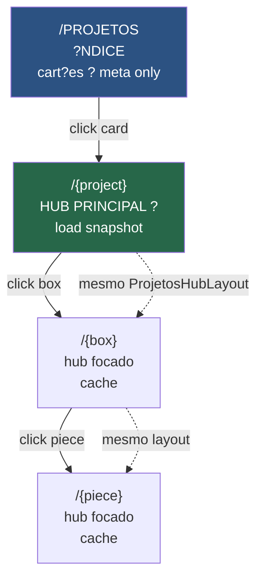
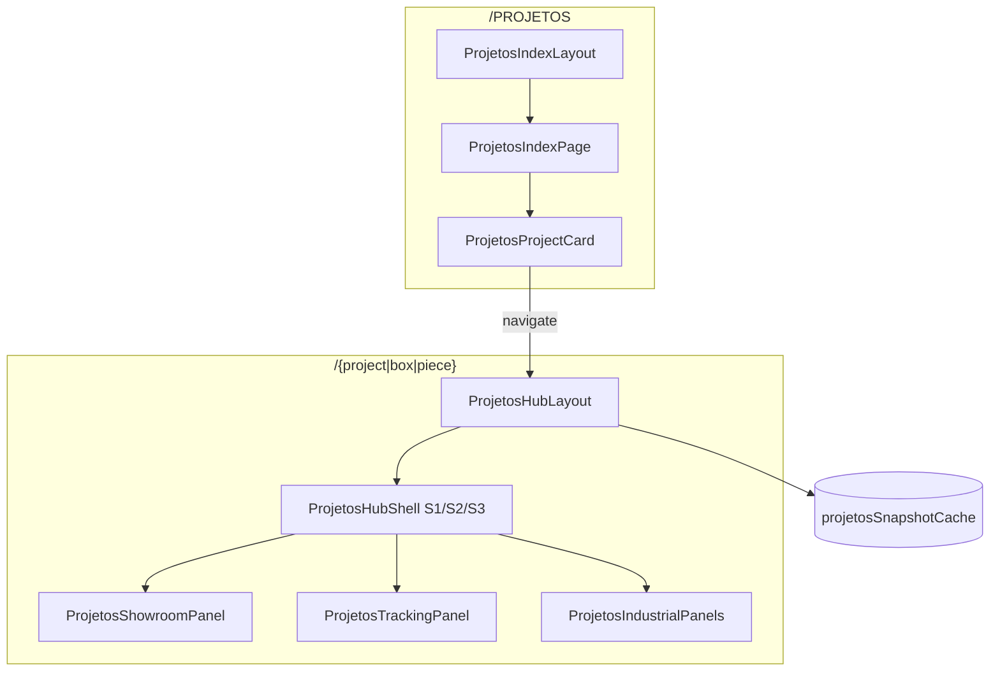
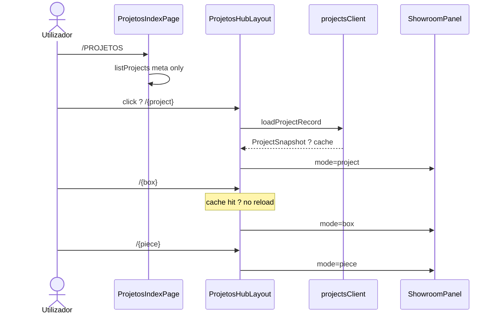

# pimo-v3.1 ? Sistema de P?ginas PROJETOS

> **Iniciativa:** pimo-v3.1  
> **Reposit?rio:** `pimo-criativo`  
> **Estado deste documento:** an?lise + plano arquitetural (fase de desenho ? sem implementa??o)  
> **Data:** 2026-06-27  
> **Vers?o de refer?ncia do c?digo analisado:** `v6.0627.2046` (commit `bd0a7df`)

---

## Sum?rio executivo

O **pimo-v3.1** define um sistema de navega??o p?blica e hier?rquica para visualiza??o de projetos de mobili?rio, baseado exclusivamente em quatro n?veis de URL:

```
/PROJETOS
/PROJETOS/
/PROJETOS/{project}
/PROJETOS/{project}/{box}
/PROJETOS/{project}/{box}/{piece}
```

Este documento **n?o inclui** conceitos de utilizador, designer, multi-tenant routing, nem qualquer integra??o industrial. O objetivo ? servir como refer?ncia permanente para implementa??o futura, reaproveitando o que j? existe no `pimo-criativo` (showroom, snapshots, materiais) e isolando o que ? legado ou fora de escopo.

---

## 1. Escopo funcional (pimo-v3.1)

### 1.1 O que entra

| N?vel | Rota | Fun??o |
|-------|------|--------|
| Root | `/PROJETOS` ou `/PROJETOS/` | **?ndice p?blico** ? cart?es de projetos aprovados para produ??o (sem viewer, sem tracking) |
| Projeto | `/PROJETOS/{project}` | **P?gina principal (hub)** ? viewer showroom completo + pain?is + tracking read-only |
| Caixa | `/PROJETOS/{project}/{box}` | **Hub focado na caixa** ? mesma estrutura do hub; viewer s? caixa |
| Pe?a | `/PROJETOS/{project}/{box}/{piece}` | **Hub focado na pe?a** ? mesma estrutura; viewer isolate + tracking pe?a |

**Princ?pios:**

- Navega??o **read-only** por defeito (visualiza??o / showroom).
- Identificadores na URL s?o **est?veis** (`slug` ou `id` opaco ? ver sec??o 5).
- Dados carregados a partir de **snapshots de projeto** j? existentes (`ProjectSnapshot`).
- **Viewer Showroom** apenas em `{project}`, `{box}` e `{piece}` ? **nunca** em `/PROJETOS`.
- **Tracking read-only** apenas em `{project}`, `{box}` e `{piece}` ? **nunca** em `/PROJETOS`.
- `/PROJETOS/{project}` ? o **hub principal**; `{box}` e `{piece}` reutilizam snapshot e layout, mudando s? o foco.

### 1.2 O que fica explicitamente fora

- Routing por utilizador / designer / f?brica.
- Autentica??o como requisito de navega??o PROJETOS.
- Qualquer rota, servi?o, middleware ou import **industrial**.
- Edi??o param?trica (Workspace em `/`).
- Nesting, CNC, work orders, QR operacional, tracking de produ??o.

### 1.3 Rela??o com o c?digo actual

Hoje **n?o existe** o segmento `/PROJETOS` no router. O equivalente parcial ?:

| pimo-v3.1 (alvo) | C?digo actual | Gap |
|------------------|---------------|-----|
| `/PROJETOS` | `/projects` (protegido, multi-user) | Nova rota p?blica; cart?es como `/projects`; s? projetos aprovados produ??o |
| `/PROJETOS/{project}` | `/projects/:id` (placeholder) + `/projects/viewer` | **Hub principal** com viewer + pain?is + tracking |
| `/PROJETOS/{project}/{box}` | ? | Inexistente na URL |
| `/PROJETOS/{project}/{box}/{piece}` | ? | Inexistente (`/industrial/piece/:id` ? outro sistema) |

---

## 2. An?lise do estado actual (somente leitura)

### 2.1 Rotas actuais (SPA / router)

**Motor de routing:** React Router v7 (`BrowserRouter` em `src/main.tsx`, `<Routes>` em `src/App.tsx`).

**Sistema h?brido:** a rota `/` renderiza `LegacyApp`, que alterna p?ginas via `window.history.pushState` **sem** rotas React Router dedicadas.

#### 2.1.1 Mapa de rotas relevantes para PROJETOS

| Rota | Componente | Peso | Liga??o ao viewer | Relev?ncia pimo-v3.1 |
|------|------------|------|-------------------|----------------------|
| `/` | `Workspace` + `ProjectProvider` | **Pesado** | `ViewerCore` imperativo (edi??o) | Legado ? editor, n?o showroom |
| `/projects` | `ProjectsPage` | Leve | Thumbnails est?ticos | **Reaproveitar** padr?es de listagem |
| `/projects/:id` | `ProjectDetailPage` | Leve | Nenhum (placeholder Fase 4) | **Substituir** por `/PROJETOS/{project}` |
| `/projects/viewer?ids=` | `ProjectsViewerPage` | M?dio | `ShowroomCanvas` (R3F) | **Base directa** do Showroom Viewer |
| `/meus-projetos` | `UserProjectsPage` | Leve | Abre snapshot em `/` | Legado ? acoplado a user |
| `/v4` | Removida (Z-03.8) | — | — | Rota inexistente |
| `/nesting_v3` | `NestingV3RoutePage` | Pesado | SVG layout | Fora de escopo v3.1 |
| `*` | `Navigate ? /` | ? | ? | Catch-all actual |

#### 2.1.2 Classifica??o workspace vs showroom

```
???????????????????????????????????????????????????????????????????
?  WORKSPACE PESADO (n?o usar em PROJETOS v3.1)                   ?
?  ? /  ? ViewerCore + ProjectContext live + ferramentas edi??o   ?
?  ? /v4 ? V4 removido (Z-03.8)                                   ?
?  ? /nesting_v3 ? layout manual de corte                         ?
???????????????????????????????????????????????????????????????????

???????????????????????????????????????????????????????????????????
?  SHOWROOM / VISUALIZA??O LEVE (base do pimo-v3.1)               ?
?  ? /projects/viewer ? ShowroomCanvas + snapshots read-only      ?
?  ? Piece3DModal ? preview isolado de caixa (modal, n?o rota)    ?
???????????????????????????????????????????????????????????????????

???????????????????????????????????????????????????????????????????
?  P?GINAS LEVE (listagem / meta)                                 ?
?  ? /projects, /projects/:id, /meus-projetos, /dashboard         ?
???????????????????????????????????????????????????????????????????
```

#### 2.1.3 Ficheiros-chave de routing

| Ficheiro | Papel |
|----------|-------|
| `src/main.tsx` | `BrowserRouter` |
| `src/App.tsx` | Defini??o de todas as `<Route>` |
| `src/components/ProtectedRoute.tsx` | Gate auth (PROJETOS v3.1 deve **n?o** depender disto) |
| `src/components/Navbar.tsx` | Links `/projects`, `/dashboard` |
| `src/pages/ProjectsViewerPage.tsx` | Showroom multi-projeto |
| `src/workspace/PendingSingleLoadEffect.tsx` | Bridge showroom ? workspace via `sessionStorage` |

---

### 2.2 Estrutura de dados

#### 2.2.1 Onde vivem project / box / piece hoje

| Entidade l?gica | Tipo TypeScript | Localiza??o no estado | Persist?ncia |
|-----------------|-----------------|----------------------|--------------|
| **Projeto** | `ProjectSnapshot` ? `ProjectState` | `snapshot.projectState` | IndexedDB, localStorage, PHP remoto |
| **Caixa (box)** | `WorkspaceBox` + `BoxModule` | `projectState.workspaceBoxes[]`, `projectState.boxes[]` | Dentro do snapshot |
| **Pe?a (piece)** | `CutListItem` | `box.cutList[]`, agregado em `projectState.cutList` | Calculado em runtime; serializado no snapshot |

**N?o existem** tipos literais `Project`, `Box` ou `Piece` ? s?o conven??es de dom?nio sobre estruturas existentes.

#### 2.2.2 Formatos de persist?ncia

**A) Snapshot local / offline (`OfflineProjectRecord`)**

```json
{
  "id": "local-?",
  "remoteId": "pimo-?",
  "name": "Cozinha Cliente X",
  "snapshot": {
    "projectState": { "workspaceBoxes": [], "boxes": [], "cutList": [], ? },
    "viewerSnapshot": { ? },
    "roomSnapshot": { ? }
  }
}
```

- **IndexedDB:** `pimo-projects-db` (`src/core/projects/projectsIndexedDbStore.ts`)
- **localStorage fallback:** `pimo_offline_projects_v2`, `pimo_autosave`

**B) Servidor PHP (produ??o Hostinger)**

- Endpoint: `GET/POST /api/projects/index.php`
- Ficheiro: `project-{id}.json` (mapeado via `hostinger/api/projects/`)
- Formato remoto: `PimoProjectData` (`src/core/projects/types.ts`)

**C) Repo / samples**

- Pasta conceptual `data/projects/` (samples em dev; nem sempre versionada no git)
- `data/projects/index.json` ? ?ndice de meta

#### 2.2.3 Fluxo de carga para o frontend

```
loadProjectRecord(id)
    ?
    ??? IndexedDB (offline-first)
    ?
    ??? GET /api/projects/index.php?action=load&id=
            ?
            ?
    reviveState(snapshot.projectState)     ? src/context/projectPersistence.ts
            ?
            ?
    applyResultados()                      ? recalcula boxes + cutList
            ?
            ??? ProjectContext (workspace pesado em /)
            ??? useShowroomLoader (showroom em /projects/viewer)
```

**Servi?os principais:**

| M?dulo | Ficheiro | Fun??o |
|--------|----------|--------|
| API p?blica | `src/core/projects/projectsClient.ts` | `listProjects`, `loadProjectRecord`, `saveProject` |
| Offline | `src/core/projects/projectsOfflineStore.ts` | IDB + fila sync |
| Remoto | `src/core/projects/projectsApi.ts` | HTTP ? PHP |
| Mappers | `src/core/projects/projectsMappers.ts` | `ProjectSnapshot` ? `PimoProjectData` |
| IO UI | `src/context/hooks/useProjectIoActions.ts` | Abrir/guardar na UI |

#### 2.2.4 Rela??o box ? piece

```
ProjectState
??? workspaceBoxes[]     ? posi??o 3D, material, dimens?es (fonte visual)
??? boxes[]              ? BoxModule com cutList calculada
?   ??? cutList[]        ? CutListItem (pe?as de fabrica??o)
??? cutList[]            ? agregado de todas as caixas
```

Cada `CutListItem` pode ter `boxId` para associa??o ? caixa de origem.

---

### 2.3 Viewer

#### 2.3.1 Motores 3D existentes

| Motor | Ficheiro(s) | Usado em | Peso |
|-------|-------------|----------|------|
| **ViewerCore** | `src/3d/viewer-engine/ViewerCore.ts`, `src/3d/core/Viewer.ts` | `/` Workspace | Pesado |
| **Showroom R3F** | `src/components/showroom/ShowroomCanvas.tsx` | `/projects/viewer` | Leve |
| **V4Viewer** | — | — | Removido (Z-03.8) |
| **Piece3DModal** | `src/components/modals/Piece3DModal.tsx` | Modal | Leve (isolado) |

#### 2.3.2 Showroom Viewer ? como funciona hoje

```
ProjectsViewerPage
  ??? useShowroomLoader(projectIds)
        ??? loadProjectRecord(id) ? ProjectState
  ??? ShowroomCanvas (@react-three/fiber)
        ??? ShowroomProjectRoot (por projeto)
              ??? buildShowroomWorkspaceSceneGroup(projectState)
                    ??? buildBoxLegacy() + materiais + drill markers
```

- **Sem** `ProjectProvider` / `ViewerCore`.
- **Read-only:** snapshots carregados, sem sync bidireccional.
- Estado UI: `useShowroomStore` (Zustand) ? ferramenta, c?mara, sele??o.
- Controlo orbital: `ShowroomOrbitControls` (`@react-three/drei`).

#### 2.3.3 Workspace Viewer ? o que evitar em PROJETOS

O `ViewerCore` inclui:

- `RoomManager`, `ReflowManager`, `CollisionManager`
- Ferramentas de edi??o (gizmos, drag, snapping)
- `MaterialEngine` com sync live via `useCalculadoraSync`
- Modos ultra-performance, photo mode, r?gua interna

**Regra pimo-v3.1:** PROJETOS usa **apenas** o pipeline showroom (`showroomBuildWorkspaceScene.ts`).

#### 2.3.4 Chunk `viewer-*.js` (produ??o)

Definido em `vite.config.ts`:

```ts
manualChunks: {
  viewer: ['three/examples/jsm/controls/OrbitControls'],
}
```

- Agrupa `OrbitControls` nativo Three.js (ViewerCore, Piece3DModal).
- Showroom R3F usa `@react-three/drei` ? chunks separados (`ShowroomCanvas`, `three-*.js`).

#### 2.3.5 Dados m?nimos por contexto (alvo v3.1)

| Contexto | Dados necess?rios | Viewer |
|----------|-------------------|--------|
| Projeto (overview) | `ProjectState.workspaceBoxes[]`, materiais, posi??es | Showroom ? todas as caixas |
| Caixa | Um `WorkspaceBox` + `BoxModule.cutList` | Showroom ? uma caixa, orbit em torno dela |
| Pe?a | Um `CutListItem` + mesh correspondente | Showroom ? highlight/isolate pe?a |

---

### 2.4 Texturas e materiais

#### 2.4.1 Estrutura de ficheiros

```
public/textures/
??? glass/    (ao, base, metalness, normal, roughness ? .svg)
??? marble/
??? metal/
??? plastic/
??? stone/
??? wood/     (+ carvalho.jpg, nogueira.jpg)
??? mdf/      (+ mdf-branco.jpg, mdf-cinza.jpg, branco/map.jpg, ?)
```

Espelhado em `dist/textures/` ap?s build. O workflow de deploy **exclui** `**/textures/**` do FTP (preserva texturas no servidor).

#### 2.4.2 Pipeline de materiais

```
listOfficialMaterials()          ? src/core/materials/materials.api.ts
        ?
        ?
GET /api/materials               ? dev: middleware vite (materialsApi.ts)
        ?                         prod: handler PHP / build-time
        ?
MaterialOption { id, viewerMaterialId, espessuras, ? }
        ?
        ?
getViewerMaterialId(canonicalId) ? src/core/materials/service.ts
        ?
        ?
presets.ts ? textureUrl, PBR     ? src/core/materials/presets.ts
        ?
        ?
buildBoxLegacy({ materialName }) ? showroom + ViewerCore
```

**Importante:** URLs de textura s? s?o preenchidas se `VITE_TEXTURES_URL` estiver definida. Sem ela, o viewer usa **cor + PBR** (sem fetch de JPG/SVG).

#### 2.4.3 Depend?ncias viewer ? materiais (showroom)

| Depend?ncia | Descri??o |
|-------------|-----------|
| `getViewerMaterialId()` | Traduz ID industrial ? preset visual |
| `presets.ts` | Cor, roughness, metallic, textureUrl |
| `buildBoxLegacy()` | Aplica `materialName` na mesh |
| `/api/materials` | Cat?logo oficial (opcional em showroom se IDs j? est?o no snapshot) |

**Stub futuro:** `pieceMaterialExtension.ts` ? contrato para material por pe?a no preview; **n?o implementado**.

---

### 2.5 API / endpoints (relevantes para PROJETOS)

#### 2.5.1 Endpoints usados pelo fluxo de projetos

| Endpoint | M?todo | Consumidor | Uso PROJETOS |
|----------|--------|------------|--------------|
| `/api/projects/index.php` | GET (list) | `projectsApi.ts` | ?ndice `/PROJETOS` |
| `/api/projects/index.php?action=load&id=` | GET | `projectsApi.ts` | Carregar `{project}` |
| `/api/projects/index.php` | POST | sync engine | Fora de escopo v3.1 (read-only) |
| `/api/materials` | GET | `useMaterialsForPicker` | Labels de materiais nas p?ginas |
| `/version.json` | GET | Footer, deploy | Meta de vers?o do site |

#### 2.5.2 Endpoints legados / n?o relevantes para PROJETOS

| ?rea | Endpoints / paths | Motivo exclus?o |
|------|-------------------|-----------------|
| Auth SaaS | `/auth/login`, `/me`, `/users` | Sem conceito de user em v3.1 |
| Settings | `/user/settings`, `/config/global` | Admin, n?o showroom |
| Axios `/projects` | Dashboard alternativo | Duplicado do PHP index |
| Qualquer `/api/industrial/*` | ? | Fora de escopo expl?cito |

#### 2.5.3 Proxy Vite (dev)

```ts
// vite.config.ts
server.proxy: {
  '/api': { target: 'https://pimo.pro', changeOrigin: true, secure: true }
}
```

- `/api/materials` ? middleware local (prioridade).
- `/api/projects/*` ? proxy para produ??o ou `VITE_API_URL`.

---

## 3. Plano arquitectural ? Sistema PROJETOS (pimo-v3.1)

### 3.1 Mapa de rotas proposto

#### 3.1.1 Defini??o formal

| Rota | Nome | P?gina | Viewer | Tracking | Layout |
|------|------|--------|--------|----------|--------|
| `/PROJETOS` | ?ndice | `ProjetosIndexPage` | **Nenhum** | **Nenhum** | Cart?es simples (como `/projects`) |
| `/PROJETOS/` | ?ndice (alias) | redirect ? `/PROJETOS` | ? | ? | ? |
| `/PROJETOS/{project}` | **Hub principal** | `ProjetosProjectPage` | Showroom `project` (todas caixas) | Read-only agregado | S1/S2/S3 |
| `/PROJETOS/{project}/{box}` | Hub caixa | `ProjetosBoxPage` | Showroom `box` (caixa isolada) | Read-only caixa | S1/S2/S3 |
| `/PROJETOS/{project}/{box}/{piece}` | Hub pe?a | `ProjetosPiecePage` | Showroom `piece` (highlight) | Read-only pe?a | S1/S2/S3 |

#### 3.1.2 Resolu??o de par?metros URL

Proposta de identificadores **sem user na path**:

```
{project}  ? projectSlug | projectId
             Prefer?ncia: slug derivado do nome ("cozinha-cliente-x")
             Fallback: id opaco ("pimo-abc123")

{box}      ? boxSlug | boxId
             Derivado de WorkspaceBox.id ou nome normalizado

{piece}    ? pieceSlug | pieceId
             Derivado de CutListItem.id ou shortCode industrial
```

**Servi?o novo (planeado):** `src/projetos/routing/resolveProjetosPath.ts`

```ts
// Pseudoc?digo ? n?o implementado
resolveProject(param: string): Promise<ProjectRef | null>
resolveBox(project: ProjectRef, param: string): BoxRef | null
resolvePiece(box: BoxRef, param: string): PieceRef | null
```

#### 3.1.3 Diagrama de navega??o

```
                    ???????????????????
                    ?  /PROJETOS      ?
                    ?  ?NDICE         ?
                    ?  cart?es only   ?
                    ?  sem viewer     ?
                    ?  sem tracking   ?
                    ???????????????????
                             ? click card
                             ?
              ????????????????????????????????
              ? /PROJETOS/{project}          ?
              ? ? HUB PRINCIPAL ?            ?
              ? viewer project + pain?is     ?
              ? tracking + OT + quality?     ?
              ????????????????????????????????
                             ? click box (mesmo layout)
                             ?
         ?????????????????????????????????????????
         ? /PROJETOS/{project}/{box}             ?
         ? hub focado ? viewer box               ?
         ? pain?is caixa + tracking caixa        ?
         ?????????????????????????????????????????
                            ? click piece (mesmo layout)
                            ?
    ???????????????????????????????????????????????
    ? /PROJETOS/{project}/{box}/{piece}           ?
    ? hub focado ? viewer piece + highlight       ?
    ? ficha pe?a + tracking pe?a                  ?
    ???????????????????????????????????????????????

Snapshot: carregado em {project}; {box}/{piece} reutilizam cache ? s? muda foco viewer.
```

#### 3.1.4 Integra??o no router

**Plano:** dois layouts distintos ? ?ndice simples vs hub S1/S2/S3:

```tsx
// PLAN ? n?o implementado
<Route path="/PROJETOS">
  {/* ?ndice: layout simples, sem viewer, sem tracking */}
  <Route index element={
    <ProjetosIndexLayout>
      <ProjetosIndexPage />
    </ProjetosIndexLayout>
  } />
  {/* Hub: project / box / piece partilham ProjetosHubLayout */}
  <Route path=":project" element={<ProjetosHubLayout />}>
    <Route index element={<ProjetosProjectPage />} />
    <Route path=":box" element={<ProjetosBoxPage />} />
    <Route path=":box/:piece" element={<ProjetosPiecePage />} />
  </Route>
</Route>
```

- `ProjetosIndexLayout` ? header + grid de cart?es (espelha conceito de `ProjectsPage`).
- `ProjetosHubLayout` ? shell S1/S2/S3; monta viewer + pain?is; carrega snapshot em `{project}`.
- Navega??o `{box}` / `{piece}` dentro do hub **n?o recarrega** snapshot ? altera `focusLevel` + URL.

**Redirect de compatibilidade (opcional v3.2):**

- `/projects` ? `/PROJETOS` (se auth n?o for necess?ria)
- Manter `/projects` protegido para SaaS; `/PROJETOS` p?blico

---

### 3.2 Estrutura de componentes

#### 3.2.1 ?rvore proposta (novo namespace `src/projetos/`)

```
src/projetos/
??? pages/
?   ??? ProjetosIndexPage.tsx
?   ??? ProjetosProjectPage.tsx
?   ??? ProjetosBoxPage.tsx
?   ??? ProjetosPiecePage.tsx
??? layout/
?   ??? ProjetosLayout.tsx          ? shell, breadcrumb, SEO
??? components/
?   ??? ProjetosBreadcrumb.tsx
?   ??? ProjetosProjectCard.tsx
?   ??? ProjetosBoxList.tsx
?   ??? ProjetosPieceList.tsx
?   ??? ProjetosPieceDetailPanel.tsx
?   ??? ProjetosShowroomPanel.tsx   ? wrapper ShowroomCanvas
??? hooks/
?   ??? useProjetosProject.ts       ? load + cache snapshot
?   ??? useProjetosBox.ts
?   ??? useProjetosPiece.ts
??? routing/
?   ??? slugify.ts
?   ??? resolveProjetosPath.ts
??? types/
    ??? projetosTypes.ts            ? ProjectRef, BoxRef, PieceRef
```

#### 3.2.2 Reaproveitamento do c?digo actual

| Componente / m?dulo existente | Reutiliza??o em pimo-v3.1 |
|------------------------------|---------------------------|
| `ShowroomCanvas` | **Directo** ? canvas 3D em todas as p?ginas com viewer |
| `ShowroomProjectRoot` | **Directo** ? root por projeto |
| `ShowroomToolbar` | **Parcial** ? ferramentas orbit/measure adaptadas |
| `showroomBuildWorkspaceScene.ts` | **Directo** ? constru??o de meshes |
| `useShowroomLoader` | **Base** ? estender para single-project |
| `useShowroomStore` | **Directo** ? estado c?mara/selec??o |
| `PageContainer`, `PageHeader`, `Card`, `Loader` | **Directo** ? UI shell |
| `ProjectsPage` (cards, thumbnails) | **Inspirar** ? `ProjetosProjectCard` |
| `listProjects`, `loadProjectRecord` | **Directo** ? data layer |
| `getViewerMaterialId`, `presets.ts` | **Directo** ? materiais no viewer |
| `ProjectDetailPage` | **Substituir** ? placeholder actual |
| `ProjectsViewerPage` | **Refer?ncia** ? l?gica multi-id ? simplificar |

#### 3.2.3 Componentes novos necess?rios

| Componente | Responsabilidade |
|------------|------------------|
| `ProjetosLayout` | Layout comum, `<Outlet>`, meta tags |
| `ProjetosBreadcrumb` | `PROJETOS > {project} > {box} > {piece}` |
| `ProjetosShowroomPanel` | Props: `mode: 'overview' \| 'box' \| 'piece'`, ids |
| `ProjetosPieceHighlight` | Extens?o R3F para isolar mesh de pe?a |
| `ProjetosIndexPage` | Lista sem auth/user sidebar |
| `resolveProjetosPath` | URL ? entidades |

---

### 3.3 Liga??o ao Showroom Viewer

#### 3.3.1 Modos de visualiza??o

| Modo | P?gina | Implementa??o |
|------|--------|---------------|
| **project** | `/PROJETOS/{project}` (hub ?) | `buildShowroomWorkspaceSceneGroup` ? todas as caixas |
| **box** | `?/{box}` | Filtrar `workspaceBoxes` a uma caixa; c?mara fit-to-box |
| **piece** | `?/{piece}` | Highlight pe?a na cutlist; c?mara fit-to-piece (PLAN) |

> **Nota:** `/PROJETOS` (?ndice) **n?o** monta viewer. Modos aplicam-se s? dentro de `ProjetosHubLayout`.

#### 3.3.2 Dados m?nimos por modo

```ts
// PLAN ? contrato ProjetosShowroomPanel
type ProjetosShowroomMode = 'overview' | 'box' | 'piece';

interface ProjetosShowroomProps {
  mode: ProjetosShowroomMode;
  projectState: ProjectState;
  boxId?: string;
  pieceId?: string;
}
```

| Modo | Campos obrigat?rios |
|------|---------------------|
| overview | `projectState.workspaceBoxes`, materiais |
| box | + `boxId`, `boxes[].cutList` da caixa |
| piece | + `pieceId`, `CutListItem` (dimens?es, material, furos) |

#### 3.3.3 Separa??o Showroom vs Workspace

```
???????????????????????????????????????????????????????????????
? SHOWROOM VIEWER (pimo-v3.1)                                 ?
? ? ShowroomCanvas + buildShowroomWorkspaceSceneGroup         ?
? ? Snapshot read-only                                        ?
? ? Sem ProjectProvider                                       ?
? ? Sem ViewerCore                                            ?
? ? Rotas: /PROJETOS/**                                       ?
???????????????????????????????????????????????????????????????

???????????????????????????????????????????????????????????????
? WORKSPACE VIEWER (legado ? fora pimo-v3.1)                  ?
? ? ViewerCore imperativo                                     ?
? ? ProjectContext live                                       ?
? ? Edi??o, sync, ferramentas                                 ?
? ? Rota: /                                                   ?
???????????????????????????????????????????????????????????????
```

**Ponte opcional (IDEIA v3.2):** bot?o "Abrir no editor" em `/PROJETOS/{project}` ? `sessionStorage` + navigate `/` (padr?o j? usado por `PendingSingleLoadEffect`).

---

### 3.4 Modelo de dados PROJETOS

#### 3.4.1 Tipos propostos (camada de apresenta??o)

Estes tipos **envolvem** os existentes sem os substituir:

```ts
/** Refer?ncia m?nima para routing ? src/projetos/types/projetosTypes.ts (PLAN) */

interface ProjetosProject {
  id: string;
  slug: string;
  name: string;
  updatedAt: string;
  thumbnailDataUrl: string | null;
  boxCount: number;
  /** Snapshot completo ? carregado lazy ap?s resolu??o */
  snapshot?: ProjectSnapshot;
}

interface ProjetosBox {
  id: string;
  slug: string;
  name: string;
  projectId: string;
  dimensoes: Dimensoes;
  materialId?: string;
  pieceCount: number;
  /** Refer?ncia ao WorkspaceBox + BoxModule */
  workspaceBox: WorkspaceBox;
  boxModule?: BoxModule;
}

interface ProjetosPiece {
  id: string;
  slug: string;
  name: string;
  projectId: string;
  boxId: string;
  dimensoes: CutListItem['dimensoes'];
  espessura: number;
  material: string;
  materialId?: string;
  tipo: string;
  grainDirection?: IndustrialGrainCode;
  drillHoles?: DrillHole[];
  /** Refer?ncia directa */
  cutListItem: CutListItem;
}
```

#### 3.4.2 Mapeamento entidade ? rota

| URL param | Origem no snapshot | Fun??o slug |
|-----------|-------------------|-------------|
| `{project}` | `SavedProjectMeta.id` ou slug(name) | `slugify(projectName)-{id6}` |
| `{box}` | `WorkspaceBox.id` | `slugify(box.nome)-{id6}` |
| `{piece}` | `CutListItem.id` ou `shortCode` | `slugify(piece.nome)-{id6}` |

#### 3.4.3 Estrat?gia de carregamento

```
/PROJETOS
  ?? listProjects() ? ProjetosProject[] (meta only)

/PROJETOS/{project}
  ?? loadProjectRecord(project) ? snapshot
  ?? mapProjectStateToBoxes() ? ProjetosBox[]

/PROJETOS/{project}/{box}
  ?? (cache) snapshot j? carregado
  ?? findBox(box) ? ProjetosBox
  ?? mapCutList(box) ? ProjetosPiece[]

/PROJETOS/{project}/{box}/{piece}
  ?? findPiece(piece) ? ProjetosPiece
```

**Cache:** React Query ou Map em mem?ria por sess?o (`useProjetosProject`).

#### 3.4.4 Extensibilidade (pimo-v3.2+)

| Vers?o | Extens?o |
|--------|----------|
| v3.1 | Routing hier?rquico + showroom read-only |
| v3.2 | Filtros (material, tipo pe?a), pesquisa full-text |
| v3.3 | Export PDF por p?gina, partilha de URL |
| v3.4 | Index server-side em `PROJETOS/index.json` (CDN) |

**Contrato de extens?o:** novos campos em `ProjetosProject` como optional; slugs imut?veis ap?s cria??o.

---

### 3.5 Separa??o l?gica de sistemas

```
????????????????????????????????????????????????????????????????????
? PIMO-CRIATIVO / PROJETOS / SHOWROOM (pimo-v3.1)                  ?
? ? Rotas /PROJETOS/**                                             ?
? ? src/projetos/**                                                ?
? ? ShowroomCanvas pipeline                                        ?
? ? projectsClient / snapshots                                     ?
? ? /api/projects/index.php, /api/materials                        ?
? ? public/textures/                                               ?
????????????????????????????????????????????????????????????????????

????????????????????????????????????????????????????????????????????
? LEGADO (manter, n?o estender para PROJETOS)                      ?
? ? / (Workspace + ViewerCore)                                     ?
? ? LegacyApp pushState routes                                     ?
? ? /meus-projetos, /projects (SaaS multi-user)                    ?
? ? materialLibraryV2 CRUD localStorage                            ?
? ? V4 removido (Z-03.8, /v4)                                    ?
????????????????????????????????????????????????????????????????????

????????????????????????????????????????????????????????????????????
? FORA DE ESCOPO (n?o referenciar em pimo-v3.1)                    ?
? ? src/app/industrial/**                                          ?
? ? /industrial/**, /pieces/:id redirects                          ?
? ? pimo-pro-industrial, industrial-api, MES, SGPI                 ?
? ? Work orders, QR operacional, tracking produ??o                 ?
????????????????????????????????????????????????????????????????????
```

---

## 4. Considera??es t?cnicas de implementa??o (fase seguinte)

### 4.1 SEO e SSR

- PROJETOS ? SPA; meta tags via `react-helmet` ou equivalente (PLAN).
- `index.html` serve shell; conte?do 3D client-only.

### 4.2 Performance

- Lazy load `ShowroomCanvas` (j? padr?o no codebase).
- Carregar snapshot completo s? em `{project}`, n?o no ?ndice.
- Limitar pe?as renderizadas em overview (IDEIA: LOD por dist?ncia).

### 4.3 Erros e 404

| Caso | Comportamento |
|------|---------------|
| project n?o encontrado | P?gina 404 PROJETOS |
| box inv?lida no project | 404 com breadcrumb |
| piece inv?lida | 404 com link para box |

### 4.4 Testes (TODO fase implementa??o)

- Unit: `resolveProjetosPath`, `slugify`
- Integration: load snapshot ? render showroom sem crash
- E2E: navegar hierarquia completa

---

## 5. Estado e evolu??o (pimo-v3.1)

> Lista actualizada com prepara??o de layout, ?cones, p?ginas base e regras `[RULE]`.

### 5.1 Infraestrutura e dados

- `[OK]` Persist?ncia de projetos via `ProjectSnapshot` (IndexedDB + PHP)
- `[OK]` API `GET /api/projects/index.php` (list + load)
- `[OK]` Tipos `WorkspaceBox`, `BoxModule`, `CutListItem` definidos
- `[OK]` Pipeline `loadProjectRecord` ? `reviveState` ? `ProjectState`
- `[PLAN]` Tipos de apresenta??o `ProjetosProject`, `ProjetosBox`, `ProjetosPiece`
- `[PLAN]` Servi?o `resolveProjetosPath` (slug ? entidade)
- `[TODO]` ?ndice p?blico `PROJETOS/index.json` no servidor (cache CDN)
- `[IDEIA]` Versionamento de snapshots por URL (`?v=timestamp`)

### 5.2 Routing e p?ginas

- `[OK]` React Router v7 operacional em `App.tsx`
- `[OK]` `/projects` ? listagem com cards e thumbnails
- `[OK]` `/projects/viewer` ? showroom multi-projeto
- `[OK]` `/projects/:id` ? rota de detalhe (placeholder)
- `[PLAN]` Rotas `/PROJETOS/**` p?blicas
- `[PLAN]` `ProjetosLayout` + breadcrumb hier?rquico
- `[PLAN]` `ProjetosIndexLayout` ? cart?es only (sem viewer/tracking)
- `[PLAN]` `ProjetosHubLayout` ? hub S1/S2/S3 (`/{project}` ?, `/{box}`, `/{piece}`)
- `[PLAN]` P?ginas base com pap?is distintos (?ndice vs hub)
- `[PLAN]` Biblioteca de ?cones PROJETOS em SVG
- `[TODO]` P?gina `/PROJETOS/{project}/{box}` com viewer caixa
- `[TODO]` P?gina `/PROJETOS/{project}/{box}/{piece}` com viewer pe?a focada
- `[TODO]` P?ginas 404 contextuais PROJETOS
- `[TODO]` Mapeamento concreto de estados de produ??o nas p?ginas PROJETOS
- `[TODO]` Prepara??o de loaders e stores para liga??o futura (viewer + dados)
- `[IDEIA]` Redirect `/projects` ? `/PROJETOS` para utilizadores an?nimos
- `[IDEIA]` Painel de resumo de tracking por projeto/caixa/pe?a
- `[IDEIA]` Pain?is din?micos por estado de produ??o

### 5.3 Regras de projeto ([RULE])

- `[RULE]` Reutiliza??o obrigat?ria de PIMO-TRAK / Tracking / Work Orders / Supervisor / Quality / Rework / Time Tracking / Operations / Settings Industrial antes de criar sistemas paralelos
- `[RULE]` Separa??o total de industrial (c?digo novo s? em `src/projetos/**`)
- `[RULE]` N?o modificar c?digo industrial a partir de pimo-v3.1
- `[RULE]` PROJETOS ? camada de visualiza??o / navega??o sobre o que j? existe, n?o um novo sistema industrial
- `[RULE]` Nenhum ?cone hardcoded em componentes PROJETOS ? todos via `Icon` + biblioteca registada

### 5.4 Viewer

- `[OK]` ShowroomCanvas (R3F) funcional
- `[OK]` `buildShowroomWorkspaceSceneGroup` ? geometria param?trica sem ViewerCore
- `[OK]` `useShowroomLoader` ? carga de snapshots por ID
- `[OK]` OrbitControls via `@react-three/drei` no showroom
- `[OK]` Chunk `viewer-*.js` (OrbitControls nativo) para workspace ? separado do showroom
- `[PLAN]` `ProjetosShowroomPanel` com modos overview / box / piece
- `[PLAN]` C?mara fit-to-box
- `[TODO]` Highlight / isolate pe?a individual no showroom
- `[TODO]` Integrar `pieceMaterialExtension` quando implementado
- `[IDEIA]` Mini-map 2D da caixa com pe?a seleccionada

### 5.5 Materiais e texturas

- `[OK]` Cat?logo `/api/materials` (middleware dev + prod)
- `[OK]` `public/textures/` com fam?lias wood, mdf, metal, marble, etc.
- `[OK]` `getViewerMaterialId` ? mapeamento ID ? preset visual
- `[OK]` Deploy preserva `/textures/**` no servidor (exclude FTP)
- `[OK]` PBR fallback quando `VITE_TEXTURES_URL` ausente
- `[PLAN]` Labels de material nas p?ginas PROJETOS (read-only)
- `[TODO]` Texturas por pe?a via `faceMaterials` / `visualMaterial` na ficha pe?a
- `[IDEIA]` Preview swatch de material na lista de pe?as

### 5.6 API e backend

- `[OK]` CRUD projetos PHP em `/api/projects/index.php`
- `[OK]` Proxy Vite `/api` ? pimo.pro (dev)
- `[PLAN]` Endpoint `GET /api/projects/index.php?action=public-list` (meta only, sem auth)
- `[TODO]` Resolver slugs server-side (opcional ? pode ser client-only em v3.1)
- `[IDEIA]` ETag / cache headers para snapshots

### 5.7 Separa??o e limpeza

- `[OK]` Showroom isolado de ViewerCore (sem ProjectProvider)
- `[PLAN]` Namespace `src/projetos/` sem imports de `src/app/industrial/`
- `[TODO]` Remover depend?ncia de `ProtectedRoute` nas rotas PROJETOS
- `[TODO]` Documentar fronteira PROJETOS vs Workspace no README
- `[IDEIA]` Feature flag `features.projetosPages` (default false at? GA)

### 5.8 Evolu??es futuras (pimo-v3.2+)

- `[IDEIA]` Filtro por material / tipo de pe?a
- `[IDEIA]` Filtro por estado de produ??o (via sistemas existentes ? ver sec??o 7)
- `[IDEIA]` Bot?o "Abrir no editor" (bridge sessionStorage ? `/`)
- `[IDEIA]` Export PDF da ficha pe?a a partir de `/PROJETOS/.../piece`
- `[IDEIA]` Galeria comparativa multi-projeto em `/PROJETOS?view=compare`
- `[IDEIA]` Slugs amig?veis gerados na grava??o do projeto (persistidos no meta)

### 5.9 Preparação do projeto ? checklist consolidado (ver —11)

- `[PLAN]` `ProjetosIndexLayout` ? índice cartões (sem viewer/tracking)
- `[PLAN]` `ProjetosHubLayout` ? hub S1/S2/S3 partilhado
- `[PLAN]` Hub `/{project}` ? ? viewer + painéis industriais read-only
- `[PLAN]` Hubs `/{box}` / `/{piece}` ? foco + cache snapshot
- `[RULE]` Tracking/industrial **proibido** em `/PROJETOS`
- `[TODO]` Loaders + cache + `focusLevel` por URL
- `[IDEIA]` Painéis S2 dinámicos por estado produção

> **Referéncia:** —6 estrutura — —11 preparação — —12 explicação técnica.

---

## 6. Estrutura das p?ginas PROJETOS (modelo v3.1)

> **Modelo correcto (obrigat?rio):** quatro rotas com **pap?is distintos** ? ?ndice de cart?es vs hub principal vs hubs focados.  
> **Refer?ncias:** ?11 (prepara??o), ?12 (explica??o t?cnica), ?3.1 (rotas formais).

### 6.0 Vis?o geral ? quatro pap?is, dois layouts

| Rota | Papel | Layout | Viewer | Tracking | Refer?ncia UX |
|------|-------|--------|--------|----------|---------------|
| `/PROJETOS` | **?ndice p?blico** | Simples (cart?es) | ? | ? | [pimo.pro/projects](https://pimo.pro/projects) |
| `/PROJETOS/{project}` | **Hub principal** ? | S1 / S2 / S3 | ? project | ? agregado | Dashboard-like |
| `/PROJETOS/{project}/{box}` | Hub focado caixa | S1 / S2 / S3 | ? box | ? caixa | Mesmo hub, foco caixa |
| `/PROJETOS/{project}/{box}/{piece}` | Hub focado pe?a | S1 / S2 / S3 | ? piece | ? pe?a | Mesmo hub, foco pe?a |

**Regra central:** `{project}`, `{box}` e `{piece}` partilham **`ProjetosHubLayout`** ? mesma estrutura visual, mesmos tipos de pain?is; apenas o **n?vel de foco** (dados + viewer + tracking) muda conforme a URL.

**Regra ?ndice:** `/PROJETOS` usa **`ProjetosIndexLayout`** ? zero viewer, zero tracking, zero layout S1/S2/S3.

---

### 6.1 `/PROJETOS` ? ?ndice p?blico (apenas cart?es)

Equivalente conceptual a **`https://pimo.pro/projects`**, adaptado para rota p?blica `/PROJETOS`.

#### O que exibe

- **Apenas** cart?es de projetos **aprovados para produ??o** (filtro na API ou meta ? `[PLAN]`).
- Cada cart?o (`ProjetosProjectCard`):
  - nome do projeto
  - thumbnail
  - n?mero de caixas
  - n?mero de pe?as
  - estado geral do projeto (badge visual, **n?o** painel tracking)

#### O que N?O tem

| Proibido no ?ndice | Motivo |
|--------------------|--------|
| Viewer / Showroom / 3D | Performance; ?ndice ? cat?logo |
| Tracking / PIMO-TRAK / OT | Tracking s? existe dentro do hub |
| Edi??o | PROJETOS ? read-only |
| Layout S1/S2/S3 | Complexidade desnecess?ria |
| Sidebar industrial | Fora de escopo |

#### Comportamento

- Click no cart?o ? navega para `/PROJETOS/{project}` (hub principal).
- Dados: `listProjects()` ou endpoint `public-list` ? **meta only**, sem `loadProjectRecord`.

#### Esqueleto (fase 0)

| Aspecto | Defini??o |
|---------|-----------|
| **Ficheiro** | `src/projetos/pages/ProjetosIndexPage.tsx` |
| **Layout** | `ProjetosIndexLayout` (header + grid) |
| **Slots** | `header` ? `search-bar` (opcional) ? `card-grid` ? `footer-meta` |
| **Componentes** | `ProjetosProjectCard`, `Loader`, empty state |

```
??????????????????????????????????????????????????????????????
? [header]  PROJETOS ? Projetos em produ??o                  ?
??????????????????????????????????????????????????????????????
? [search]                              (opcional v3.1)      ?
??????????????????????????????????????????????????????????????
?  ???????????  ???????????  ???????????                   ?
?  ? Card    ?  ? Card    ?  ? Card    ?  ? click ? /{proj} ?
?  ? thumb   ?  ? thumb   ?  ? thumb   ?                   ?
?  ? nome    ?  ? nome    ?  ? nome    ?                   ?
?  ? N caixas?  ? ?       ?  ? ?       ?                   ?
?  ? N pe?as ?  ?         ?  ?         ?                   ?
?  ? estado  ?  ?         ?  ?         ?                   ?
?  ???????????  ???????????  ???????????                   ?
??????????????????????????????????????????????????????????????
? [footer-meta] vers?o site                                  ?
??????????????????????????????????????????????????????????????
```

---

### 6.2 `/PROJETOS/{project}` ? P?gina principal (hub) ?

Esta ? a **p?gina central do sistema PROJETOS**. Tudo o resto (box, piece) ? variante focada desta mesma estrutura.

#### Conte?do obrigat?rio

| ?rea | Conte?do |
|------|----------|
| **Viewer** | Showroom ? projeto **completo** (todas as caixas), modo `project` |
| **Estado** | Estado completo do projeto (badges read-only) |
| **Listas** | Lista de caixas + lista de pe?as (project-wide ou por sec??o S2) |
| **Pain?is** | Informa??o project: dimens?es totais, materiais, datas, meta |
| **Tracking read-only** | Integra??o visual com PIMO-TRAK (agregado project) |
| **Industrial read-only** | Work Orders ? Quality ? Rework ? Time Tracking ? Operations ? Supervisor |

Tudo **visual, n?o edit?vel**. Sem muta??o de estado fabril.

#### Carga de dados

- **Primeira entrada no hub:** `loadProjectRecord(project)` ? snapshot completo ? cache sess?o.
- Snapshot permanece em cache enquanto utilizador navega `{box}` / `{piece}`.

#### Esqueleto hub (S1 / S2 / S3)

| Aspecto | Defini??o |
|---------|-----------|
| **Ficheiro** | `src/projetos/pages/ProjetosProjectPage.tsx` |
| **Layout** | `ProjetosHubLayout` + `ProjetosHubShell` |
| **Viewer** | `ProjetosShowroomPanel` mode=`project` |
| **Hook** | `useProjetosProject` ? carga + cache snapshot |

```
????????????????????????????????????????????????????????????????????????
? [top-bar]  PROJETOS ? {project}  ? badges estado ? tracking agregado?
????????????????????????????????????????????????????????????????????????
? S1 ? S2           ? S3                                               ?
?nav ? ? Caixas     ? ???????????????????????????????????????????????? ?
?    ? ? Pe?as      ? ?         Showroom ? projeto completo          ? ?
?    ? ? Estado     ? ???????????????????????????????????????????????? ?
?    ? ? Tracking   ? [pain?is: WO ? Quality ? Rework ? Ops ? Super.]  ?
?    ? ? Supervisor ?                                                  ?
????????????????????????????????????????????????????????????????????????
```

---

### 6.3 `/PROJETOS/{project}/{box}` ? Hub focado na caixa

**Mesma estrutura** que ?6.2 (`ProjetosHubLayout`). Diferen?as:

| Aspecto | Comportamento |
|---------|---------------|
| **Viewer** | Showroom modo `box` ? **apenas** caixa seleccionada; c?mara fit-to-box |
| **Pain?is S2/S3** | Dados **s? da caixa**: cut list, dimens?es, material, estado caixa |
| **Tracking** | Read-only **da caixa** (OT, progresso, qualidade agregada caixa) |
| **Opera??es** | Links/contexto opera??es **da caixa** |
| **Snapshot** | **Reutiliza cache** ? `findBox(boxParam)`; sem novo `loadProjectRecord` |
| **Listas** | Pe?as da caixa destacadas; outras caixas vis?veis em S2 para navega??o |

---

### 6.4 `/PROJETOS/{project}/{box}/{piece}` ? Hub focado na pe?a

**Mesma estrutura** hub. Diferen?as:

| Aspecto | Comportamento |
|---------|---------------|
| **Viewer** | Showroom modo `piece` ? highlight/isolate pe?a |
| **Pain?is** | Ficha completa pe?a: dimens?es, espessura, material, furos, grain |
| **Tracking** | Read-only **da pe?a** (timeline, QR, estado produ??o) |
| **Opera??es** | Opera??es **da pe?a** |
| **Snapshot** | **Reutiliza cache** ? `findPiece(pieceParam)` |

---

### 6.5 Layout ? dois shells distintos

#### 6.5.1 `ProjetosIndexLayout` (s? `/PROJETOS`)

- Header simples + grid responsivo de cart?es.
- Classes existentes: `PageContainer`, `PageHeader`, `Card` (como `ProjectsPage`).
- **N?o** usa `.ui-settings-shell`.

#### 6.5.2 `ProjetosHubLayout` (hub ? `{project}` / `{box}` / `{piece}`)

- Shell S1 / S2 / S3 inspirado em `/dashboard` (`.ui-settings-*`).
- **Refer?ncia:** `DashboardPage.tsx` + `ui.css`.
- **N?o copiar:** auth, NAV_SECTIONS SaaS, formul?rios dashboard.

```
ProjetosHubLayout
  ??? ProjetosHubShell (S1 | S2 | S3)
        ??? S1 ? nav + breadcrumb hier?rquico
        ??? S2 ? sec??es accordion (listas + meta contextual ao focusLevel)
        ??? S3 ? ProjetosShowroomPanel + pain?is industriais read-only
```

#### 6.5.3 `focusLevel` derivado da URL

| URL match | `focusLevel` | Viewer mode | Pain?is activos |
|-----------|--------------|-------------|-----------------|
| `/:project` | `project` | `project` | project-wide |
| `/:project/:box` | `box` | `box` | caixa + pe?as da caixa |
| `/:project/:box/:piece` | `piece` | `piece` | pe?a |

`ProjetosHubLayout` l? params React Router e propaga `focusLevel` + ids a S2/S3/viewer.

#### 6.5.4 `ProjetosTopBar` por focusLevel

| Elemento | Index | Hub project | Hub box | Hub piece |
|----------|-------|-------------|---------|-----------|
| Breadcrumb | ? | ? | ? | ? |
| Viewer | ? | ? project | ? box | ? piece |
| Tracking | ? | ? agregado | ? caixa | ? pe?a |
| Badges WO/Quality | ? | ? | ? | ? |

---

### 6.6 Componentes partilhados do hub

| Componente | Responsabilidade |
|------------|------------------|
| `ProjetosHubLayout` | Shell hub; carga snapshot; `focusLevel` |
| `ProjetosHubShell` | Grid S1/S2/S3 |
| `ProjetosBreadcrumb` | `PROJETOS ? project ? box ? piece` |
| `ProjetosShowroomPanel` | `mode: project \| box \| piece` |
| `ProjetosBoxList` / `ProjetosPieceList` | Navega??o S2 |
| `ProjetosInfoPanels` | Sec??es estado, meta, materiais |
| `ProjetosTrackingPanel` | Tracking read-only (s? hub) |
| `ProjetosIndustrialPanels` | WO, Quality, Rework, Time, Ops, Supervisor |
| `ProjetosProjectCard` | S? ?ndice `/PROJETOS` |

**Contrato hub (PLAN):**

```tsx
interface ProjetosHubContext {
  focusLevel: 'project' | 'box' | 'piece';
  project: ProjetosProject;
  projectState: ProjectState;
  box?: ProjetosBox;
  piece?: ProjetosPiece;
  viewerMode: 'project' | 'box' | 'piece';
}
```

---

### 6.7 ?cones SVG + Biblioteca de ?cones

#### 6.7.1 Sistema existente

| Elemento | Ficheiro |
|----------|----------|
| `<Icon name="?" />` | `src/components/icons/Icon.tsx` |
| Registo | `src/components/icons/iconRegistry.ts` |
| Galeria admin | `/admin/icons` |

#### 6.7.2 Regras ([RULE])

- Proibido SVG inline em `src/projetos/**`.
- ?cones novos: `groups/projetos.ts` ? registry ? galeria.

#### 6.7.3 Invent?rio

| ?cone | Uso | Estado | Nome |
|-------|-----|--------|------|
| Raiz PROJETOS | header ?ndice | `[PLAN]` | `projetosRoot` |
| Projeto | card ?ndice, breadcrumb | `[OK]` | `projects` |
| Caixa | lista S2 hub | `[OK]` | `furniture` |
| Pe?a | lista pe?as | `[PLAN]` | `projetosPiece` |
| Viewer 3D | hub S3 | `[OK]` | `orbit` / `camera` |
| Estado / progresso | card ?ndice + hub | `[PLAN]` | `projetosStatus` |
| Tracking | hub only | `[PLAN]` | `projetosTracking` |
| Work order | hub | `[PLAN]` | `projetosWorkOrder` |
| Qualidade | hub | `[PLAN]` | `projetosQuality` |
| Rework | hub | `[PLAN]` | `projetosRework` |
| Tempo | hub | `[PLAN]` | `projetosTime` |
| Opera??es | hub | `[PLAN]` | `projetosOperations` |
| QR / etiqueta | hub pe?a | `[PLAN]` | `projetosQr` |
| Navega??o | breadcrumb | `[OK]` | `chevronRight` |

**Resumo:** ?cones de tracking/industrial **s? no hub** ? nunca no ?ndice.

---

## 7. Reutiliza??o obrigat?ria da infra-estrutura existente

### 7.1 Regra geral ([RULE])

> Antes de criar qualquer componente, hook, API ou sistema novo para PROJETOS, inspecionar o c?digo existente e **reutilizar / adaptar** em vez de duplicar.

Fluxo:

```
Nova necessidade em PROJETOS
        ?
        ?
Existe equivalente em PIMO-TRAK / Tracking / Work Orders / ? ?
        ?
   ???????????
  SIM       N?O
   ?         ?
   ?         ?
Reutilizar  Documentar [TODO] + proposta neste ficheiro
/ link      (sem mini-sistema paralelo)
```

### 7.2 Infra-estruturas base

| Sistema | Localiza??o | Uso PROJETOS |
|---------|-------------|--------------|
| **PIMO-TRAK** | Ecossistema + `src/app/industrial/*`, `src/industrial/*` | Referenciar estados; n?o reimplementar |
| **Tracking** | `src/app/industrial/tracking/` | Badges + links read-only |
| **Work Orders** | `src/app/industrial/work-orders/` | Indicador OT por pe?a/caixa |
| **Supervisor** | `src/app/industrial/supervisor/` | KPIs agregados (n?vel project) |
| **Quality** | `src/app/industrial/quality/` | Badge qualidade na ficha pe?a |
| **Rework** | `src/app/industrial/rework/` | Badge rework + link |
| **Time Tracking** | `src/app/industrial/time-tracking/` | Meta tempo no detail-panel |
| **Operations** | `src/app/industrial/operations/` | Links contextuais |
| **Settings Industrial** | `src/app/admin/settings/industrial/` | Fora de UI PROJETOS |
| **Etiquetas / QR** | `src/core/qrcode/`, `src/industrial/core/barcode/` | C?digo pe?a; sem novo gerador |
| **Projetos (dados)** | `src/core/projects/*` | Fonte prim?ria project/box/piece |
| **Showroom** | `src/components/showroom/*` | Fonte prim?ria 3D |

### 7.3 Referenciar vs replicar

| Necessidade | Fazer | N?o fazer |
|-------------|-------|-----------|
| Estado produ??o | Badge + link sistemas existentes | `ProjetosTrackingStore` paralelo |
| Work orders | Link `/industrial/work-orders` | Recriar lista OT na sidebar |
| KPIs | Widget read-only (contrato supervisor) | Duplicar hook KPI |
| QR pe?a | `shortCode` / etiqueta existente | Novo gerador em `src/projetos/` |

### 7.4 Regra de documenta??o ([RULE])

- `[RULE]` Qualquer funcionalidade nova em PROJETOS deve verificar primeiro os sistemas listados em 7.2.
- Se existir ? reutilizar / estender (preferir link + badge read-only).
- Se n?o existir ? registar `[TODO]` neste documento + proposta de integra??o futura.

---

## 8. Regras de seguran?a ? separa??o industrial

### 8.1 Per?metro proibido ([RULE])

- `[RULE]` **N?o modificar c?digo industrial** a partir de pimo-v3.1, incluindo:
  - `pimo-pro-industrial`, `pimo-pro-industrial-api`
  - Middleware industrial (`vite.config`, servers)
  - `src/app/industrial/**`, `src/industrial/**`
  - Rotas `/industrial/**`, redirects `/pieces/:id`
  - `/admin/settings/industrial`, `/admin/system-settings/industrial/**`

### 8.2 Fluxos intoc?veis ([RULE])

- `[RULE]` N?o quebrar: **PIMO-TRAK**, Tracking, Work Orders, Supervisor, Quality, Rework, Time Tracking, Operations, Settings Industrial.

### 8.3 Modelo mental ([RULE])

- `[RULE]` **PROJETOS ? camada de visualiza??o / navega??o** sobre snapshots e refer?ncias read-only a sistemas operacionais.
- `[RULE]` PROJETOS **n?o ?** um novo sistema industrial, MES ou substituto do PIMO-TRAK.
- `[RULE]` C?digo novo s? em `src/projetos/**`; zero imports de industrial (excepto tipos read-only documentados).

### 8.4 Checklist pr?-PR

- [ ] S? `src/projetos/**` alterado?
- [ ] Sem imports industrial / pimo-pro-industrial?
- [ ] Rotas `/industrial/*` intactas?
- [ ] Smoke tracking/OT OK?

---

## 9. Refer?ncias de c?digo (an?lise v6.0627.2046)

| ?rea | Ficheiros |
|------|-----------|
| Router | `src/main.tsx`, `src/App.tsx` |
| Projetos UI | `src/pages/ProjectsPage.tsx`, `ProjectDetailPage.tsx`, `ProjectsViewerPage.tsx` |
| Showroom | `src/components/showroom/*` |
| Workspace pesado | `src/components/layout/workspace/Workspace.tsx`, `src/3d/viewer-engine/ViewerCore.ts` |
| Tipos | `src/context/projectTypes.ts`, `src/core/types.ts`, `src/core/projects/types.ts` |
| Persist?ncia | `src/core/projects/projectsClient.ts`, `projectsOfflineStore.ts`, `projectsApi.ts` |
| Materiais | `src/core/materials/presets.ts`, `materials.api.ts`, `src/server/materialsApi.ts` |
| Vite | `vite.config.ts` |
| Texturas | `public/textures/**` |
| Dashboard layout | `src/pages/DashboardPage.tsx`, `ui.css` (`.ui-settings-*`) |
| ?cones | `src/components/icons/` |
| Industrial (ref. only) | `src/app/industrial/**`, `src/industrial/**` |

---

## 10. Gloss?rio

| Termo | Significado |
|-------|-------------|
| **Project** | Unidade persistida (`ProjectSnapshot`) com nome, caixas e estado 3D |
| **Box / Caixa** | M?dulo de mobili?rio (`WorkspaceBox` + `BoxModule`) |
| **Piece / Pe?a** | Item de fabrica??o (`CutListItem`) dentro de uma caixa |
| **Showroom Viewer** | Pipeline R3F read-only (`ShowroomCanvas`) |
| **Workspace Viewer** | Editor 3D pesado (`ViewerCore`) ? **n?o** usado em PROJETOS |
| **Snapshot** | `ProjectSnapshot` serializado (projectState + viewerSnapshot) |
| **Slug** | Identificador leg?vel na URL derivado de nome + id curto |
| **PIMO-TRAK** | Designa??o do ecossistema de trilho operacional ? referenciar, n?o duplicar |
| **Biblioteca de ?cones** | Galeria admin `/admin/icons` ? registo central via `<Icon name="?" />` |

---

## ?11 ? Prepara??o do Projeto para P?ginas PROJETOS (pimo-v3.1)

> **Escopo:** plano de prepara??o **sem execu??o de c?digo**.  
> **Modelo obrigat?rio:** ?ndice de cart?es (`/PROJETOS`) separado do **hub principal** (`/{project}`) e hubs focados (`/{box}`, `/{piece}`).  
> **Refer?ncias:** ?6 (estrutura p?ginas), ?12 (explica??o t?cnica), ?7??8 (industrial).

### 11.1 Modelo de p?ginas ? resumo obrigat?rio

| Rota | Papel | Layout | Viewer | Tracking |
|------|-------|--------|--------|----------|
| `/PROJETOS` | ?ndice p?blico | `ProjetosIndexLayout` ? cart?es | ? | ? |
| `/PROJETOS/{project}` | **Hub principal** ? | `ProjetosHubLayout` S1/S2/S3 | ? `project` | ? |
| `/PROJETOS/{project}/{box}` | Hub focado caixa | **Mesmo** `ProjetosHubLayout` | ? `box` | ? |
| `/PROJETOS/{project}/{box}/{piece}` | Hub focado pe?a | **Mesmo** `ProjetosHubLayout` | ? `piece` | ? |

---

### 11.2 Prepara??o por p?gina

#### 11.2.1 `ProjetosIndexPage` ? `/PROJETOS`

| Item | Prepara??o |
|------|------------|
| **Conceito** | Id?ntico a [pimo.pro/projects](https://pimo.pro/projects) ? cart?es only |
| **Cart?o** | nome ? thumbnail ? N caixas ? N pe?as ? estado geral (badge) |
| **Filtro** | S? projetos **aprovados para produ??o** `[PLAN]` |
| **Proibido** | viewer ? tracking ? S1/S2/S3 ? edi??o |
| **Click** | ? `/PROJETOS/{project}` |
| **Dados** | `listProjects()` meta only |

#### 11.2.2 `ProjetosProjectPage` ? `/PROJETOS/{project}` ?

| Item | Prepara??o |
|------|------------|
| **Papel** | **P?gina principal** do sistema PROJETOS |
| **Layout** | `ProjetosHubLayout` + S1/S2/S3 |
| **Viewer** | Showroom projeto completo ? mode `project` |
| **Pain?is** | Estado project ? listas caixas/pe?as ? info ? tracking agregado |
| **Industrial** | WO ? Quality ? Rework ? Time ? Operations ? Supervisor (read-only) |
| **Dados** | `loadProjectRecord` ? cache snapshot (**?nica carga pesada**) |

#### 11.2.3 `ProjetosBoxPage` ? `/PROJETOS/{project}/{box}`

| Item | Prepara??o |
|------|------------|
| **Estrutura** | **Igual ao hub project** ? mesmo layout, mesmos tipos de painel |
| **Viewer** | mode `box` ? s? caixa seleccionada |
| **Pain?is** | Dados **s? da caixa** + tracking caixa + ops caixa |
| **Dados** | Snapshot **em cache** ? `findBox`; sem reload |

#### 11.2.4 `ProjetosPiecePage` ? `/PROJETOS/{project}/{box}/{piece}`

| Item | Prepara??o |
|------|------------|
| **Estrutura** | **Igual ao hub project** |
| **Viewer** | mode `piece` ? highlight/isolate |
| **Pain?is** | Ficha pe?a completa + tracking pe?a + ops pe?a |
| **Dados** | Snapshot **em cache** ? `findPiece` |

---

### 11.3 Prepara??o de layouts (dois shells)

#### `ProjetosIndexLayout` ? s? `/PROJETOS`

- Header + grid cart?es + footer meta.
- Reutilizar padr?es `ProjectsPage` / `Card` / `PageContainer`.
- **N?o** montar `ProjetosHubShell`.

#### `ProjetosHubLayout` ? hub `{project}` / `{box}` / `{piece}`

- S1 / S2 / S3 (dashboard-like, `.ui-settings-*`).
- `ProjetosHubLayout` carrega snapshot na entrada em `{project}`.
- Navega??o para `{box}` / `{piece}` altera `focusLevel` + viewer mode ? layout **permanece montado**.
- S2 accordion; S3 viewer + pain?is industriais.

**Ordem implementa??o sugerida:**

1. Rotas + `ProjetosIndexLayout` + cart?es placeholder
2. `ProjetosHubLayout` esqueleto S1/S2/S3
3. `ProjetosProjectPage` + carga snapshot + viewer `project`
4. Pain?is tracking/industrial read-only (slots)
5. `{box}` / `{piece}` ? foco viewer + filtros pain?is

---

### 11.4 ?cones SVG

Regras inalteradas ([RULE]): SVG via `<Icon />`; registo em `groups/projetos.ts`.

| Contexto | ?cones |
|----------|--------|
| **?ndice** | `projects`, `projetosStatus` (badge card) |
| **Hub** | `furniture`, `projetosPiece`, `orbit`, `projetosTracking`, `projetosWorkOrder`, etc. |
| **Nunca no ?ndice** | tracking, WO, quality, rework icons |

---

### 11.5 Reutiliza??o e seguran?a

- Ver ?7 (reutiliza??o industrial) e ?8 (separa??o).
- Tracking **s?** em hub ? nunca implementar pain?is tracking no ?ndice.

---

### 11.6 Estado de prepara??o (resumo ?11)

| Tag | Item |
|-----|------|
| `[PLAN]` | `ProjetosIndexLayout` ? cart?es (sem viewer/tracking) |
| `[PLAN]` | `ProjetosHubLayout` ? hub S1/S2/S3 partilhado |
| `[PLAN]` | Hub principal `{project}` com viewer + pain?is completos |
| `[PLAN]` | Hubs focados `{box}` / `{piece}` ? reutilizam layout + cache |
| `[PLAN]` | Filtro projetos aprovados produ??o no ?ndice |
| `[RULE]` | Tracking/industrial **proibido** em `/PROJETOS` |
| `[TODO]` | Loaders + cache snapshot + `focusLevel` por URL |
| `[IDEIA]` | Pain?is S2 din?micos por estado produ??o |

Lista completa: **?5.9** e **?12**.

---

## ?12 ? Explica??o T?cnica Completa do Plano pimo-v3.1

> **Objectivo:** documento explicativo para implementadores ? l?gica, liga??es, fluxos. **Sem c?digo.**  
> **Modelo v3.1:** `/PROJETOS` = ?ndice cart?es ? `/{project}` = **hub principal** ? `/{box}`/`/{piece}` = hub focado (mesmo layout).  
> **P?blico:** implementadores, revisores PR, agentes Cursor.

---

### 12.1 A l?gica geral do plano pimo-v3.1

#### 12.1.1 Dois tipos de p?gina ? ?ndice vs hub

O erro a corrigir no plano anterior era tratar as quatro rotas como **fun??es semelhantes**. O modelo correcto distingue:

| Tipo | Rotas | Fun??o |
|------|-------|--------|
| **?ndice** | `/PROJETOS` | Cat?logo p?blico ? cart?es como `/projects` |
| **Hub** | `/{project}`, `/{box}`, `/{piece}` | Experi?ncia completa ? viewer + pain?is + tracking |

```
/PROJETOS                    ? ?NDICE (cart?es, meta only)
     ?
     ??? /{project}         ? HUB PRINCIPAL ? (snapshot load + viewer project)
              ??? /{box}    ? HUB FOCADO (cache + viewer box)
              ??? /{box}/{piece} ? HUB FOCADO (cache + viewer piece)
```

#### 12.1.2 Porque `/PROJETOS` ? apenas ?ndice

- Espelha [pimo.pro/projects](https://pimo.pro/projects): descoberta r?pida sem custo 3D.
- Lista **projetos aprovados para produ??o** ? meta (nome, thumb, contagens, estado badge).
- **Sem** `loadProjectRecord` em massa ? performance e simplicidade.
- **Sem** tracking: estado no cart?o ? **resumo visual**, n?o painel PIMO-TRAK.
- Click ? entra no hub em `/{project}`.

#### 12.1.3 Porque `/PROJETOS/{project}` ? a p?gina principal

- **?nico ponto** de carga do `ProjectSnapshot` completo.
- Concentra **viewer Showroom** (projeto inteiro), listas, pain?is informativos e **toda** integra??o industrial read-only (Tracking, WO, Quality, Rework, Time, Operations, Supervisor).
- `{box}` e `{piece}` **n?o s?o p?ginas diferentes em esp?rito** ? s?o o **mesmo hub** com `focusLevel` alterado.
- Implementa??o: `ProjetosHubLayout` montado em `{project}`; filhos `{box}`/`{piece}` re-renderizam S2/S3 + viewer mode.

#### 12.1.4 Hierarquia URL ? snapshot

| Rota | Snapshot | Viewer | Tracking |
|------|----------|--------|----------|
| `/PROJETOS` | `listProjects()` meta | ? | ? |
| `/{project}` | `loadProjectRecord` ? cache | `project` | ? agregado |
| `/{box}` | cache + `findBox` | `box` | ? caixa |
| `/{piece}` | cache + `findPiece` | `piece` | ? pe?a |

#### 12.1.5 Como evita duplica??o

- Dois layouts (`Index` vs `Hub`), n?o quatro shells diferentes.
- Um cache snapshot por project/sess?o.
- Um `ProjetosShowroomPanel` ? tr?s modos de foco.
- Tracking s? no hub ? zero c?digo tracking no ?ndice.

---


### 12.2 O que ser? criado na fase de implementa??o

> Lista exaustiva do **escopo v3.1**. Nada disto existe ainda em `src/projetos/` (confirmado em `v6.0627.2046`).

#### 12.2.1 Dois layouts ? Index vs Hub

| Layout | Rotas | Componente |
|--------|-------|------------|
| **Index** | `/PROJETOS` | `ProjetosIndexLayout` ? cart?es only |
| **Hub** | `/{project}`, `/{box}`, `/{piece}` | `ProjetosHubLayout` ? S1/S2/S3 |

#### 12.2.2 Pastas novas (`src/projetos/**`)

```
src/projetos/
??? pages/
?   ??? ProjetosIndexPage.tsx      # ?ndice cart?es
?   ??? ProjetosProjectPage.tsx    # hub principal
?   ??? ProjetosBoxPage.tsx        # hub focado caixa
?   ??? ProjetosPiecePage.tsx      # hub focado pe?a
??? layout/
?   ??? ProjetosIndexLayout.tsx    # layout simples cart?es
?   ??? ProjetosHubLayout.tsx      # S1/S2/S3 partilhado
??? components/
?   ??? ProjetosProjectCard.tsx
?   ??? ProjetosHubShell.tsx
?   ??? ProjetosShowroomPanel.tsx
?   ??? ProjetosTrackingPanel.tsx  # s? hub
?   ??? ProjetosIndustrialPanels.tsx
??? hooks/
?   ??? useProjetosProject.ts      # load + cache snapshot
?   ??? useProjetosFocusLevel.ts   # URL ? project|box|piece
?   ??? useProjetosHubContext.ts
??? routing/
?   ??? resolveProjetosPath.ts
??? store/
?   ??? projetosSnapshotCache.ts
??? types/
    ??? projetosTypes.ts
```

#### 12.2.3 P?ginas ? pap?is distintos

| P?gina | Rota | Layout | Viewer | Tracking |
|--------|------|--------|--------|----------|
| `ProjetosIndexPage` | `/PROJETOS` | Index | ? | ? |
| `ProjetosProjectPage` | `/{project}` | Hub ? | `project` | ? |
| `ProjetosBoxPage` | `/{box}` | Hub | `box` | ? |
| `ProjetosPiecePage` | `/{piece}` | Hub | `piece` | ? |

#### 12.2.4 Componentes-chave

| Componente | Onde |
|------------|------|
| `ProjetosProjectCard` | S? ?ndice |
| `ProjetosHubLayout` / `ProjetosHubShell` | Hub only |
| `ProjetosShowroomPanel` | Hub ? modes `project` \| `box` \| `piece` |
| `ProjetosTrackingPanel` | Hub only ? **nunca** ?ndice |
| `ProjetosIndustrialPanels` | Hub ? WO, Quality, Rework, Time, Ops, Supervisor |

#### 12.2.5 Rotas (dois layouts)

Ver ?3.1.4 ? `ProjetosIndexLayout` vs `ProjetosHubLayout` nested.

---

### 12.3 Como tudo ser? ligado entre si
#### 12.3.1 Data flow ? ?ndice vs hub

```
/PROJETOS ? listProjects() meta only ? sem viewer ? sem tracking
/{project} ? loadProjectRecord ? CACHE ? hub viewer mode=project
/{box}     ? CACHE + findBox ? mode=box
/{piece}   ? CACHE + findPiece ? mode=piece
```

---


#### 12.3.2 Carregamento do snapshot (s? na entrada do hub)

```
Click cart?o /PROJETOS ? /{project}
  ? resolveProjetosPath(project)
  ? loadProjectRecord(id) ? reviveState ? projetosSnapshotCache.set(id, state)

Navega??o /{box} ou /{piece}
  ? projetosSnapshotCache.get(id)  // sem novo fetch
  ? findBox / findPiece
  ? ProjetosShowroomPanel mode += focusLevel
```

#### 12.3.3 Viewer ? modos de foco

| mode | Rota | Comportamento |
|------|------|---------------|
| `project` | `/{project}` | Todas as caixas vis?veis |
| `box` | `/{box}` | Isolar caixa + fit-to-box |
| `piece` | `/{piece}` | Highlight pe?a [TODO] |

#### 12.3.4 Tracking ? mapa por rota

| Rota | Tracking / industrial |
|------|----------------------|
| `/PROJETOS` | **Nenhum** |
| `/{project}` | Agregado + Supervisor + WO summary |
| `/{box}` | Tracking caixa + Operations caixa |
| `/{piece}` | Tracking pe?a + Quality + Rework + QR + Time |

---

### 12.4 User Journey (modelo correcto)

1. **`/PROJETOS`** ? grid cart?es (como `/projects`); click ? hub.
2. **`/{project}`** ? load snapshot; viewer projeto completo; pain?is completos; tracking activo.
3. **`/{box}`** ? mesmo hub; viewer foca caixa; pain?is filtram caixa; cache snapshot.
4. **`/{piece}`** ? mesmo hub; viewer foca pe?a; ficha + tracking pe?a; cache snapshot.

---

### 12.5 Diagramas

#### 12.5.1 Mapa de rotas



#### 12.5.2 Diagrama de componentes



#### 12.5.3 Data flow



---

### 12.6 Resumo do modelo pimo-v3.1

| Conceito | Defini??o |
|----------|-----------|
| **?ndice** | `/PROJETOS` = cat?logo cart?es; sem viewer/tracking |
| **Hub principal** | `/{project}` = experi?ncia completa PROJETOS |
| **Hub focado** | `/{box}`, `/{piece}` = mesmo shell, foco diferente |
| **Snapshot** | Carregado uma vez em `{project}`; reutilizado |
| **Viewer** | S? no hub; modos `project` / `box` / `piece` |
| **Tracking** | S? no hub; read-only; ver ?7 |

---

### 12.7 Mapa de leitura

| Quer? | Ler |
|-------|-----|
| Estrutura p?ginas | **?6** |
| Prepara??o | **?11** |
| Vis?o t?cnica | **?12** |
| Rotas formais | ?3.1 |

---

*Documento pimo-v3.1 ? plano arquitectural. Modelo ?ndice + hub principal alinhado com vis?o produto. Sem altera??o de c?digo.*


